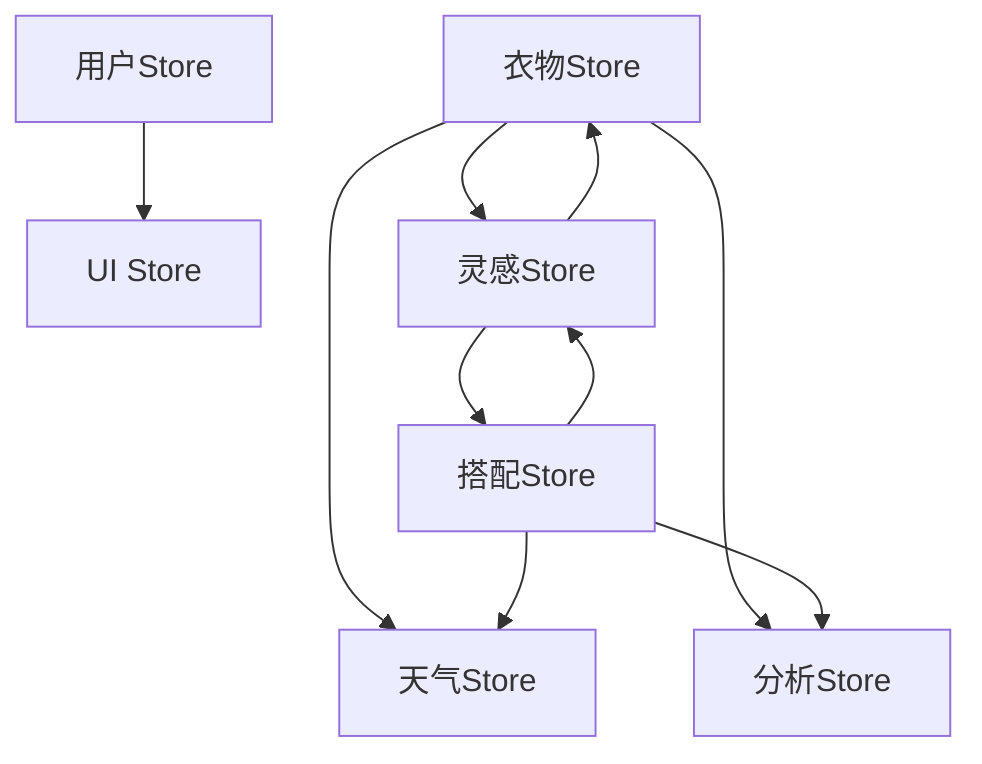

# StyleVault Store 体系架构分析报告

## 🎯 概述

本项目采用 **Pinia** 作为状态管理方案，构建了清晰的分层store架构。各store功能定位明确，依赖关系合理，数据流清晰。

## 📊 Store 功能定位矩阵

| Store名称 | 核心功能 | 数据类型 | 依赖关系 | 使用场景 |
|-----------|----------|----------|----------|----------|
| **userStore** | 用户身份与偏好管理 | 用户信息、设置偏好 | 无 | 全局用户状态 |
| **clothingStore** | 衣物数据管理 | 衣物列表、分类、统计 | clothingAdapter | 衣柜管理 |
| **outfitStore** | 搭配方案管理 | 搭配列表、标签、收藏 | outfitService | 搭配管理 |
| **inspirationStore** | 灵感生成与筛选 | 组合筛选、分页、推荐 | clothingStore + outfitStore | 灵感页面 |
| **weatherStore** | 天气数据与推荐 | 天气信息、天气推荐 | clothingStore + outfitStore | 天气相关功能 |
| **analyticsStore** | 数据分析与统计 | 使用统计、成本分析 | clothingStore + outfitStore | 分析页面 |
| **uiStore** | UI状态管理 | 主题、通知、模态框 | 无 | 全局UI状态 |

## 🔗 依赖关系图谱



## 🔄 数据交互机制

### 1. 跨Store数据共享
- **计算属性依赖**：通过`computed`实现响应式数据共享
- **方法调用**：直接调用其他store的action方法
- **事件通信**：通过Vue的响应式系统实现数据同步

### 2. 初始化流程
```javascript
// 典型初始化序列
1. userStore.initializeUser() // 用户偏好
2. clothingStore.fetchCategories() // 基础数据
3. clothingStore.fetchClothingItems() // 衣物数据
4. outfitStore.fetchOutfits() // 搭配数据
5. 其他store按需初始化
```

### 3. 缓存策略
- **内存缓存**：使用`Map`实现5分钟TTL缓存
- **本地存储**：用户偏好、UI主题持久化
- **防抖处理**：搜索、筛选操作防抖优化

## 📋 通信机制详解

### 单向数据流
```
用户操作 → UI组件 → Store Action → 状态更新 → 计算属性 → 组件重新渲染
```

### 跨Store调用示例
```javascript
// inspirationStore中的跨store调用
const clothingStore = useClothingStore()
const outfitStore = useOutfitStore()

// 计算属性：实时获取衣物数据
const clothes = computed(() => clothingStore.clothingItems)
const savedOutfits = computed(() => outfitStore.allOutfits)

// 方法：协调多个store操作
const initialize = async () => {
  await Promise.all([
    outfitStore.fetchOutfits(),
    clothingStore.fetchCategories(),
    clothingStore.fetchClothingItems()
  ])
}
```

## ⚠️ 潜在问题与优化建议

### 1. 循环依赖风险
- **现状**：无循环依赖，架构清晰
- **建议**：保持当前架构，避免store间相互引用

### 2. 性能优化点
- **数据冗余**：inspirationStore重复计算数据，建议优化
- **缓存粒度**：考虑按用户ID隔离缓存
- **防抖策略**：统一防抖工具函数

### 3. 错误处理
- **现状**：各store独立错误处理
- **建议**：建立全局错误处理机制

## 🎯 最佳实践总结

### ✅ 优秀设计
1. **功能分离**：每个store职责单一明确
2. **响应式数据**：充分利用Vue3 Composition API
3. **缓存优化**：合理的缓存策略减少API调用
4. **错误边界**：完善的错误处理机制
5. **初始化机制**：统一的store初始化流程

### 🔧 可改进点
1. **类型安全**：建议引入TypeScript增强类型检查
2. **数据验证**：增加数据schema验证
3. **性能监控**：添加store操作性能监控
4. **持久化策略**：优化本地存储策略

## 📈 扩展建议

### 1. 模块化增强
```javascript
// 建议的模块划分
stores/
├── core/           // 核心store
├── modules/        // 功能模块
├── plugins/        // 插件扩展
└── utils/          // 工具函数
```

### 2. 中间件支持
- 日志中间件：记录store操作
- 性能中间件：监控操作耗时
- 缓存中间件：统一缓存管理

### 3. 测试策略
- 单元测试：各store独立测试
- 集成测试：跨store交互测试
- 端到端测试：完整用户流程测试