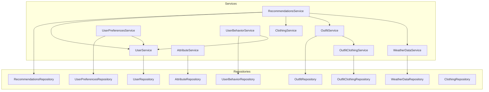
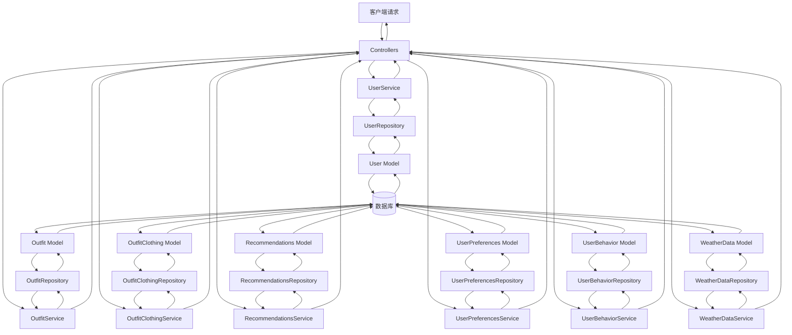

# 创建服务层 DESIGN 文档

## 1. 整体架构图

```mermaid
flowchart TD
    subgraph 表示层
        Controllers[Controllers 控制器]
    end

    subgraph 业务逻辑层
        AuthService[AuthService 认证服务]
        ClothingService[ClothingService 衣物服务]
        AttributeService[AttributeService 属性服务]
        UserService[UserService 用户服务]
        OutfitService[OutfitService 搭配服务]
        OutfitClothingService[OutfitClothingService 搭配-衣物关联服务]
        RecommendationsService[RecommendationsService 推荐服务]
        UserPreferencesService[UserPreferencesService 用户偏好服务]
        UserBehaviorService[UserBehaviorService 用户行为服务]
        WeatherDataService[WeatherDataService 天气数据服务]
    end

    subgraph 数据访问层
        UserRepository[UserRepository 用户仓库]
        ClothingRepository[ClothingRepository 衣物仓库]
        OutfitRepository[OutfitRepository 搭配仓库]
        OutfitClothingRepository[OutfitClothingRepository 搭配-衣物关联仓库]
        AttributeRepository[AttributeRepository 属性仓库]
        RecommendationsRepository[RecommendationsRepository 推荐仓库]
        UserPreferencesRepository[UserPreferencesRepository 用户偏好仓库]
        UserBehaviorRepository[UserBehaviorRepository 用户行为仓库]
        WeatherDataRepository[WeatherDataRepository 天气数据仓库]
    end

    subgraph 数据模型层
        UserModel[User 模型]
        ClothingModel[Clothing 模型]
        OutfitModel[Outfit 模型]
        OutfitClothingModel[OutfitClothing 模型]
        AttributeModel[Attribute 模型]
        RecommendationsModel[Recommendations 模型]
        UserPreferencesModel[UserPreferences 模型]
        UserBehaviorModel[UserBehavior 模型]
        WeatherDataModel[WeatherData 模型]
    end

    Controllers --> AuthService
    Controllers --> ClothingService
    Controllers --> AttributeService
    Controllers --> UserService
    Controllers --> OutfitService
    Controllers --> OutfitClothingService
    Controllers --> RecommendationsService
    Controllers --> UserPreferencesService
    Controllers --> UserBehaviorService
    Controllers --> WeatherDataService

    UserService --> UserRepository
    OutfitService --> OutfitRepository
    OutfitClothingService --> OutfitClothingRepository
    RecommendationsService --> RecommendationsRepository
    UserPreferencesService --> UserPreferencesRepository
    UserBehaviorService --> UserBehaviorRepository
    WeatherDataService --> WeatherDataRepository

    UserRepository --> UserModel
    ClothingRepository --> ClothingModel
    OutfitRepository --> OutfitModel
    OutfitClothingRepository --> OutfitClothingModel
    AttributeRepository --> AttributeModel
    RecommendationsRepository --> RecommendationsModel
    UserPreferencesRepository --> UserPreferencesModel
    UserBehaviorRepository --> UserBehaviorModel
    WeatherDataRepository --> WeatherDataModel

    OutfitService -.-> OutfitClothingService
    RecommendationsService -.-> UserService
    RecommendationsService -.-> ClothingService
    RecommendationsService -.-> OutfitService
    RecommendationsService -.-> WeatherDataService
```



## 2. 分层设计和核心组件

### 2.1 分层设计

1. **表示层（Controllers）**
   - 处理HTTP请求和响应
   - 调用服务层方法处理业务逻辑
   - 实现路由和参数验证

2. **业务逻辑层（Services）**
   - 实现核心业务逻辑
   - 处理数据验证和业务规则
   - 管理事务和错误处理
   - 协调多个Repository的操作

3. **数据访问层（Repositories）**
   - 封装数据访问逻辑
   - 提供CRUD操作接口
   - 实现数据查询和过滤

4. **数据模型层（Models）**
   - 定义数据实体和属性
   - 描述实体间的关联关系
   - 实现数据验证和实例方法

### 2.2 核心组件

#### 2.2.1 UserService
- **功能**：用户管理、认证、授权、个人资料管理
- **主要方法**：findAll, findById, create, update, delete, findByUsername, findByEmail, updateProfile, getProfileWithStats等
- **依赖**：UserRepository

#### 2.2.2 OutfitService
- **功能**：搭配管理、发布、归档、评分、统计
- **主要方法**：findAll, findById, create, update, delete, publish, archive, updateRating, getFullInfo, calculateTotalPrice等
- **依赖**：OutfitRepository, OutfitClothingRepository

#### 2.2.3 OutfitClothingService
- **功能**：搭配与衣物关联管理、排序、批量操作
- **主要方法**：findAll, findById, create, update, delete, addClothingToOutfit, removeClothingFromOutfit, reorderClothes等
- **依赖**：OutfitClothingRepository

#### 2.2.4 RecommendationsService
- **功能**：推荐生成、管理、统计、反馈
- **主要方法**：findAll, findById, create, update, delete, generateRecommendations, getRecommendationsForUser, trackRecommendationInteraction等
- **依赖**：RecommendationsRepository, UserService, ClothingService, OutfitService, WeatherDataService

#### 2.2.5 UserPreferencesService
- **功能**：用户偏好设置、个性化推荐
- **主要方法**：findAll, findById, create, update, delete, getUserPreferences, updateUserPreferences, analyzeUserPreferences等
- **依赖**：UserPreferencesRepository, UserRepository

#### 2.2.6 UserBehaviorService
- **功能**：用户行为追踪、分析、统计
- **主要方法**：findAll, findById, create, update, delete, trackUserBehavior, analyzeUserBehavior, getBehaviorStats等
- **依赖**：UserBehaviorRepository, UserRepository

#### 2.2.7 WeatherDataService
- **功能**：天气数据管理、查询、分析
- **主要方法**：findAll, findById, create, update, delete, getWeatherDataByLocation, analyzeWeatherForClothing等
- **依赖**：WeatherDataRepository

## 3. 模块依赖关系图



## 4. 接口契约定义

### 4.1 UserService接口
```typescript
interface UserService {
  findAll(options: UserQueryOptions): Promise<User[]>
  findById(id: number): Promise<User | null>
  create(data: UserCreateData): Promise<User>
  update(id: number, data: UserUpdateData): Promise<User | null>
  delete(id: number): Promise<boolean>
  findByUsername(username: string): Promise<User | null>
  findByEmail(email: string): Promise<User | null>
  updateProfile(id: number, data: UserProfileUpdateData): Promise<User | null>
  getProfileWithStats(id: number): Promise<any>
  updateLastLogin(id: number): Promise<boolean>
}
```

### 4.2 OutfitService接口
```typescript
interface OutfitService {
  findAll(options: OutfitQueryOptions): Promise<Outfit[]>
  findById(id: number, options?: { includeClothes?: boolean, includeUser?: boolean }): Promise<Outfit | null>
  create(data: OutfitCreateData): Promise<Outfit>
  update(id: number, data: OutfitUpdateData): Promise<Outfit | null>
  delete(id: number): Promise<boolean>
  findByUserId(userId: number, options?: OutfitQueryOptions): Promise<Outfit[]>
  publishOutfit(id: number): Promise<boolean>
  archiveOutfit(id: number): Promise<boolean>
  updateRating(id: number, rating: number): Promise<boolean>
  getFullInfo(id: number): Promise<any>
  calculateTotalPrice(id: number): Promise<number>
  getStats(userId: number): Promise<OutfitStats>
}
```

### 4.3 OutfitClothingService接口
```typescript
interface OutfitClothingService {
  findAll(options: OutfitClothingQueryOptions): Promise<OutfitClothing[]>
  findById(id: number): Promise<OutfitClothing | null>
  create(data: OutfitClothingCreateData): Promise<OutfitClothing>
  update(id: number, data: OutfitClothingUpdateData): Promise<OutfitClothing | null>
  delete(id: number): Promise<boolean>
  findByOutfitId(outfitId: number): Promise<OutfitClothing[]>
  findByClothingId(clothingId: number): Promise<OutfitClothing[]>
  addClothingToOutfit(outfitId: number, clothingId: number, orderIndex?: number): Promise<OutfitClothing>
  removeClothingFromOutfit(outfitId: number, clothingId: number): Promise<boolean>
  reorderClothes(outfitId: number, orderData: Array<{id: number, orderIndex: number}>): Promise<void>
}
```

### 4.4 RecommendationsService接口
```typescript
interface RecommendationsService {
  findAll(options: RecommendationsQueryOptions): Promise<Recommendations[]>
  findById(id: number): Promise<Recommendations | null>
  create(data: RecommendationsCreateData): Promise<Recommendations>
  update(id: number, data: RecommendationsUpdateData): Promise<Recommendations | null>
  delete(id: number): Promise<boolean>
  generateRecommendations(options: GenerateRecommendationsOptions): Promise<Recommendations[]>
  getRecommendationsForUser(userId: number, options?: RecommendationsQueryOptions): Promise<Recommendations[]>
  trackRecommendationInteraction(id: number, data: {isViewed?: boolean, isClicked?: boolean}): Promise<boolean>
  getStats(userId?: number): Promise<RecommendationsStats>
}
```

### 4.5 UserPreferencesService接口
```typescript
interface UserPreferencesService {
  findAll(options: UserPreferencesQueryOptions): Promise<UserPreferences[]>
  findById(id: number): Promise<UserPreferences | null>
  create(data: UserPreferencesCreateData): Promise<UserPreferences>
  update(id: number, data: UserPreferencesUpdateData): Promise<UserPreferences | null>
  delete(id: number): Promise<boolean>
  getUserPreferences(userId: number): Promise<UserPreferences[]>
  updateUserPreferences(userId: number, data: UserPreferencesData): Promise<UserPreferences[]>
  analyzeUserPreferences(userId: number): Promise<any>
}
```

### 4.6 UserBehaviorService接口
```typescript
interface UserBehaviorService {
  findAll(options: UserBehaviorQueryOptions): Promise<UserBehavior[]>
  findById(id: number): Promise<UserBehavior | null>
  create(data: UserBehaviorCreateData): Promise<UserBehavior>
  update(id: number, data: UserBehaviorUpdateData): Promise<UserBehavior | null>
  delete(id: number): Promise<boolean>
  trackUserBehavior(userId: number, data: UserBehaviorTrackData): Promise<UserBehavior>
  analyzeUserBehavior(userId: number, options?: AnalysisOptions): Promise<any>
  getBehaviorStats(userId?: number, options?: StatsOptions): Promise<any>
}
```

### 4.7 WeatherDataService接口
```typescript
interface WeatherDataService {
  findAll(options: WeatherDataQueryOptions): Promise<WeatherData[]>
  findById(id: number): Promise<WeatherData | null>
  create(data: WeatherDataCreateData): Promise<WeatherData>
  update(id: number, data: WeatherDataUpdateData): Promise<WeatherData | null>
  delete(id: number): Promise<boolean>
  getWeatherDataByLocation(location: string, date?: Date): Promise<WeatherData | null>
  analyzeWeatherForClothing(weatherData: WeatherData, userId?: number): Promise<any>
  getRecentWeatherData(userId: number, days?: number): Promise<WeatherData[]>
}
```

## 5. 数据流向图



## 6. 异常处理策略

1. **错误类型**：
   - **业务错误**：用户输入错误、业务规则违反等
   - **系统错误**：数据库错误、网络错误等
   - **安全错误**：未授权访问、权限不足等

2. **错误处理流程**：
   - Repository层捕获底层异常并转换为标准错误
   - Service层处理业务逻辑错误并抛出具体业务异常
   - Service层捕获Repository层异常并进行适当处理或向上传递
   - Controller层统一捕获Service层抛出的异常并返回适当的HTTP响应

3. **错误信息格式**：
   ```typescript
   interface ErrorResponse {
     code: string;
     message: string;
     details?: any;
     timestamp: string;
   }
   ```

4. **日志记录**：
   - 所有异常都应记录到日志系统
   - 记录异常类型、错误信息、堆栈跟踪、请求上下文等信息

5. **事务回滚**：
   - 在Service层实现事务管理
   - 发生异常时自动回滚事务
   - 确保数据一致性