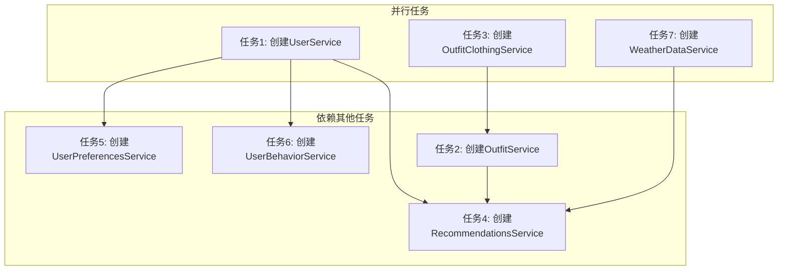

# 创建服务层 TASK 文档

## 1. 子任务拆分

### 任务1: 创建UserService

**输入契约**: 
- UserRepository类已存在
- User模型已定义
- 现有项目结构和代码规范

**输出契约**: 
- 创建 `/src/services/UserService.ts` 文件
- 实现完整的UserService类
- 通过TypeScript编译检查

**实现约束**: 
- 严格遵循现有代码规范
- 实现所有定义的接口方法
- 进行适当的错误处理和数据验证
- 使用async/await处理异步操作

**依赖关系**: 
- 依赖UserRepository
- 无后置任务依赖

### 任务2: 创建OutfitService

**输入契约**: 
- OutfitRepository类已存在
- Outfit模型已定义
- OutfitClothingRepository类已存在
- 现有项目结构和代码规范

**输出契约**: 
- 创建 `/src/services/OutfitService.ts` 文件
- 实现完整的OutfitService类
- 通过TypeScript编译检查

**实现约束**: 
- 严格遵循现有代码规范
- 实现所有定义的接口方法
- 进行适当的错误处理和数据验证
- 使用async/await处理异步操作
- 集成搭配与衣物的关联管理

**依赖关系**: 
- 依赖OutfitRepository和OutfitClothingRepository
- 无后置任务依赖

### 任务3: 创建OutfitClothingService

**输入契约**: 
- OutfitClothingRepository类已存在
- OutfitClothing模型已定义
- 现有项目结构和代码规范

**输出契约**: 
- 创建 `/src/services/OutfitClothingService.ts` 文件
- 实现完整的OutfitClothingService类
- 通过TypeScript编译检查

**实现约束**: 
- 严格遵循现有代码规范
- 实现所有定义的接口方法
- 进行适当的错误处理和数据验证
- 使用async/await处理异步操作

**依赖关系**: 
- 依赖OutfitClothingRepository
- 无后置任务依赖

### 任务4: 创建RecommendationsService

**输入契约**: 
- RecommendationsRepository类已存在
- Recommendations模型已定义
- UserService、ClothingService、OutfitService、WeatherDataService等服务已创建
- 现有项目结构和代码规范

**输出契约**: 
- 创建 `/src/services/RecommendationsService.ts` 文件
- 实现完整的RecommendationsService类
- 通过TypeScript编译检查

**实现约束**: 
- 严格遵循现有代码规范
- 实现所有定义的接口方法
- 进行适当的错误处理和数据验证
- 使用async/await处理异步操作
- 模拟实现推荐算法接口

**依赖关系**: 
- 依赖RecommendationsRepository
- 依赖UserService、ClothingService、OutfitService、WeatherDataService
- 前置任务: 任务1、任务2、任务3、任务7

### 任务5: 创建UserPreferencesService

**输入契约**: 
- UserPreferencesRepository类已存在
- UserPreferences模型已定义
- UserService已创建
- 现有项目结构和代码规范

**输出契约**: 
- 创建 `/src/services/UserPreferencesService.ts` 文件
- 实现完整的UserPreferencesService类
- 通过TypeScript编译检查

**实现约束**: 
- 严格遵循现有代码规范
- 实现所有定义的接口方法
- 进行适当的错误处理和数据验证
- 使用async/await处理异步操作

**依赖关系**: 
- 依赖UserPreferencesRepository
- 依赖UserService
- 前置任务: 任务1

### 任务6: 创建UserBehaviorService

**输入契约**: 
- UserBehaviorRepository类已存在
- UserBehavior模型已定义
- UserService已创建
- 现有项目结构和代码规范

**输出契约**: 
- 创建 `/src/services/UserBehaviorService.ts` 文件
- 实现完整的UserBehaviorService类
- 通过TypeScript编译检查

**实现约束**: 
- 严格遵循现有代码规范
- 实现所有定义的接口方法
- 进行适当的错误处理和数据验证
- 使用async/await处理异步操作

**依赖关系**: 
- 依赖UserBehaviorRepository
- 依赖UserService
- 前置任务: 任务1

### 任务7: 创建WeatherDataService

**输入契约**: 
- WeatherDataRepository类已存在
- WeatherData模型已定义
- 现有项目结构和代码规范

**输出契约**: 
- 创建 `/src/services/WeatherDataService.ts` 文件
- 实现完整的WeatherDataService类
- 通过TypeScript编译检查

**实现约束**: 
- 严格遵循现有代码规范
- 实现所有定义的接口方法
- 进行适当的错误处理和数据验证
- 使用async/await处理异步操作

**依赖关系**: 
- 依赖WeatherDataRepository
- 无后置任务依赖

## 2. 任务依赖图

## 3. 执行顺序

根据任务依赖关系，建议的执行顺序为：

1. **并行执行任务1、任务3、任务7**
   - 这些任务不依赖其他创建的服务

2. **执行任务2**
   - 依赖任务3的完成

3. **执行任务5、任务6**
   - 依赖任务1的完成

4. **最后执行任务4**
   - 依赖任务1、任务2、任务3、任务7的完成

## 4. 复杂度评估

| 任务 | 复杂度 | 预估实现时间 | 风险评估 |
|------|--------|--------------|----------|
| 任务1: 创建UserService | 中 | 2-3小时 | 低 |
| 任务2: 创建OutfitService | 中高 | 3-4小时 | 中 |
| 任务3: 创建OutfitClothingService | 中 | 2-3小时 | 低 |
| 任务4: 创建RecommendationsService | 高 | 4-5小时 | 中高 |
| 任务5: 创建UserPreferencesService | 中 | 2-3小时 | 低 |
| 任务6: 创建UserBehaviorService | 中 | 2-3小时 | 低 |
| 任务7: 创建WeatherDataService | 中 | 2-3小时 | 低 |

## 5. 验证标准

每个任务完成后，应进行以下验证：

1. **代码编译检查**: 运行 `npx tsc --noEmit` 确保无编译错误
2. **代码规范检查**: 确保代码遵循项目的代码规范
3. **功能完整性**: 确保实现了所有定义的接口方法
4. **类型安全**: 确保所有代码都有正确的TypeScript类型定义
5. **错误处理**: 确保实现了适当的错误处理机制

## 6. 注意事项

1. 严格遵循现有项目的代码风格和命名规范
2. 确保所有异步操作都使用async/await处理
3. 为所有方法添加适当的注释
4. 为复杂业务逻辑添加单元测试（如有需要）
5. 优先实现核心功能，然后再优化和添加额外功能
6. 注意处理边界情况和异常情况