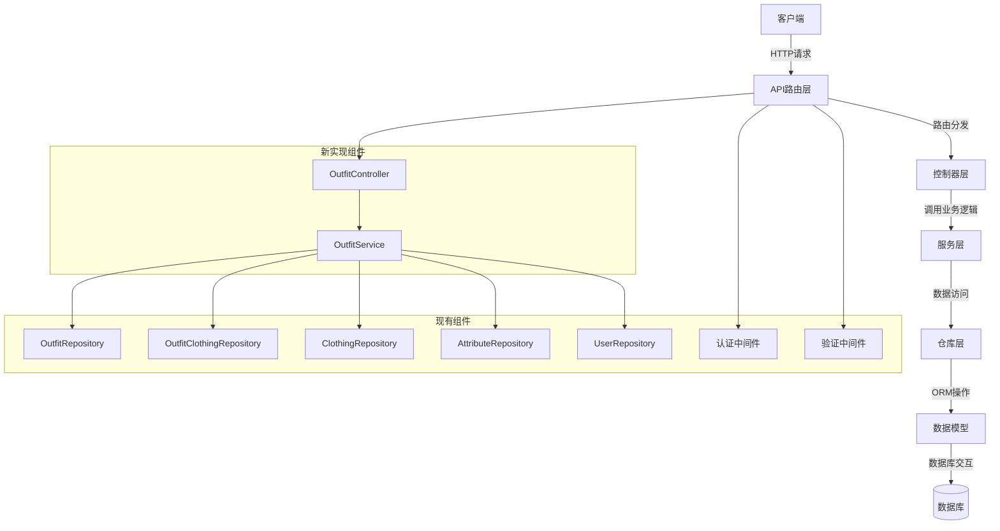
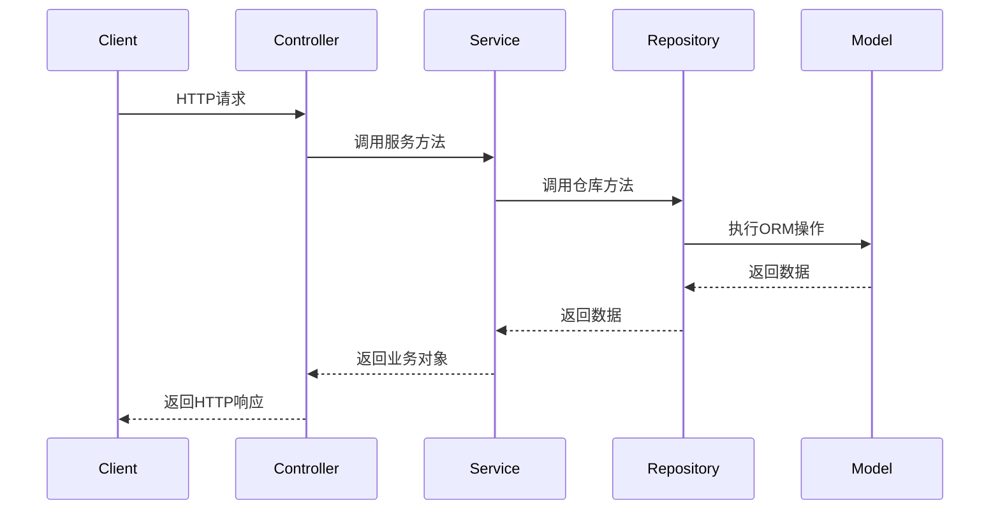

# 搭配管理系统 - 设计文档

## 整体架构图



## 分层设计和核心组件

### 1. 路由层 (Routes)

- **职责**：定义API端点，处理路由分发
- **文件**：`src/routes/outfit.ts`
- **主要功能**：
  - 定义所有搭配相关的API端点
  - 应用认证和验证中间件
  - 将请求转发到对应的控制器方法

### 2. 控制器层 (Controllers)

- **职责**：处理HTTP请求，调用服务层，返回响应
- **文件**：`src/controllers/OutfitController.ts`
- **主要功能**：
  - 解析HTTP请求参数和请求体
  - 调用服务层的相应方法
  - 格式化并返回HTTP响应
  - 处理和转换错误信息

### 3. 服务层 (Services)

- **职责**：实现业务逻辑，处理数据验证和转换
- **文件**：`src/services/OutfitService.ts`
- **主要功能**：
  - 实现搭配的CRUD操作
  - 管理搭配与衣物的关联
  - 实现搭配的分类、筛选和统计
  - 处理业务规则和验证

### 4. 仓库层 (Repositories)

- **职责**：封装数据访问逻辑
- **文件**：`src/repositories/OutfitRepository.ts`, `src/repositories/OutfitClothingRepository.ts`
- **主要功能**：
  - 提供对搭配数据的CRUD操作
  - 管理搭配与衣物的关联数据
  - 实现复杂查询和数据统计

### 5. 数据模型 (Models)

- **职责**：定义数据结构和关系
- **文件**：`src/models/entities/Outfit.ts`, `src/models/entities/OutfitClothing.ts`
- **主要功能**：
  - 定义实体的字段和类型
  - 定义实体间的关系
  - 提供基本的数据访问方法

### 6. 中间件 (Middleware)

- **职责**：处理横切关注点
- **文件**：`src/middleware/auth.ts`, `src/middleware/validation.ts`
- **主要功能**：
  - 身份验证
  - 请求参数验证
  - 错误处理

## 模块依赖关系图

```mermaid
digraph TD
    OutfitController --> OutfitService
    OutfitService --> OutfitRepository
    OutfitService --> OutfitClothingRepository
    OutfitService --> ClothingRepository
    OutfitService --> AttributeRepository
    OutfitController --> AuthMiddleware
    OutfitController --> ValidationMiddleware
    OutfitRepository --> OutfitModel[Outfit Model]
    OutfitClothingRepository --> OutfitClothingModel[OutfitClothing Model]
    ClothingRepository --> ClothingModel[Clothing Model]
    AttributeRepository --> AttributeModel[Attribute Model]
```

## 接口契约定义

### 1. OutfitService 接口

```typescript
interface OutfitCreateData {
  userId: number;
  name: string;
  description?: string;
  season?: number;
  occasion?: number;
  style?: number;
  coverImageUrl?: string;
  imageUrls?: string[];
  isPublic?: boolean;
  metadata?: any;
}

interface OutfitUpdateData {
  name?: string;
  description?: string;
  season?: number;
  occasion?: number;
  style?: number;
  coverImageUrl?: string;
  imageUrls?: string[];
  isPublic?: boolean;
  metadata?: any;
}

interface OutfitQueryOptions {
  userId?: number;
  status?: string;
  season?: number;
  occasion?: number;
  style?: number;
  isPublic?: boolean;
  search?: string;
  page?: number;
  limit?: number;
  sortBy?: string;
  sortOrder?: 'ASC' | 'DESC';
}

class OutfitService {
  async createOutfit(data: OutfitCreateData): Promise<any>;
  async getOutfits(options: OutfitQueryOptions): Promise<any>;
  async getOutfitById(id: number, userId?: number): Promise<any | null>;
  async updateOutfit(id: number, userId: number, data: OutfitUpdateData): Promise<any>;
  async deleteOutfit(id: number, userId: number): Promise<void>;
  async addClothingToOutfit(outfitId: number, clothingId: number, userId: number): Promise<any>;
  async removeClothingFromOutfit(outfitId: number, clothingId: number, userId: number): Promise<void>;
  async reorderClothesInOutfit(outfitId: number, clothesOrder: number[], userId: number): Promise<any>;
  async getOutfitClothes(outfitId: number, userId?: number): Promise<any[]>;
  async publishOutfit(id: number, userId: number): Promise<any>;
  async archiveOutfit(id: number, userId: number): Promise<any>;
  async setOutfitPublic(id: number, userId: number): Promise<any>;
  async setOutfitPrivate(id: number, userId: number): Promise<any>;
  async rateOutfit(id: number, rating: number, userId: number): Promise<any>;
  async recordOutfitUsage(id: number, userId: number): Promise<any>;
  async getOutfitStats(userId: number): Promise<any>;
}
```

### 2. OutfitController 接口

```typescript
class OutfitController {
  createOutfit: (req: Request, res: Response) => Promise<void>;
  getOutfits: (req: Request, res: Response) => Promise<void>;
  getOutfitById: (req: Request, res: Response) => Promise<void>;
  updateOutfit: (req: Request, res: Response) => Promise<void>;
  deleteOutfit: (req: Request, res: Response) => Promise<void>;
  addClothingToOutfit: (req: Request, res: Response) => Promise<void>;
  removeClothingFromOutfit: (req: Request, res: Response) => Promise<void>;
  reorderClothesInOutfit: (req: Request, res: Response) => Promise<void>;
  getOutfitClothes: (req: Request, res: Response) => Promise<void>;
  publishOutfit: (req: Request, res: Response) => Promise<void>;
  archiveOutfit: (req: Request, res: Response) => Promise<void>;
  setOutfitPublic: (req: Request, res: Response) => Promise<void>;
  setOutfitPrivate: (req: Request, res: Response) => Promise<void>;
  rateOutfit: (req: Request, res: Response) => Promise<void>;
  recordOutfitUsage: (req: Request, res: Response) => Promise<void>;
  getOutfitStats: (req: Request, res: Response) => Promise<void>;
}
```

## 数据流向图



## 异常处理策略

1. **验证异常**：输入参数不符合要求时，返回400状态码和详细的错误信息
2. **认证异常**：未提供有效的认证信息时，返回401状态码
3. **授权异常**：用户尝试访问或修改不属于自己的资源时，返回403状态码
4. **资源不存在**：请求的资源不存在时，返回404状态码
5. **业务逻辑异常**：业务规则违反时，返回400或409状态码
6. **服务器内部错误**：系统异常时，返回500状态码，不暴露详细错误信息给客户端

所有异常都应该记录到日志系统，以便排查问题。