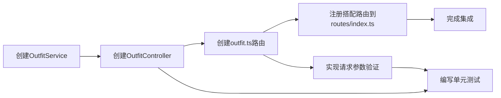

# 搭配管理系统 - 任务分解文档

## 子任务拆分

### 1. 创建OutfitService服务层

**任务描述**：实现搭配管理的核心业务逻辑，包括搭配的CRUD操作、搭配与衣物的关联管理、搭配的分类筛选等功能。

**输入契约**：
- 无前置依赖
- 需使用现有的仓库类：OutfitRepository, OutfitClothingRepository, ClothingRepository

**输出契约**：
- 完成`src/services/OutfitService.ts`文件实现
- 包含所有设计文档中定义的接口方法

**实现约束**：
- 严格遵循TypeScript类型定义
- 实现适当的错误处理和数据验证
- 遵循现有服务层的代码风格和模式

**依赖关系**：
- 依赖现有仓库层
- 后续任务依赖此服务层

### 2. 创建OutfitController控制器层

**任务描述**：实现搭配管理的HTTP请求处理，调用服务层完成业务逻辑，并返回标准化的HTTP响应。

**输入契约**：
- 前置依赖：OutfitService已实现
- 需使用express的Request和Response对象
- 需使用authMiddleware进行身份验证

**输出契约**：
- 完成`src/services/OutfitController.ts`文件实现
- 包含所有设计文档中定义的接口方法

**实现约束**：
- 遵循RESTful API设计原则
- 返回统一格式的响应
- 实现适当的错误处理和参数验证

**依赖关系**：
- 依赖OutfitService
- 后续任务依赖此控制器层

### 3. 创建outfit.ts路由定义

**任务描述**：定义搭配管理相关的API端点，应用中间件，并将请求转发到对应的控制器方法。

**输入契约**：
- 前置依赖：OutfitController已实现
- 需使用express的Router对象
- 需使用authMiddleware和验证中间件

**输出契约**：
- 完成`src/routes/outfit.ts`文件实现
- 定义所有设计文档中指定的API端点
- 正确应用中间件

**实现约束**：
- 遵循项目现有的路由定义模式
- 正确设置路由前缀
- 实现请求参数验证

**依赖关系**：
- 依赖OutfitController
- 后续任务需将此路由注册到应用

### 4. 在routes/index.ts中注册搭配路由

**任务描述**：将搭配路由注册到应用的主路由系统中，使其可以被客户端访问。

**输入契约**：
- 前置依赖：outfit.ts路由已实现
- 需修改现有的`src/routes/index.ts`文件

**输出契约**：
- 成功将搭配路由注册到应用
- 确保API前缀正确

**实现约束**：
- 遵循现有路由注册模式
- 不影响现有路由功能

**依赖关系**：
- 依赖outfit.ts路由

### 5. 实现请求参数验证

**任务描述**：为搭配相关的API端点实现请求参数验证，确保输入数据的合法性。

**输入契约**：
- 前置依赖：OutfitController和outfit.ts路由已实现
- 需使用express-validator库

**输出契约**：
- 在outfit.ts路由中实现所有必要的参数验证
- 提供清晰的验证错误信息

**实现约束**：
- 遵循现有项目的验证模式
- 验证规则应全面覆盖业务需求

**依赖关系**：
- 依赖outfit.ts路由

### 6. 编写单元测试（可选）

**任务描述**：为搭配管理系统编写单元测试，确保功能的正确性和稳定性。

**输入契约**：
- 前置依赖：OutfitService和OutfitController已实现
- 需使用测试框架（如Jest）

**输出契约**：
- 完成主要功能的单元测试
- 测试覆盖率应达到合理水平

**实现约束**：
- 遵循现有项目的测试风格
- 测试应包括正常流程、边界条件和异常情况

**依赖关系**：
- 依赖OutfitService和OutfitController

## 任务依赖图

## 执行顺序

1. 创建OutfitService服务层
2. 创建OutfitController控制器层
3. 创建outfit.ts路由定义
4. 在routes/index.ts中注册搭配路由
5. 实现请求参数验证
6. 编写单元测试（可选）

## 关键里程碑

- **服务层完成**：OutfitService实现所有核心业务逻辑
- **控制器层完成**：OutfitController实现所有API端点的请求处理
- **路由完成**：搭配路由正确注册并可访问
- **验证完成**：实现所有必要的参数验证
- **测试完成**：单元测试覆盖率达到要求

## 风险评估

1. **依赖风险**：依赖现有仓库层的功能，如仓库层功能不完善可能影响服务层实现
2. **数据一致性风险**：搭配与衣物关联操作需要确保数据一致性
3. **性能风险**：复杂查询和大量数据操作可能影响系统性能
4. **安全风险**：需要确保正确实现身份验证和权限控制

## 应对策略

- 仔细检查并测试与现有仓库层的集成
- 实现事务管理确保数据一致性
- 优化查询逻辑，合理使用索引
- 严格遵循认证和授权流程