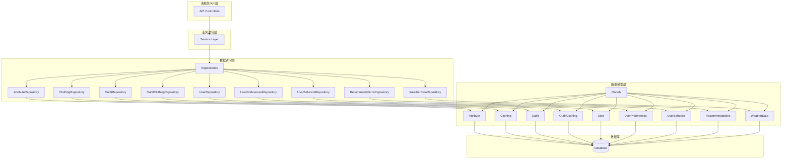
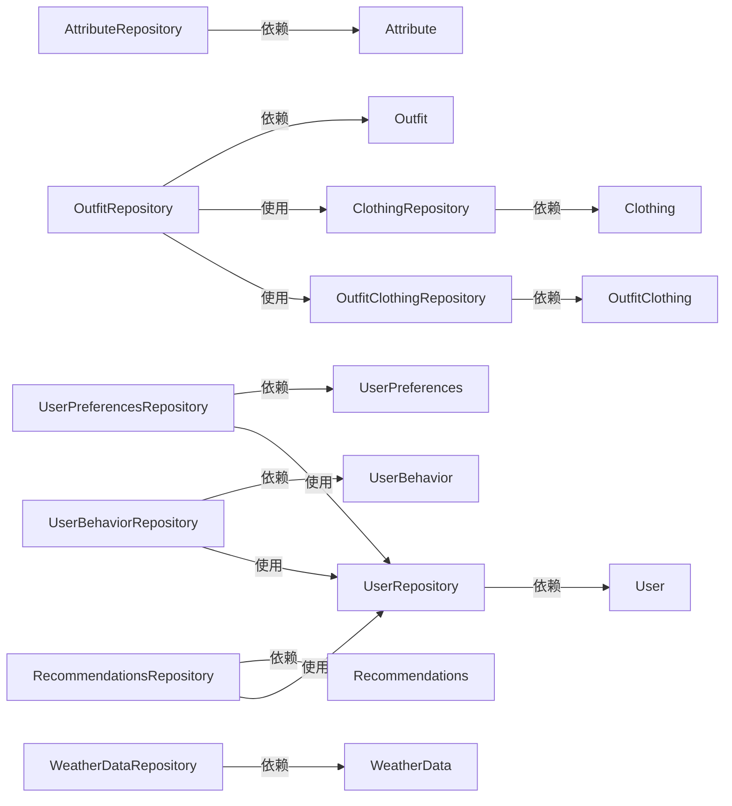
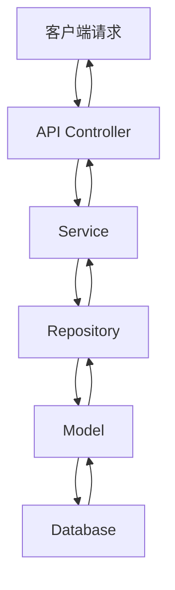

# 仓库层实现设计文档

## 1. 整体架构图



## 2. 分层设计

### 2.1 数据访问层（Repository Layer）
- **职责**：封装所有与数据库相关的操作，提供统一的数据访问接口
- **设计原则**：单一职责、依赖倒置、接口隔离
- **实现方式**：每个数据模型对应一个仓库类

### 2.2 核心组件

每个仓库类作为独立的核心组件，负责：
- 提供对特定数据模型的CRUD操作
- 实现复杂查询逻辑
- 处理数据转换
- 管理事务（如需）
- 处理数据库异常

## 3. 模块依赖关系图



## 4. 接口契约定义

### 4.1 通用仓库接口

所有仓库类应实现以下基本接口：

```typescript
interface BaseRepository<T, ID> {
  findAll(options?: any): Promise<T[]>;
  findById(id: ID): Promise<T | null>;
  create(data: any): Promise<T>;
  update(id: ID, data: any): Promise<T | null>;
  delete(id: ID): Promise<boolean>;
}
```

### 4.2 特定仓库接口示例

#### 4.2.1 AttributeRepository接口

```typescript
interface AttributeRepository extends BaseRepository<Attribute, number> {
  findByCategory(category: string): Promise<Attribute[]>;
  getAttributeTree(): Promise<Attribute[]>;
  isAttributeUsed(attributeId: number): Promise<boolean>;
}
```

#### 4.2.2 ClothingRepository接口

```typescript
interface ClothingRepository extends BaseRepository<Clothing, number> {
  findClothingItems(options: ClothingQueryOptions): Promise<{
    items: Clothing[];
    total: number;
    page: number;
    pageSize: number;
  }>;
  findFavoriteItems(userId: number, limit?: number): Promise<Clothing[]>;
  getClothingStats(userId: number): Promise<ClothingStats>;
}
```

#### 4.2.3 UserRepository接口

```typescript
interface UserRepository extends BaseRepository<User, number> {
  findByUsername(username: string): Promise<User | null>;
  findByEmail(email: string): Promise<User | null>;
  updatePassword(userId: number, passwordHash: string): Promise<User | null>;
  activateUser(userId: number): Promise<User | null>;
}
```

## 5. 数据流向图



## 6. 异常处理策略

### 6.1 异常类型
- **DatabaseError** - 数据库操作错误
- **NotFoundError** - 资源未找到错误
- **ValidationError** - 数据验证错误
- **ConflictError** - 数据冲突错误

### 6.2 异常处理流程
1. 仓库层捕获数据库操作异常
2. 将数据库异常转换为应用级异常
3. 添加上下文信息和错误码
4. 向上层抛出异常
5. 上层服务或控制器处理异常并返回适当的响应

### 6.3 事务管理
- 对于需要多步操作的业务逻辑，使用Sequelize事务确保数据一致性
- 在仓库层提供事务支持方法

## 7. 设计原则

1. **单一职责原则** - 每个仓库类只负责一个数据模型的数据访问
2. **依赖倒置原则** - 业务逻辑层依赖于仓库接口，而非具体实现
3. **接口隔离原则** - 仓库接口精简，只包含必要的方法
4. **开闭原则** - 可以扩展新的仓库类，而无需修改现有代码
5. **里氏替换原则** - 子类可以替换父类，保持接口一致性

## 8. 性能优化考虑

1. **查询优化** - 使用Sequelize的include选项进行关联查询，避免N+1查询问题
2. **分页处理** - 实现有效的分页机制，避免一次性加载大量数据
3. **缓存策略** - 对于频繁查询的数据，考虑实现缓存机制
4. **批量操作** - 支持批量创建、更新操作，减少数据库交互次数

## 9. 总结

本设计文档定义了StyleVault项目仓库层的整体架构、模块设计、接口规范和异常处理策略。通过实现独立的仓库类，将数据访问逻辑与业务逻辑分离，提高了代码的可维护性、可测试性和可扩展性。每个仓库类封装了对应数据模型的所有数据访问操作，并提供了统一的接口供业务逻辑层使用。