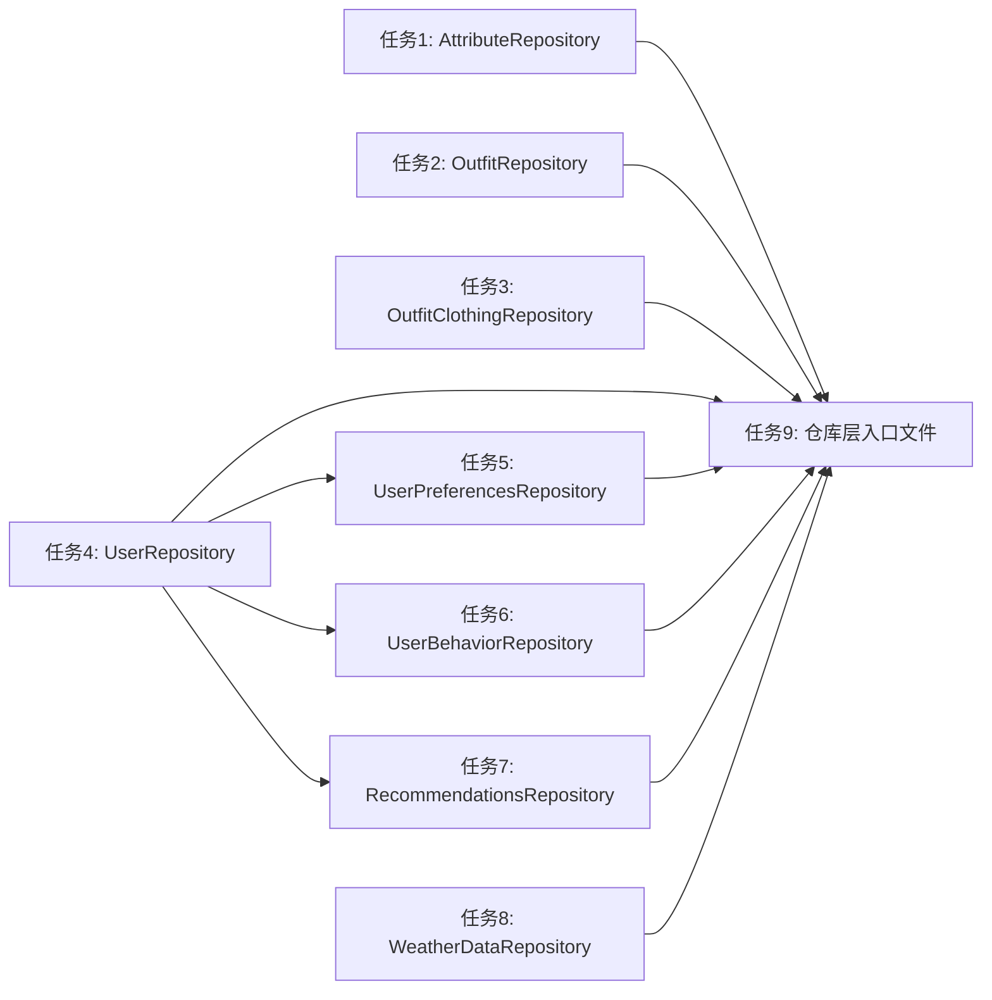

# 仓库层实现任务文档

## 1. 子任务拆分

根据仓库层设计文档，将实现任务拆分为以下原子任务：

### 1.1 任务1：创建AttributeRepository

- **任务描述**：为Attribute模型创建仓库类，封装属性数据的访问逻辑
- **输入契约**：
  - Attribute模型文件：`backend/src/models/entities/Attribute.ts`
  - 现有仓库实现参考：`backend/src/repositories/ClothingRepository.ts`
- **输出契约**：
  - 仓库类文件：`backend/src/repositories/AttributeRepository.ts`
- **实现约束**：
  - 实现基础CRUD操作
  - 实现findByCategory、getAttributeTree、isAttributeUsed等特定方法
  - 遵循现有代码规范
- **依赖关系**：无前置依赖

### 1.2 任务2：创建OutfitRepository

- **任务描述**：为Outfit模型创建仓库类，封装搭配数据的访问逻辑
- **输入契约**：
  - Outfit模型文件：`backend/src/models/entities/Outfit.ts`
  - 现有仓库实现参考：`backend/src/repositories/ClothingRepository.ts`
- **输出契约**：
  - 仓库类文件：`backend/src/repositories/OutfitRepository.ts`
- **实现约束**：
  - 实现基础CRUD操作
  - 实现findByUserId、countByStatus、calculateTotalPrice等特定方法
  - 遵循现有代码规范
- **依赖关系**：无前置依赖

### 1.3 任务3：创建OutfitClothingRepository

- **任务描述**：为OutfitClothing模型创建仓库类，封装搭配-服装关联数据的访问逻辑
- **输入契约**：
  - OutfitClothing模型文件：`backend/src/models/entities/OutfitClothing.ts`
  - 现有仓库实现参考：`backend/src/repositories/ClothingRepository.ts`
- **输出契约**：
  - 仓库类文件：`backend/src/repositories/OutfitClothingRepository.ts`
- **实现约束**：
  - 实现基础CRUD操作
  - 实现findByOutfitId、addClothingToOutfit、removeClothingFromOutfit等特定方法
  - 遵循现有代码规范
- **依赖关系**：无前置依赖

### 1.4 任务4：创建UserRepository

- **任务描述**：为User模型创建仓库类，封装用户数据的访问逻辑
- **输入契约**：
  - User模型文件：`backend/src/models/entities/User.ts`
  - 现有仓库实现参考：`backend/src/repositories/ClothingRepository.ts`
- **输出契约**：
  - 仓库类文件：`backend/src/repositories/UserRepository.ts`
- **实现约束**：
  - 实现基础CRUD操作
  - 实现findByUsername、findByEmail、updatePassword、activateUser等特定方法
  - 遵循现有代码规范
- **依赖关系**：无前置依赖

### 1.5 任务5：创建UserPreferencesRepository

- **任务描述**：为UserPreferences模型创建仓库类，封装用户偏好数据的访问逻辑
- **输入契约**：
  - UserPreferences模型文件：`backend/src/models/entities/UserPreferences.ts`
  - 现有仓库实现参考：`backend/src/repositories/ClothingRepository.ts`
- **输出契约**：
  - 仓库类文件：`backend/src/repositories/UserPreferencesRepository.ts`
- **实现约束**：
  - 实现基础CRUD操作
  - 实现findByUserId、createOrUpdate、updateStyleProfile等特定方法
  - 遵循现有代码规范
- **依赖关系**：任务4（UserRepository）

### 1.6 任务6：创建UserBehaviorRepository

- **任务描述**：为UserBehavior模型创建仓库类，封装用户行为数据的访问逻辑
- **输入契约**：
  - UserBehavior模型文件：`backend/src/models/entities/UserBehavior.ts`
  - 现有仓库实现参考：`backend/src/repositories/ClothingRepository.ts`
- **输出契约**：
  - 仓库类文件：`backend/src/repositories/UserBehaviorRepository.ts`
- **实现约束**：
  - 实现基础CRUD操作
  - 实现recordBehavior、getUserBehaviorStats、cleanupOldBehaviors等特定方法
  - 遵循现有代码规范
- **依赖关系**：任务4（UserRepository）

### 1.7 任务7：创建RecommendationsRepository

- **任务描述**：为Recommendations模型创建仓库类，封装推荐数据的访问逻辑
- **输入契约**：
  - Recommendations模型文件：`backend/src/models/entities/Recommendations.ts`
  - 现有仓库实现参考：`backend/src/repositories/ClothingRepository.ts`
- **输出契约**：
  - 仓库类文件：`backend/src/repositories/RecommendationsRepository.ts`
- **实现约束**：
  - 实现基础CRUD操作
  - 实现generateRecommendations、getUserRecommendations、getRecommendationStats等特定方法
  - 遵循现有代码规范
- **依赖关系**：任务4（UserRepository）

### 1.8 任务8：创建WeatherDataRepository

- **任务描述**：为WeatherData模型创建仓库类，封装天气数据的访问逻辑
- **输入契约**：
  - WeatherData模型文件：`backend/src/models/entities/WeatherData.ts`
  - 现有仓库实现参考：`backend/src/repositories/ClothingRepository.ts`
- **输出契约**：
  - 仓库类文件：`backend/src/repositories/WeatherDataRepository.ts`
- **实现约束**：
  - 实现基础CRUD操作
  - 实现findByCityAndDate、findLatestByCity、getForecast、batchSaveWeatherData等特定方法
  - 遵循现有代码规范
- **依赖关系**：无前置依赖

### 1.9 任务9：创建仓库层入口文件

- **任务描述**：创建仓库层的入口文件，导出所有仓库类，方便上层调用
- **输入契约**：
  - 所有已创建的仓库类文件
- **输出契约**：
  - 入口文件：`backend/src/repositories/index.ts`
- **实现约束**：
  - 导出所有仓库类
  - 提供获取仓库实例的方法
  - 遵循现有代码规范
- **依赖关系**：任务1-8（所有仓库类）

## 2. 拆分原则

1. **复杂度可控** - 每个任务只负责一个仓库类的实现，复杂度可控
2. **功能独立** - 每个仓库类可以独立编译和测试
3. **明确验收标准** - 每个任务都有明确的输出和实现约束
4. **依赖关系清晰** - 任务之间的依赖关系明确，避免循环依赖

## 3. 任务依赖图

## 4. 执行检查清单

### 4.1 完整性
- ✅ 所有数据模型都有对应的仓库类实现任务
- ✅ 包含仓库层入口文件的创建任务
- ✅ 任务覆盖了所有需求

### 4.2 一致性
- ✅ 与前期ALIGNMENT、CONSENSUS、DESIGN文档保持一致
- ✅ 任务描述与设计文档中的接口定义一致

### 4.3 可行性
- ✅ 技术方案确实可行
- ✅ 每个任务的复杂度适中，便于实现

### 4.4 可控性
- ✅ 风险在可接受范围
- ✅ 任务之间的依赖关系清晰，无循环依赖

### 4.5 可测性
- ✅ 每个任务都有明确的验收标准
- ✅ 每个仓库类可以独立验证