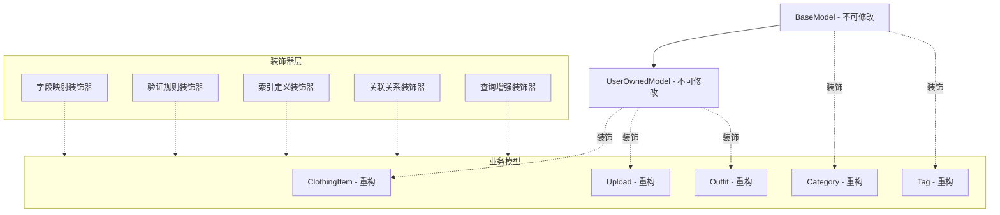
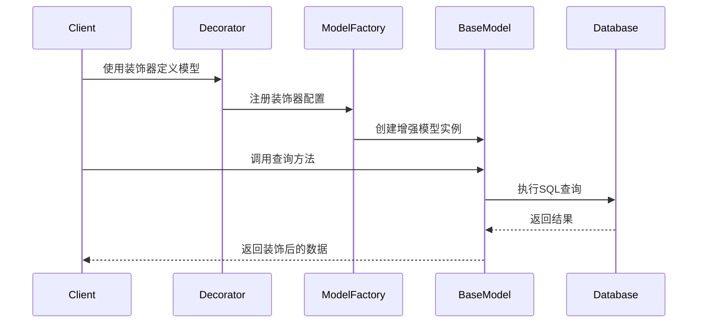

# 模型优化设计 - 架构阶段

## 整体架构设计

### 装饰器模式架构图



## 分层设计

### 1. 核心装饰器层

#### A. 字段映射装饰器
```typescript
// @Field 装饰器 - 统一字段映射
@Field({
  type: DataType.STRING,
  allowNull: false,
  field: 'user_id',  // 数据库字段名
  camelCase: 'userId'  // TypeScript属性名
})
```

#### B. 验证规则装饰器
```typescript
// @Validate 装饰器 - 数据验证
@Validate({
  min: 1,
  max: 100,
  message: '名称长度必须在1-100字符之间'
})
```

#### C. 索引定义装饰器
```typescript
// @Index 装饰器 - 索引管理
@Index({
  fields: ['user_id', 'created_at'],
  unique: true,
  name: 'user_created_idx'
})
```

#### D. 关联关系装饰器
```typescript
// @BelongsTo, @HasMany 装饰器 - 关联简化
@BelongsTo(() => User, 'userId')
@HasMany(() => ClothingItem, 'categoryId')
```

### 2. 查询增强层

#### A. 分页查询装饰器
```typescript
@PaginatedQuery({
  defaultLimit: 20,
  maxLimit: 100
})
```

#### B. 软删除装饰器
```typescript
@SoftDeleteQuery
```

#### C. 用户过滤装饰器
```typescript
@UserScopedQuery
```

## 模块设计

### 装饰器工具包结构

```
src/
├── decorators/
│   ├── field-decorator.ts      # 字段映射
│   ├── validation-decorator.ts # 验证规则
│   ├── index-decorator.ts      # 索引定义
│   ├── association-decorator.ts # 关联关系
│   └── query-decorator.ts      # 查询增强
├── utils/
│   ├── model-factory.ts        # 模型工厂
│   └── decorator-registry.ts    # 装饰器注册
└── types/
    ├── decorator.types.ts        # 装饰器类型定义
    └── model.types.ts          # 模型类型扩展
```

## 接口契约定义

### 装饰器配置接口

```typescript
// 字段装饰器配置
interface FieldDecoratorOptions {
  type: DataType;
  allowNull?: boolean;
  defaultValue?: any;
  field?: string;           // 数据库字段名
  camelCase?: string;       // TypeScript属性名
  validate?: ValidationRule[];
}

// 验证规则接口
interface ValidationRule {
  type: 'length' | 'range' | 'format' | 'custom';
  constraint?: any;
  message?: string;
  validator?: (value: any) => boolean;
}

// 索引配置接口
interface IndexDecoratorOptions {
  fields: string[];
  unique?: boolean;
  name?: string;
  type?: 'BTREE' | 'HASH' | 'GIN';
}

// 关联关系接口
interface AssociationDecoratorOptions {
  model: () => typeof Model;
  foreignKey: string;
  as?: string;
  onDelete?: 'CASCADE' | 'SET NULL' | 'RESTRICT';
  onUpdate?: 'CASCADE' | 'SET NULL' | 'RESTRICT';
}
```

## 数据流向图



## 异常处理策略

### 装饰器错误处理
- **配置验证**: 装饰器参数运行时验证
- **类型检查**: TypeScript编译时类型检查
- **回退机制**: 装饰器失败时回退到基础行为

### 数据验证错误
- **统一错误格式**: ValidationError标准化
- **字段级错误**: 具体到字段的错误信息
- **批量验证**: 支持多个错误一次性返回

### 查询增强错误
- **查询构建失败**: 回退到基础查询
- **参数验证失败**: 抛出清晰的错误信息
- **数据库错误**: 包装为业务异常