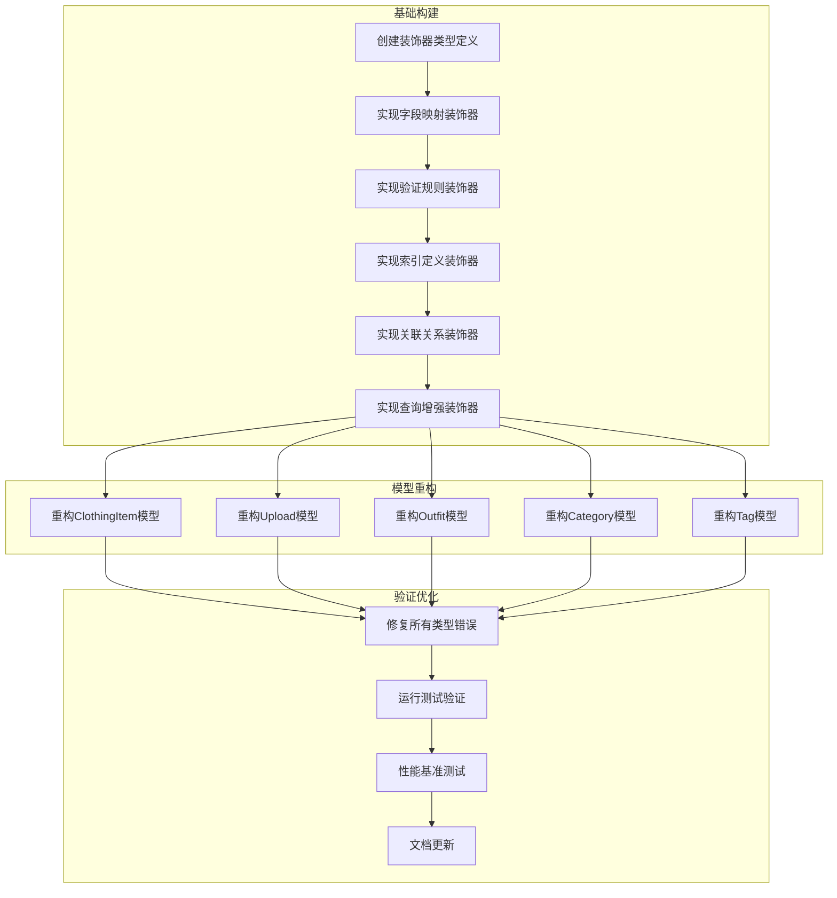

# 模型优化任务拆分 - 原子化阶段

## 任务依赖图

## 原子任务定义

### 任务1: 创建装饰器类型定义
**输入契约**:
- 现有BaseModel和UserOwnedModel定义
- TypeScript装饰器规范
- Sequelize-typescript装饰器接口

**输出契约**:
- `src/types/decorator.types.ts` - 装饰器配置接口
- `src/types/model.types.ts` - 模型类型扩展
- 完整的类型定义文档

**实现约束**:
- 必须与现有BaseModel兼容
- 支持装饰器链式调用
- 类型安全100%覆盖

### 任务2: 实现字段映射装饰器
**输入契约**:
- 任务1的类型定义
- 现有字段映射需求分析
- 数据库命名规范

**输出契约**:
- `src/decorators/field-decorator.ts`
- 支持驼峰↔下划线自动映射
- 字段验证和转换

**实现约束**:
- 零运行时开销
- 支持自定义映射规则
- 向后兼容现有代码

### 任务3: 实现验证规则装饰器
**输入契约**:
- 业务验证需求
- 现有验证规则分析
- 错误处理规范

**输出契约**:
- `src/decorators/validation-decorator.ts`
- 统一验证错误格式
- 支持异步验证

**实现约束**:
- 验证规则可组合
- 支持自定义验证器
- 错误信息国际化准备

### 任务4: 实现索引定义装饰器
**输入契约**:
- 现有索引使用情况
- 性能优化需求
- 数据库索引最佳实践

**输出契约**:
- `src/decorators/index-decorator.ts`
- 索引配置统一管理
- 复合索引支持

**实现约束**:
- 索引命名规范
- 支持条件索引
- 索引性能分析

### 任务5: 实现关联关系装饰器
**输入契约**:
- 现有模型关联分析
- 关联关系复杂度
- 查询性能需求

**输出契约**:
- `src/decorators/association-decorator.ts`
- 简化关联定义
- 自动外键映射

**实现约束**:
- 关联类型全覆盖
- 级联操作配置
- 循环依赖检测

### 任务6: 实现查询增强装饰器
**输入契约**:
- 通用查询模式分析
- 分页需求
- 用户数据隔离需求

**输出契约**:
- `src/decorators/query-decorator.ts`
- 分页查询封装
- 用户作用域查询
- 软删除查询增强

**实现约束**:
- 查询性能优化
- 缓存友好
- 查询构建器支持

### 任务7: 重构ClothingItem模型
**输入契约**:
- 任务2-6的装饰器
- 现有ClothingItem.ts
- 测试用例

**输出契约**:
- 重构后的ClothingItem.ts
- 零类型错误
- 向后兼容API

**实现约束**:
- 保持现有API不变
- 所有测试通过
- 性能不下降

### 任务8: 重构Upload模型
**输入契约**:
- 任务2-6的装饰器
- 现有Upload.ts
- 文件上传测试

**输出契约**:
- 重构后的Upload.ts
- 文件相关功能完整
- 类型安全

**实现约束**:
- 文件操作API不变
- 存储路径逻辑不变
- 上传验证增强

### 任务9: 重构Outfit模型
**输入契约**:
- 任务2-6的装饰器
- 现有Outfit.ts
- 穿搭关联测试

**输出契约**:
- 重构后的Outfit.ts
- 穿搭功能完整
- 关联查询优化

**实现约束**:
- 穿搭创建API不变
- 关联查询性能优化
- 评分系统完整

### 任务10: 重构Category模型
**输入契约**:
- 任务2-6的装饰器
- 现有Category.ts
- 层级结构测试

**输出契约**:
- 重构后的Category.ts
- 层级结构支持
- 分类查询优化

**实现约束**:
- 层级API不变
- 递归查询优化
- 分类缓存支持

### 任务11: 重构Tag模型
**输入契约**:
- 任务2-6的装饰器
- 现有Tag.ts
- 标签系统测试

**输出契约**:
- 重构后的Tag.ts
- 标签功能完整
- 使用统计优化

**实现约束**:
- 标签API不变
- 使用计数准确
- 系统标签保护

### 任务12: 修复所有类型错误
**输入契约**:
- 重构后的所有模型
- TypeScript配置
- 编译器错误报告

**输出契约**:
- 零类型错误报告
- 类型定义完整
- 编译通过

**实现约束**:
- 严格类型检查
- 无类型断言
- 完整类型推导

### 任务13: 运行测试验证
**输入契约**:
- 现有测试套件
- 重构后的模型
- 测试配置

**输出契约**:
- 测试报告
- 性能基准
- 兼容性验证

**实现约束**:
- 所有测试通过
- 性能回归测试
- 覆盖率不下降

### 任务14: 性能基准测试
**输入契约**:
- 性能测试脚本
- 重构前后对比
- 查询性能指标

**输出契约**:
- 性能对比报告
- 优化建议
- 性能调优指南

**实现约束**:
- 关键查询性能
- 内存使用分析
- 并发性能测试

### 任务15: 文档更新
**输入契约**:
- 所有重构结果
- 装饰器使用示例
- 迁移指南需求

**输出契约**:
- 装饰器使用文档
- 迁移指南
- API更新说明

**实现约束**:
- 文档完整性
- 示例代码可运行
- 迁移步骤清晰

## 任务优先级

### P0 - 阻塞级
- T1, T2, T12 - 基础类型和错误修复

### P1 - 高优先级
- T7, T8, T9 - 核心业务模型

### P2 - 中优先级
- T3, T4, T5, T6 - 装饰器功能
- T10, T11 - 其他模型

### P3 - 低优先级
- T13, T14, T15 - 验证和文档

## 风险评估

### 高风险
- T12 类型错误修复 - 可能影响API兼容性
- T13 测试验证 - 可能发现隐藏问题

### 中风险
- 装饰器性能影响 - 需要基准测试
- 向后兼容性 - 需要全面测试

### 低风险
- 文档更新 - 不影响功能
- 代码重构 - 有测试保护