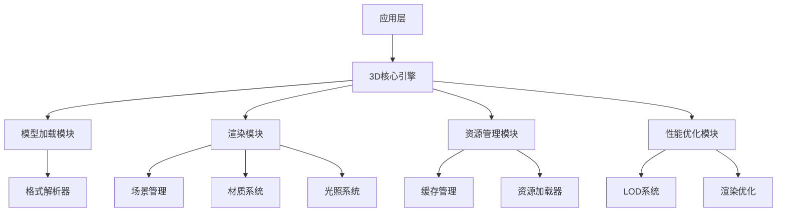
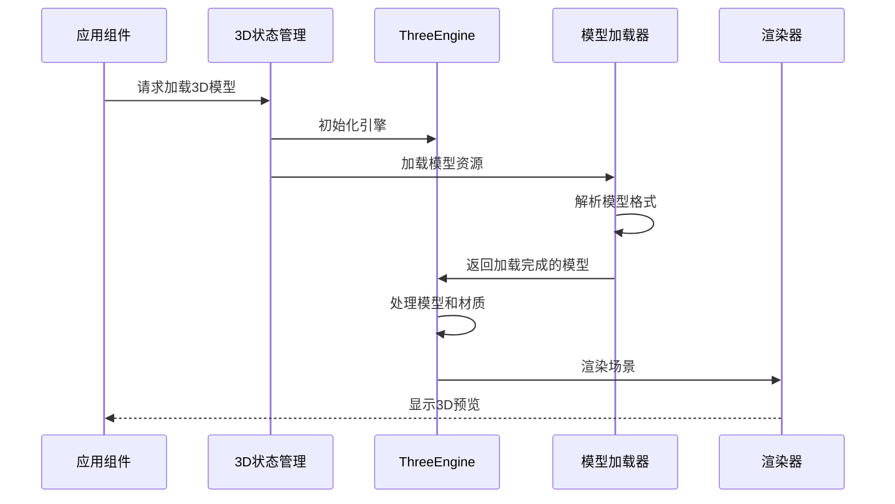

# StyleVault 3D搭配预览 - 3D模型加载与渲染系统设计

## 1. 系统架构概述

### 1.1 架构层次


### 1.2 核心组件关系
- **应用层**：Vue组件，负责用户交互和状态管理
- **3D核心引擎**：基于Three.js的封装，提供统一的3D功能接口
- **模型加载模块**：处理不同格式3D模型的加载和解析
- **渲染模块**：负责场景渲染、材质和光照管理
- **资源管理模块**：处理纹理、模型等资源的加载和缓存
- **性能优化模块**：实现LOD、渲染优化等性能提升策略

## 2. 技术实现方案

### 2.1 核心技术栈
- **Three.js**：核心3D渲染引擎
- **@types/three**：TypeScript类型定义
- **three-gltf-loader**：GLTF格式支持
- **three-obj-loader**：OBJ格式支持
- **three-fbx-loader**：FBX格式支持
- **gsap**：动画和过渡效果

### 2.2 模块详细设计

#### 2.2.1 3D核心引擎
```typescript
// src/core/ThreeEngine.ts
class ThreeEngine {
  private scene: THREE.Scene;
  private camera: THREE.PerspectiveCamera;
  private renderer: THREE.WebGLRenderer;
  private controls: THREE.OrbitControls;
  private loaders: Map<string, THREE.Loader>;
  private resources: Map<string, any>;
  
  constructor(container: HTMLElement) {
    this.initScene();
    this.initCamera();
    this.initRenderer(container);
    this.initControls();
    this.initLoaders();
    this.initLighting();
  }
  
  // 初始化方法...
  
  // 核心方法
  loadModel(url: string, format: string): Promise<THREE.Object3D>;
  render(): void;
  update(delta: number): void;
  dispose(): void;
}
```

#### 2.2.2 模型加载模块
- **格式支持**：
  - GLTF/GLB（推荐）：使用GLTFLoader
  - OBJ：使用OBJLoader
  - FBX：使用FBXLoader
  - 其他格式：通过转换器支持

- **加载流程**：
  1. 资源验证和预处理
  2. 格式检测和选择对应加载器
  3. 异步加载和解析
  4. 模型优化和后处理
  5. 场景集成和返回

#### 2.2.3 渲染模块
- **场景管理**：
  - 场景图结构
  - 对象层级管理
  - 坐标系和单位统一

- **材质系统**：
  - 标准材质（PBR）
  - 纹理映射
  - 透明度和混合模式
  - 材质模板和预设

- **光照系统**：
  - 环境光
  - 方向光（主光源）
  - 点光源（辅助光源）
  - 阴影配置

#### 2.2.4 资源管理模块
- **资源加载器**：
  - 纹理加载
  - 模型加载
  - 异步加载队列
  - 进度跟踪

- **缓存管理**：
  - 内存缓存
  - 磁盘缓存（IndexedDB）
  - 资源复用
  - 缓存清理策略

#### 2.2.5 性能优化模块
- **LOD系统**：
  - 自动LOD生成
  - 基于距离的LOD切换
  - 自定义LOD级别

- **渲染优化**：
  - 视锥体剔除
  - 材质批处理
  - 阴影优化
  - WebGL2特性利用

## 3. 数据流设计

### 3.1 数据流向


### 3.2 状态管理
```typescript
// src/stores/modules/threeStore.ts
export const useThreeStore = defineStore('three', {
  state: () => ({
    engine: null,
    models: [],
    currentModel: null,
    loading: false,
    progress: 0,
    error: null,
    performance: {
      fps: 0,
      drawCalls: 0,
      triangles: 0,
    },
  }),
  
  actions: {
    async initializeEngine(container) {
      // 初始化ThreeEngine
    },
    
    async loadModel(url, format) {
      // 加载3D模型
    },
    
    updatePerformance() {
      // 更新性能数据
    },
    
    dispose() {
      // 清理资源
    },
  },
});
```

## 4. 技术接口设计

### 4.1 核心接口
```typescript
// 3D引擎接口
interface ThreeEngineInterface {
  init(container: HTMLElement): void;
  loadModel(url: string, options?: LoadOptions): Promise<Model>;
  addObject(object: THREE.Object3D): void;
  removeObject(object: THREE.Object3D): void;
  setCameraPosition(position: Vector3): void;
  setCameraTarget(target: Vector3): void;
  render(): void;
  resize(width: number, height: number): void;
  dispose(): void;
}

// 模型加载选项
interface LoadOptions {
  format?: string;
  scale?: number;
  position?: Vector3;
  rotation?: Euler;
  material?: MaterialOptions;
}

// 模型接口
interface Model {
  id: string;
  name: string;
  object: THREE.Object3D;
  boundingBox: THREE.Box3;
  metadata: any;
}
```

### 4.2 事件系统
- **加载事件**：
  - `model-load-start`：模型加载开始
  - `model-load-progress`：加载进度更新
  - `model-load-complete`：加载完成
  - `model-load-error`：加载失败

- **渲染事件**：
  - `render-start`：渲染开始
  - `render-complete`：渲染完成
  - `performance-update`：性能数据更新

## 5. 性能优化策略

### 5.1 模型优化
- **模型简化**：使用Draco压缩算法
- **纹理优化**：
  - 自动纹理压缩
  - 纹理大小限制
  - 纹理格式优化（WebP优先）
- **材质优化**：
  - 减少材质数量
  - 共享材质实例
  - 使用ShaderMaterial替代复杂材质

### 5.2 渲染优化
- **视锥体剔除**：Three.js内置
- **层级剔除**：基于距离的对象剔除
- **渲染批处理**：
  - 使用InstancedMesh
  - 合并几何体
- **阴影优化**：
  - 合理设置阴影相机
  - 使用PCFSoftShadowMap
  - 动态阴影距离

### 5.3 内存优化
- **资源懒加载**：按需加载模型和纹理
- **资源复用**：共享相同的纹理和材质
- **内存监控**：
  - 定期检查内存使用
  - 自动清理未使用资源
  - 内存预警机制

## 6. 兼容性与降级策略

### 6.1 浏览器兼容性
- **WebGL2**：优先使用
- **WebGL1**：降级支持
- **无WebGL**：显示2D替代方案

### 6.2 设备性能适配
- **性能检测**：初始化时检测设备性能
- **自动配置**：根据性能等级调整设置
- **手动调整**：提供性能设置选项

### 6.3 降级方案
- **低性能设备**：
  - 降低模型复杂度
  - 减少光照数量
  - 禁用阴影
  - 降低渲染分辨率

## 7. 实现路径

### 7.1 阶段一：核心基础
1. 搭建Three.js基础环境
2. 实现基本模型加载功能
3. 创建基础渲染场景

### 7.2 阶段二：功能完善
1. 支持多种模型格式
2. 实现材质和纹理系统
3. 完善光照和阴影效果

### 7.3 阶段三：性能优化
1. 实现LOD系统
2. 优化渲染性能
3. 完善内存管理

### 7.4 阶段四：集成测试
1. 与应用层集成
2. 跨设备测试
3. 性能基准测试

## 8. 技术风险评估

### 8.1 潜在风险
- **性能风险**：复杂模型在低配置设备上可能卡顿
- **兼容性风险**：部分浏览器或设备可能不支持WebGL
- **资源风险**：大型模型可能导致加载时间过长
- **内存风险**：多个模型同时加载可能导致内存溢出

### 8.2 缓解策略
- **性能风险**：实现自动性能检测和降级策略
- **兼容性风险**：提供2D替代方案和浏览器检测
- **资源风险**：实现资源压缩和渐进式加载
- **内存风险**：实现资源管理和自动清理机制

## 9. 结论

3D模型加载与渲染系统是整个3D搭配预览解决方案的核心基础，通过合理的架构设计和性能优化策略，可以在保证渲染质量的同时，确保系统在主流设备上的流畅运行。

该设计方案充分考虑了：
- 技术可行性和成熟度
- 性能优化和资源管理
- 兼容性和降级策略
- 与现有系统的集成

为后续的搭配元素映射、实时预览和交互控制模块提供了坚实的技术基础。