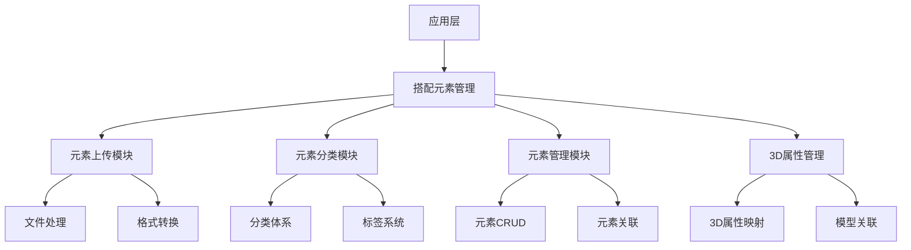
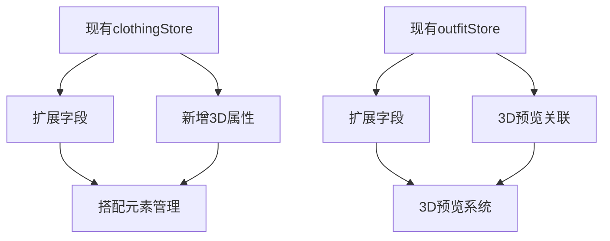
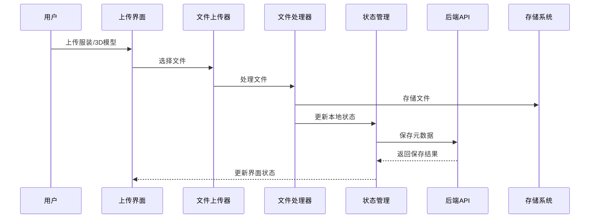
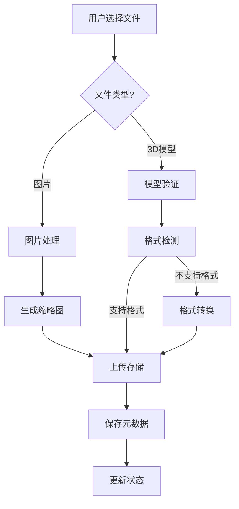
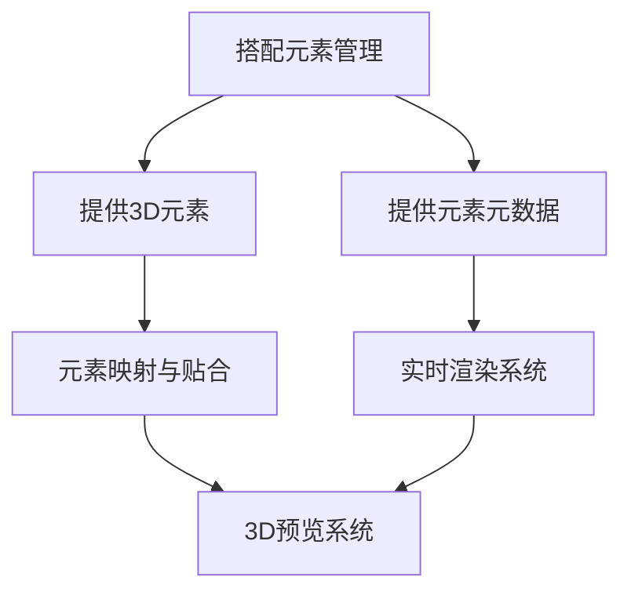

# StyleVault 3D搭配预览 - 搭配元素管理系统设计

## 1. 系统架构概述

### 1.1 架构层次


### 1.2 与现有系统集成


## 2. 技术实现方案

### 2.1 核心技术栈
- **现有技术**：Vue 3 + Pinia + TailwindCSS
- **新增技术**：
  - **filepond**：文件上传和处理
  - **sharp**：图片处理和转换
  - **@types/filepond**：TypeScript类型定义
  - **nanoid**：生成唯一ID

### 2.2 模块详细设计

#### 2.2.1 元素上传模块
- **功能**：
  - 支持多种文件格式上传（图片、3D模型）
  - 拖放上传和文件选择
  - 上传进度显示
  - 文件验证和大小限制

- **实现**：
  ```typescript
  // src/components/features/upload/ThreeDModelUpload.vue
  <template>
    <FilePond
      :allow-multiple="false"
      :accepted-file-types="['model/gltf-binary', 'model/obj', 'image/*']"
      :max-file-size="maxFileSize"
      @processfile="handleFileUpload"
      @error="handleError"
    />
  </template>
  ```

#### 2.2.2 元素分类模块
- **功能**：
  - 扩展现有分类体系
  - 支持3D元素专用分类
  - 多级分类管理
  - 标签系统增强

- **分类体系**：
  ```
  服装
  ├── 上衣
  │   ├── T恤
  │   ├── 衬衫
  │   └── 毛衣
  ├── 下装
  │   ├── 裤子
  │   ├── 裙子
  │   └── 短裤
  └── 连衣裙
 配饰
  ├── 帽子
  ├── 鞋子
  ├── 包包
  └── 首饰
 3D模型
  ├── 人体模型
  │   ├── 男性
  │   └── 女性
  └── 场景模型
  ```

#### 2.2.3 元素管理模块
- **功能**：
  - 元素CRUD操作
  - 元素关联管理
  - 元素版本控制
  - 元素预览生成

- **数据结构**：
  ```typescript
  interface ClothingItem {
    id: string;
    name: string;
    category: string;
    subcategory: string;
    price: number;
    brand: string;
    color: string;
    size: string;
    material: string;
    purchaseDate: string;
    images: string[];
    isFavorite: boolean;
    wearCount: number;
    // 新增3D属性
    threeDProperties?: {
      modelPath?: string;
      texturePath?: string;
      materialType?: string;
      fitPoints?: FitPoint[];
      defaultPosition?: Vector3;
      defaultRotation?: Euler;
      defaultScale?: Vector3;
    };
  }
  ```

#### 2.2.4 3D属性管理模块
- **功能**：
  - 3D模型属性设置
  - 材质属性配置
  - 贴合点设置
  - 预设模板管理

- **3D属性配置**：
  ```typescript
  interface ThreeDProperties {
    modelPath: string;       // 3D模型文件路径
    texturePath: string;     // 纹理文件路径
    materialType: string;     // 材质类型
    fitPoints: FitPoint[];    // 贴合点
    defaultPosition: Vector3; // 默认位置
    defaultRotation: Euler;   // 默认旋转
    defaultScale: Vector3;    // 默认缩放
    boundingBox: Box3;        // 边界框
    isDynamic: boolean;       // 是否动态（可变形）
  }
  ```

## 3. 数据流设计

### 3.1 数据流向


### 3.2 状态管理扩展
```typescript
// src/stores/modules/clothingStore.ts (扩展)
export const useClothingStore = defineStore('clothing', {
  state: () => ({
    // 现有状态...
    threeDElements: [],
    currentThreeDElement: null,
    threeDLoading: false,
  }),
  
  actions: {
    // 现有actions...
    
    // 新增3D相关actions
    async uploadThreeDElement(file, clothingId) {
      this.threeDLoading = true;
      try {
        // 上传3D模型文件
        const uploadedFile = await uploadFile(file);
        
        // 更新服装的3D属性
        const updatedClothing = await this.updateClothingItem(clothingId, {
          threeDProperties: {
            modelPath: uploadedFile.url,
            // 其他默认属性
          }
        });
        
        this.threeDElements.push(updatedClothing);
        return updatedClothing;
      } catch (error) {
        this.setError('上传3D元素失败');
        throw error;
      } finally {
        this.threeDLoading = false;
      }
    },
    
    async updateThreeDProperties(clothingId, properties) {
      try {
        return await this.updateClothingItem(clothingId, {
          threeDProperties: properties
        });
      } catch (error) {
        this.setError('更新3D属性失败');
        throw error;
      }
    }
  }
});
```

## 4. 技术接口设计

### 4.1 核心接口
```typescript
// 3D元素管理接口
interface ThreeDElementManager {
  uploadElement(file: File, clothingId: string): Promise<ThreeDElement>;
  updateElement(id: string, data: Partial<ThreeDElement>): Promise<ThreeDElement>;
  deleteElement(id: string): Promise<boolean>;
  getElement(id: string): Promise<ThreeDElement>;
  getElementsByCategory(category: string): Promise<ThreeDElement[]>;
}

// 3D元素接口
interface ThreeDElement {
  id: string;
  clothingId: string;
  type: 'model' | 'texture' | 'material';
  path: string;
  format: string;
  size: number;
  metadata: {
    name: string;
    description?: string;
    tags: string[];
  };
  properties: ThreeDProperties;
}
```

### 4.2 API接口扩展
- **现有接口**：保持不变
- **新增接口**：
  - `POST /api/clothing/{id}/three-d`：上传3D元素
  - `PUT /api/clothing/{id}/three-d`：更新3D属性
  - `GET /api/clothing/{id}/three-d`：获取3D属性
  - `DELETE /api/clothing/{id}/three-d`：删除3D元素

## 5. 功能模块设计

### 5.1 元素上传流程


### 5.2 元素分类与标签
- **分类体系**：
  - 基于现有分类扩展
  - 新增3D专用分类
  - 支持多级分类

- **标签系统**：
  - 扩展现有标签系统
  - 新增3D相关标签
  - 支持自定义标签

### 5.3 元素管理功能
- **基本管理**：
  - 创建、读取、更新、删除
  - 批量操作
  - 导入/导出

- **高级管理**：
  - 版本控制
  - 历史记录
  - 恢复功能

## 6. 与3D预览系统集成

### 6.1 集成点


### 6.2 数据传递
- **元素选择**：用户从搭配中选择元素应用到3D模型
- **属性传递**：3D属性从搭配元素传递到3D预览系统
- **状态同步**：搭配元素变更时，3D预览系统实时更新

## 7. 性能优化策略

### 7.1 上传优化
- **分块上传**：大文件分块上传
- **并行上传**：多文件并行上传
- **断点续传**：支持上传中断续传
- **压缩传输**：文件压缩后传输

### 7.2 存储优化
- **文件压缩**：3D模型和纹理压缩
- **格式优化**：转换为Web友好格式
- **CDN加速**：使用CDN分发静态资源
- **按需加载**：非关键资源按需加载

### 7.3 处理优化
- **后台处理**：复杂处理任务后台执行
- **缓存策略**：常用元素缓存
- **预计算**：预计算常用数据
- **批处理**：批量操作合并处理

## 8. 安全性考虑

### 8.1 上传安全
- **文件验证**：验证文件类型和大小
- **病毒扫描**：上传文件病毒扫描
- **权限控制**：上传权限验证
- **速率限制**：防止上传滥用

### 8.2 存储安全
- **文件加密**：敏感文件加密存储
- **访问控制**：文件访问权限控制
- **备份策略**：定期备份
- **灾难恢复**：制定灾难恢复计划

## 9. 实现路径

### 9.1 阶段一：基础扩展
1. 扩展现有clothingStore，添加3D属性字段
2. 实现基本的3D模型上传功能
3. 集成文件上传组件

### 9.2 阶段二：功能完善
1. 实现完整的3D属性管理
2. 扩展分类和标签系统
3. 实现元素关联和版本控制

### 9.3 阶段三：集成测试
1. 与3D渲染系统集成
2. 与搭配管理系统集成
3. 性能测试和优化

## 10. 技术风险评估

### 10.1 潜在风险
- **存储风险**：大量3D模型可能导致存储压力
- **性能风险**：复杂3D模型处理可能影响系统性能
- **兼容性风险**：不同3D格式可能存在兼容性问题
- **安全风险**：上传文件可能包含恶意内容

### 10.2 缓解策略
- **存储风险**：实现自动清理和存储优化
- **性能风险**：实现后台处理和异步操作
- **兼容性风险**：提供格式转换和标准化
- **安全风险**：实现严格的文件验证和扫描

## 11. 结论

搭配元素管理系统是3D搭配预览解决方案的重要组成部分，通过与现有系统的集成和扩展，为3D预览提供了必要的元素数据支持。

该设计方案充分考虑了：
- 与现有系统的无缝集成
- 3D元素的完整管理流程
- 性能优化和安全性
- 与3D预览系统的协同工作

为用户提供了一个直观、高效的搭配元素管理体验，同时为3D预览功能奠定了坚实的数据基础。