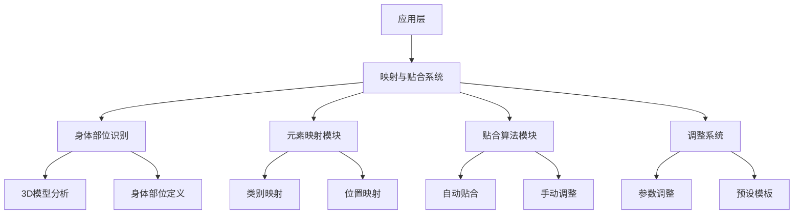
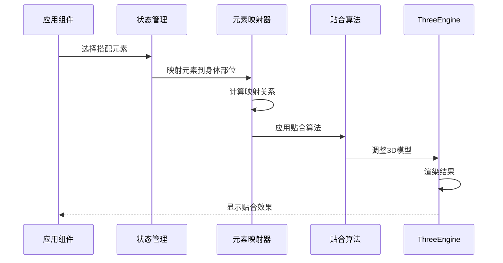
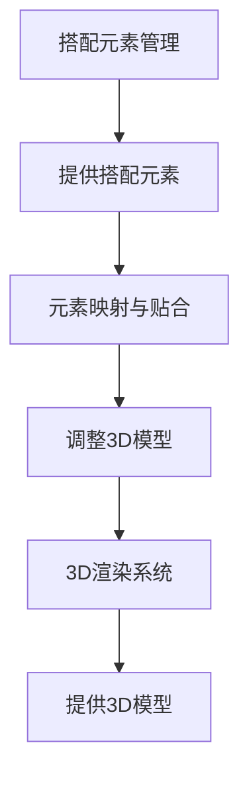

# StyleVault 3D搭配预览 - 元素映射与贴合系统设计

## 1. 系统架构概述

### 1.1 架构层次


### 1.2 核心组件关系
- **应用层**：Vue组件，负责用户交互和显示
- **映射与贴合系统**：核心处理逻辑
- **身体部位识别**：识别3D模型的身体部位
- **元素映射模块**：将搭配元素映射到对应身体部位
- **贴合算法模块**：实现元素与模型的自然贴合
- **调整系统**：提供手动调整功能

## 2. 技术实现方案

### 2.1 核心技术栈
- **Three.js**：核心3D操作
- **@types/three**：TypeScript类型定义
- **ml5.js**：可选，用于身体部位识别
- **d3.js**：数据可视化（可选）
- **lodash**：工具函数

### 2.2 模块详细设计

#### 2.2.1 身体部位识别
- **功能**：
  - 识别3D模型的关键身体部位
  - 为不同类型的3D模型定义标准身体部位
  - 支持自定义身体部位定义

- **实现**：
  ```typescript
  // src/core/body/BodyPartDetector.ts
  class BodyPartDetector {
    detectBodyParts(model: THREE.Object3D): BodyParts {
      // 基于模型结构识别身体部位
      // 返回标准身体部位映射
    }
    
    defineCustomBodyParts(customParts: BodyPart[]): void {
      // 定义自定义身体部位
    }
  }
  ```

#### 2.2.2 元素映射模块
- **功能**：
  - 基于服装类别自动映射到对应身体部位
  - 支持手动调整映射关系
  - 保存映射模板

- **映射规则**：
  | 服装类别 | 身体部位 |
  |---------|---------|
  | 上衣     | 胸部、手臂 |
  | 裤子     | 腰部、腿部 |
  | 裙子     | 腰部、臀部、腿部 |
  | 鞋子     | 脚部 |
  | 帽子     | 头部 |
  | 配饰     | 对应身体部位 |

#### 2.2.3 贴合算法模块
- **功能**：
  - 实现服装与身体的自然贴合
  - 支持基本的变形和调整
  - 处理碰撞检测

- **算法选择**：
  - **基础贴合**：基于骨骼的位置调整
  - **中级贴合**：简单的顶点变形
  - **高级贴合**：基于物理的布料模拟（可选）

#### 2.2.4 调整系统
- **功能**：
  - 提供直观的调整界面
  - 支持位置、旋转、缩放调整
  - 支持贴合参数调整
  - 保存调整预设

- **调整参数**：
  ```typescript
  interface FitAdjustment {
    position: THREE.Vector3;
    rotation: THREE.Euler;
    scale: THREE.Vector3;
    fitTightness: number; // 贴合度 0-1
    offset: THREE.Vector3; // 偏移量
    collisionEnabled: boolean; // 碰撞检测
  }
  ```

## 3. 技术实现细节

### 3.1 身体部位定义
```typescript
// src/core/body/BodyParts.ts
interface BodyPart {
  id: string;
  name: string;
  type: 'primary' | 'secondary';
  parent?: string;
  position: THREE.Vector3;
  rotation: THREE.Euler;
  scale: THREE.Vector3;
  boundingBox: THREE.Box3;
}

interface BodyParts {
  head: BodyPart;
  neck: BodyPart;
  chest: BodyPart;
  waist: BodyPart;
  hips: BodyPart;
  leftArm: BodyPart;
  rightArm: BodyPart;
  leftLeg: BodyPart;
  rightLeg: BodyPart;
  // 其他身体部位...
}
```

### 3.2 元素映射实现
```typescript
// src/core/mapping/ElementMapper.ts
class ElementMapper {
  mapElementToBodyPart(element: ClothingItem, bodyParts: BodyParts): MappingResult {
    // 基于元素类别确定目标身体部位
    const targetParts = this.determineTargetParts(element.category);
    
    // 计算初始位置和变换
    const transformations = this.calculateTransformations(element, bodyParts, targetParts);
    
    return {
      element,
      targetParts,
      transformations,
      fitPoints: this.calculateFitPoints(element, bodyParts, targetParts)
    };
  }
  
  private determineTargetParts(category: string): string[] {
    // 基于类别返回目标身体部位
    const mapping: Record<string, string[]> = {
      'top': ['chest', 'leftArm', 'rightArm'],
      'pants': ['waist', 'leftLeg', 'rightLeg'],
      'dress': ['chest', 'waist', 'hips', 'leftLeg', 'rightLeg'],
      // 其他类别...
    };
    
    return mapping[category] || ['chest'];
  }
}
```

### 3.3 贴合算法实现
```typescript
// src/core/fitting/FitAlgorithm.ts
class FitAlgorithm {
  fitElement(element: THREE.Object3D, bodyParts: BodyParts, mapping: MappingResult): void {
    // 应用基础变换
    this.applyBaseTransformations(element, mapping.transformations);
    
    // 实现贴合逻辑
    if (this.shouldUseAdvancedFitting(element)) {
      this.applyAdvancedFitting(element, bodyParts, mapping);
    } else {
      this.applyBasicFitting(element, bodyParts, mapping);
    }
    
    // 处理碰撞检测
    this.handleCollisions(element, bodyParts);
  }
  
  private applyBasicFitting(element: THREE.Object3D, bodyParts: BodyParts, mapping: MappingResult): void {
    // 基于身体部位的简单贴合
    const fitPoints = mapping.fitPoints;
    
    // 调整元素顶点以适应身体部位
    this.adjustVertices(element, bodyParts, fitPoints);
  }
  
  private applyAdvancedFitting(element: THREE.Object3D, bodyParts: BodyParts, mapping: MappingResult): void {
    // 更复杂的贴合算法，如布料模拟
    // 这里可以集成第三方物理引擎
  }
}
```

## 4. 数据流设计

### 4.1 数据流向


### 4.2 状态管理
```typescript
// src/stores/modules/fitStore.ts
export const useFitStore = defineStore('fit', {
  state: () => ({
    bodyParts: null,
    currentMapping: null,
    adjustmentPresets: [],
    currentAdjustment: null,
    fittingMode: 'auto', // auto, manual
  }),
  
  actions: {
    async mapElement(element, model) {
      // 映射元素到身体部位
    },
    
    async fitElement(element, model, mapping) {
      // 应用贴合算法
    },
    
    adjustFit(adjustment) {
      // 手动调整贴合效果
    },
    
    saveAdjustmentPreset(name, adjustment) {
      // 保存调整预设
    }
  }
});
```

## 5. 贴合效果设计

### 5.1 贴合质量等级
| 等级 | 描述 | 算法复杂度 | 性能影响 |
|------|------|-----------|---------|
| 基础 | 简单位置和缩放调整 | 低 | 最小 |
| 中级 | 基于身体部位的变形 | 中 | 中等 |
| 高级 | 基于物理的布料模拟 | 高 | 较大 |

### 5.2 贴合参数
```typescript
interface FitParameters {
  tightness: number; // 贴合度 0-1
  offset: THREE.Vector3; // 偏移量
  rotation: THREE.Euler; // 旋转调整
  scale: THREE.Vector3; // 缩放调整
  collisionDetection: boolean; // 碰撞检测
  deformationLevel: 'none' | 'basic' | 'advanced'; // 变形级别
}
```

## 6. 与其他系统集成

### 6.1 与3D渲染系统集成


### 6.2 与用户界面集成
- **贴合预览**：实时显示贴合效果
- **调整控件**：提供直观的调整界面
- **预设选择**：提供常用贴合预设

## 7. 性能优化策略

### 7.1 算法优化
- **计算优化**：
  - 使用空间分区减少碰撞检测计算
  - 实现LOD（Level of Detail）的贴合计算
  - 使用Web Workers进行复杂计算

- **缓存策略**：
  - 缓存常用身体部位映射
  - 缓存计算结果
  - 预计算常用搭配的贴合参数

### 7.2 渲染优化
- **网格合并**：合并相邻网格减少绘制调用
- **材质批处理**：批处理相同材质的渲染
- **视锥体剔除**：只处理可见元素

### 7.3 内存优化
- **对象池**：重用临时对象
- **资源懒加载**：按需加载资源
- **内存监控**：定期清理未使用资源

## 8. 实现路径

### 8.1 阶段一：基础映射
1. 实现基本的身体部位识别
2. 实现基于类别的元素映射
3. 实现基础的位置调整

### 8.2 阶段二：贴合算法
1. 实现基础贴合算法
2. 实现碰撞检测
3. 实现中级贴合效果

### 8.3 阶段三：高级功能
1. 实现高级贴合算法
2. 实现调整系统
3. 实现预设模板系统

### 8.4 阶段四：优化与集成
1. 性能优化
2. 与其他系统集成
3. 用户界面完善

## 9. 技术风险评估

### 9.1 潜在风险
- **复杂度风险**：贴合算法可能过于复杂，影响性能
- **精度风险**：不同3D模型的身体部位识别可能不准确
- **兼容性风险**：不同类型的服装可能需要不同的贴合策略
- **性能风险**：复杂的贴合计算可能导致卡顿

### 9.2 缓解策略
- **复杂度风险**：实现分级贴合算法，根据设备性能自动选择
- **精度风险**：提供手动调整功能，允许用户微调
- **兼容性风险**：为不同类型的服装实现专门的贴合策略
- **性能风险**：实现计算优化和缓存策略

## 10. 结论

元素映射与贴合系统是3D搭配预览解决方案的关键技术之一，通过精准的映射和自然的贴合效果，为用户提供真实的搭配预览体验。

该设计方案充分考虑了：
- 技术可行性和实现复杂度
- 性能优化和资源管理
- 用户体验和交互便捷性
- 与其他系统的无缝集成

通过分级实现和优化策略，可以在保证效果的同时，确保系统在主流设备上的流畅运行。