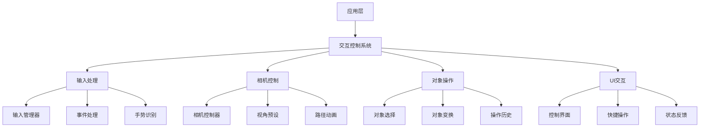
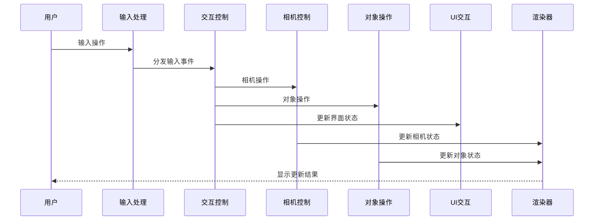
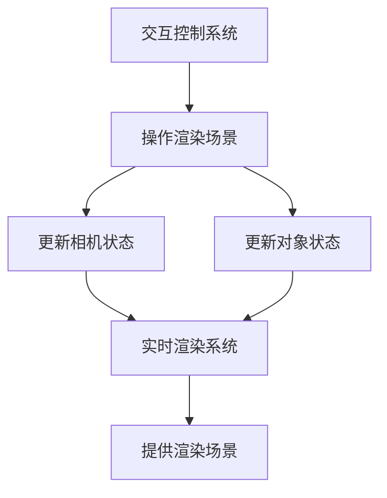

# StyleVault 3D搭配预览 - 交互控制系统设计

## 1. 系统架构概述

### 1.1 架构层次


### 1.2 核心组件关系
- **应用层**：Vue组件，负责用户交互和显示
- **交互控制系统**：核心交互逻辑
- **输入处理**：处理各种输入设备的输入
- **相机控制**：管理相机视角和动画
- **对象操作**：处理3D对象的选择和变换
- **UI交互**：提供用户界面交互元素

## 2. 技术实现方案

### 2.1 核心技术栈
- **Three.js**：核心3D操作
- **@types/three**：TypeScript类型定义
- **three/examples/jsm/controls**：相机控制
- **hammerjs**：触摸手势识别（可选）
- **lodash**：工具函数

### 2.2 模块详细设计

#### 2.2.1 输入处理
- **功能**：
  - 处理鼠标、键盘、触摸输入
  - 实现手势识别
  - 管理输入事件分发
  - 支持多输入设备

- **实现**：
  ```typescript
  // src/core/interaction/InputManager.ts
  class InputManager {
    private domElement: HTMLElement;
    private handlers: Map<string, Function[]>;
    private isDragging: boolean;
    private lastMousePosition: THREE.Vector2;
    
    constructor(domElement: HTMLElement) {
      this.domElement = domElement;
      this.initEventListeners();
    }
    
    on(event: string, handler: Function): void {
      // 注册事件处理器
    }
    
    off(event: string, handler: Function): void {
      // 移除事件处理器
    }
    
    // 其他方法...
  }
  ```

#### 2.2.2 相机控制
- **功能**：
  - 实现视角旋转、缩放、平移
  - 提供预设视角
  - 支持相机路径动画
  - 实现第一人称和第三人称视角

- **实现**：
  ```typescript
  // src/core/interaction/CameraController.ts
  class CameraController {
    private camera: THREE.PerspectiveCamera;
    private controls: THREE.OrbitControls;
    private domElement: HTMLElement;
    private viewPresets: Map<string, CameraView>;
    
    constructor(camera: THREE.PerspectiveCamera, domElement: HTMLElement) {
      this.camera = camera;
      this.initControls(domElement);
      this.initViewPresets();
    }
    
    setViewPreset(presetName: string): void {
      // 切换到预设视角
    }
    
    animateToView(presetName: string, duration: number): Promise<void> {
      // 动画过渡到指定视角
    }
    
    // 其他方法...
  }
  ```

#### 2.2.3 对象操作
- **功能**：
  - 实现3D对象选择
  - 支持对象平移、旋转、缩放
  - 提供操作辅助（如网格、轴辅助）
  - 实现操作历史和撤销/重做

- **实现**：
  ```typescript
  // src/core/interaction/ObjectManipulator.ts
  class ObjectManipulator {
    private scene: THREE.Scene;
    private camera: THREE.Camera;
    private renderer: THREE.Renderer;
    private raycaster: THREE.Raycaster;
    private selectedObject: THREE.Object3D | null;
    private transformControls: any; // THREE.TransformControls
    
    constructor(scene: THREE.Scene, camera: THREE.Camera, renderer: THREE.Renderer) {
      this.scene = scene;
      this.camera = camera;
      this.renderer = renderer;
      this.initTransformControls();
    }
    
    selectObject(position: THREE.Vector2): THREE.Object3D | null {
      // 选择对象
    }
    
    transformObject(mode: 'translate' | 'rotate' | 'scale'): void {
      // 设置变换模式
    }
    
    // 其他方法...
  }
  ```

#### 2.2.4 UI交互
- **功能**：
  - 提供直观的控制界面
  - 实现快捷操作按钮
  - 显示操作状态反馈
  - 支持键盘快捷键

- **实现**：
  ```typescript
  // src/core/interaction/UIInteraction.ts
  class UIInteraction {
    private container: HTMLElement;
    private controls: ControlPanel[];
    private shortcuts: Map<string, Function>;
    
    constructor(container: HTMLElement) {
      this.container = container;
      this.initControlPanels();
      this.initKeyboardShortcuts();
    }
    
    showControlPanel(panelName: string): void {
      // 显示控制面板
    }
    
    hideControlPanel(panelName: string): void {
      // 隐藏控制面板
    }
    
    // 其他方法...
  }
  ```

## 3. 数据流设计

### 3.1 数据流向


### 3.2 状态管理
```typescript
// src/stores/modules/interactionStore.ts
export const useInteractionStore = defineStore('interaction', {
  state: () => ({
    isDragging: false,
    isSelecting: false,
    currentTool: 'camera', // camera, select, transform
    currentTransformMode: 'translate', // translate, rotate, scale
    selectedObject: null,
    cameraPosition: { x: 0, y: 0, z: 5 },
    cameraTarget: { x: 0, y: 0, z: 0 },
    viewPresets: {
      front: { position: [0, 0, 5], target: [0, 0, 0] },
      side: { position: [5, 0, 0], target: [0, 0, 0] },
      top: { position: [0, 5, 0], target: [0, 0, 0] },
      back: { position: [0, 0, -5], target: [0, 0, 0] },
    },
  }),
  
  actions: {
    setTool(tool: string) {
      this.currentTool = tool;
    },
    
    setTransformMode(mode: string) {
      this.currentTransformMode = mode;
    },
    
    selectObject(object: any) {
      this.selectedObject = object;
    },
    
    deselectObject() {
      this.selectedObject = null;
    },
    
    setCameraPosition(position: { x: number, y: number, z: number }) {
      this.cameraPosition = position;
    },
    
    setCameraTarget(target: { x: number, y: number, z: number }) {
      this.cameraTarget = target;
    },
    
    switchToViewPreset(presetName: string) {
      const preset = this.viewPresets[presetName];
      if (preset) {
        this.cameraPosition = {
          x: preset.position[0],
          y: preset.position[1],
          z: preset.position[2],
        };
        this.cameraTarget = {
          x: preset.target[0],
          y: preset.target[1],
          z: preset.target[2],
        };
      }
    },
  }
});
```

## 4. 交互功能设计

### 4.1 相机控制功能
- **基本操作**：
  - 旋转：鼠标拖动 / 触摸旋转
  - 缩放：鼠标滚轮 / 触摸捏合
  - 平移：Shift+拖动 / 触摸平移

- **高级功能**：
  - 视角预设：前、侧、顶、后等预设视角
  - 路径动画：相机路径动画
  - 自动环绕：自动环绕观察对象

### 4.2 对象操作功能
- **选择功能**：
  - 单击选择：单击3D对象进行选择
  - 框选：拖动框选多个对象
  - 选择模式：单选、多选

- **变换功能**：
  - 平移：移动对象位置
  - 旋转：旋转对象角度
  - 缩放：调整对象大小
  - 精确输入：数值输入变换参数

### 4.3 快捷操作
- **键盘快捷键**：
  - W：平移模式
  - E：旋转模式
  - R：缩放模式
  - Esc：取消选择
  - F：聚焦选中对象
  - Space：重置视角

- **鼠标快捷操作**：
  - 双击：聚焦对象
  - 右键：上下文菜单
  - 中键：快速平移

### 4.4 多设备支持
- **桌面端**：
  - 鼠标+键盘操作
  - 精确控制
  - 丰富的快捷操作

- **移动端**：
  - 触摸手势操作
  - 简化控制界面
  - 自适应布局

## 5. 与其他系统集成

### 5.1 与实时渲染系统集成


### 5.2 与元素映射系统集成
- **对象选择**：支持选择搭配元素进行调整
- **实时反馈**：调整操作实时反馈到映射系统
- **操作历史**：记录映射调整历史

### 5.3 与用户界面集成
- **控制界面**：与Vue组件集成的控制界面
- **状态同步**：界面状态与交互状态同步
- **响应式设计**：适配不同屏幕尺寸

## 6. 性能优化策略

### 6.1 输入处理优化
- **事件节流**：对高频输入事件进行节流
- **事件委托**：使用事件委托减少事件监听器
- **输入预测**：实现输入预测减少延迟

### 6.2 渲染优化
- **相机移动平滑**：使用插值实现平滑相机移动
- **视锥体剔除**：只处理视锥体内的对象
- **LOD系统**：基于距离调整对象细节

### 6.3 内存优化
- **对象池**：重用临时对象
- **事件清理**：及时清理事件监听器
- **资源释放**：释放未使用的资源

## 7. 实现路径

### 7.1 阶段一：基础交互
1. 实现基本的相机控制
2. 实现输入处理系统
3. 实现基础对象选择

### 7.2 阶段二：核心功能
1. 实现对象变换操作
2. 实现视角预设
3. 实现控制界面

### 7.3 阶段三：高级功能
1. 实现手势识别
2. 实现操作历史和撤销/重做
3. 实现路径动画

### 7.4 阶段四：优化与集成
1. 性能优化
2. 与其他系统集成
3. 多设备适配

## 8. 技术风险评估

### 8.1 潜在风险
- **兼容性风险**：不同设备和浏览器的输入处理差异
- **性能风险**：复杂交互可能影响渲染性能
- **用户体验风险**：交互设计可能不够直观
- **实现复杂度风险**：系统复杂度可能影响开发和维护

### 8.2 缓解策略
- **兼容性风险**：使用标准化的输入处理库，提供降级方案
- **性能风险**：实现输入节流和渲染优化
- **用户体验风险**：进行用户测试，优化交互设计
- **实现复杂度风险**：模块化设计，保持代码清晰

## 9. 结论

交互控制系统是3D搭配预览解决方案的重要组成部分，通过直观、流畅的交互体验，使用户能够全方位查看和调整搭配效果。

该设计方案充分考虑了：
- 技术可行性和实现复杂度
- 性能优化和资源管理
- 用户体验和交互便捷性
- 与其他系统的无缝集成

通过分级实现和优化策略，可以在保证交互流畅性的同时，确保系统在不同设备上的良好表现，为用户提供出色的3D搭配预览交互体验。