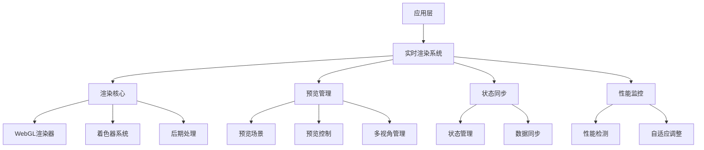
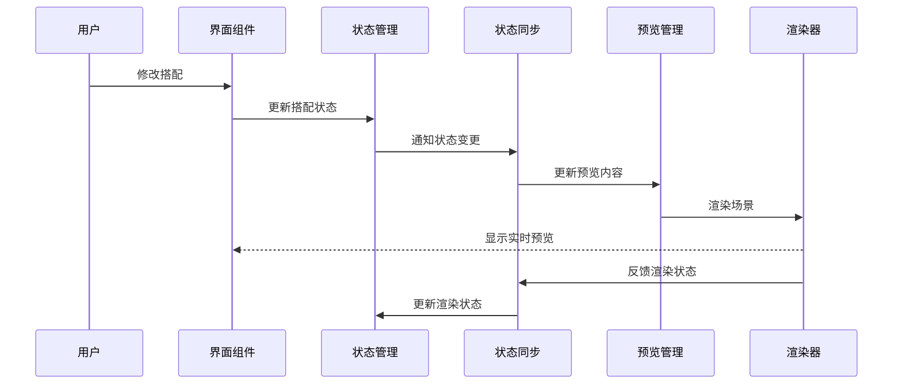
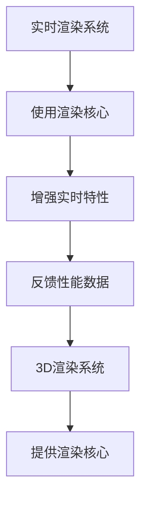

# StyleVault 3D搭配预览 - 实时渲染与预览系统设计

## 1. 系统架构概述

### 1.1 架构层次


### 1.2 核心组件关系
- **应用层**：Vue组件，负责用户交互和显示
- **实时渲染系统**：核心渲染逻辑
- **渲染核心**：基于Three.js的渲染实现
- **预览管理**：管理预览场景和控制
- **状态同步**：确保预览状态与搭配状态同步
- **性能监控**：监控和优化渲染性能

## 2. 技术实现方案

### 2.1 核心技术栈
- **Three.js**：核心3D渲染
- **@types/three**：TypeScript类型定义
- **postprocessing**：后期处理效果
- **lil-gui**：调试和控制界面（可选）
- **stats.js**：性能监控（可选）

### 2.2 模块详细设计

#### 2.2.1 渲染核心
- **功能**：
  - 高性能WebGL渲染
  - 着色器系统管理
  - 后期处理效果
  - 多渲染目标支持

- **实现**：
  ```typescript
  // src/core/rendering/RealtimeRenderer.ts
  class RealtimeRenderer {
    private renderer: THREE.WebGLRenderer;
    private composer: any; // postprocessing composer
    private scene: THREE.Scene;
    private camera: THREE.PerspectiveCamera;
    private postprocessing: boolean;
    
    constructor(container: HTMLElement, options: RendererOptions) {
      this.initRenderer(container, options);
      this.initPostprocessing();
      this.setupRenderLoop();
    }
    
    render(): void {
      if (this.postprocessing) {
        this.composer.render();
      } else {
        this.renderer.render(this.scene, this.camera);
      }
    }
    
    // 其他方法...
  }
  ```

#### 2.2.2 预览管理
- **功能**：
  - 管理预览场景
  - 支持多视角预览
  - 预览状态控制
  - 预览质量调整

- **实现**：
  ```typescript
  // src/core/preview/PreviewManager.ts
  class PreviewManager {
    private scenes: Map<string, THREE.Scene>;
    private cameras: Map<string, THREE.Camera>;
    private currentView: string;
    private renderer: RealtimeRenderer;
    
    createPreviewScene(name: string, options: SceneOptions): THREE.Scene {
      // 创建预览场景
    }
    
    switchView(viewName: string): void {
      // 切换视角
    }
    
    updatePreview(element: ClothingItem): void {
      // 更新预览内容
    }
  }
  ```

#### 2.2.3 状态同步
- **功能**：
  - 搭配状态与3D预览同步
  - 实时响应搭配变更
  - 状态历史记录
  - 撤销/重做功能

- **实现**：
  ```typescript
  // src/core/sync/StateSync.ts
  class StateSync {
    private store: any; // Pinia store
    private previewManager: PreviewManager;
    private history: StateHistory[];
    
    syncOutfitToPreview(outfit: Outfit): void {
      // 将搭配同步到预览
    }
    
    syncPreviewToState(): void {
      // 将预览状态同步回应用状态
    }
    
    undo(): void {
      // 撤销操作
    }
    
    redo(): void {
      // 重做操作
    }
  }
  ```

#### 2.2.4 性能监控
- **功能**：
  - 实时性能检测
  - FPS监控
  - 渲染时间分析
  - 自动性能调整

- **实现**：
  ```typescript
  // src/core/performance/PerformanceMonitor.ts
  class PerformanceMonitor {
    private stats: any; // stats.js实例
    private fpsHistory: number[];
    private renderTimeHistory: number[];
    private adaptationManager: PerformanceAdapter;
    
    monitor(): void {
      // 开始监控
    }
    
    getPerformanceMetrics(): PerformanceMetrics {
      // 获取性能指标
    }
    
    detectPerformanceIssues(): PerformanceIssue[] {
      // 检测性能问题
    }
  }
  ```

## 3. 数据流设计

### 3.1 数据流向


### 3.2 状态管理
```typescript
// src/stores/modules/previewStore.ts
export const usePreviewStore = defineStore('preview', {
  state: () => ({
    isPreviewing: false,
    currentView: 'front',
    qualityLevel: 'medium',
    performance: {
      fps: 0,
      renderTime: 0,
      drawCalls: 0,
    },
    previewSettings: {
      lighting: 'studio',
      background: 'white',
      shadows: true,
      postprocessing: true,
    },
  }),
  
  actions: {
    startPreview() {
      this.isPreviewing = true;
    },
    
    stopPreview() {
      this.isPreviewing = false;
    },
    
    switchView(viewName: string) {
      this.currentView = viewName;
    },
    
    setQualityLevel(level: 'low' | 'medium' | 'high') {
      this.qualityLevel = level;
    },
    
    updatePerformance(metrics: PerformanceMetrics) {
      this.performance = metrics;
    },
  }
});
```

## 4. 实时渲染特性

### 4.1 渲染质量控制
- **质量级别**：
  - 低：基础渲染，无阴影，低分辨率
  - 中：标准渲染，软阴影，中等分辨率
  - 高：高级渲染，实时阴影，高分辨率，后期处理

- **动态调整**：
  - 基于设备性能自动调整
  - 基于电池状态调整（移动设备）
  - 基于场景复杂度调整

### 4.2 光照系统
```typescript
// src/core/lighting/LightingSystem.ts
class LightingSystem {
  private scene: THREE.Scene;
  private lights: Map<string, THREE.Light>;
  private presets: LightingPreset[];
  
  createStudioLighting(): void {
    // 创建工作室光照
  }
  
  createNaturalLighting(): void {
    // 创建自然光照
  }
  
  createCustomLighting(config: LightingConfig): void {
    // 创建自定义光照
  }
}
```

### 4.3 后期处理效果
- **支持的效果**：
  - 抗锯齿（FXAA/TAA）
  -  bloom（光晕）
  - 景深
  - 色彩校正
  - 环境光遮蔽（AO）

- **实现**：
  ```typescript
  // src/core/rendering/PostProcessing.ts
  class PostProcessing {
    private composer: any;
    private effects: Map<string, any>;
    
    enableEffect(effectName: string, options?: any): void {
      // 启用后期处理效果
    }
    
    disableEffect(effectName: string): void {
      // 禁用后期处理效果
    }
    
    updateEffects(): void {
      // 更新效果参数
    }
  }
  ```

## 5. 多视角预览系统

### 5.1 预设视角
- **前视图**：正面观察
- **侧视图**：侧面观察
- **后视图**：背面观察
- **俯视图**：顶部观察
- **3/4视图**：斜角观察

### 5.2 自定义视角
- **自由视角**：用户可自由调整
- **保存视角**：允许用户保存自定义视角
- **视角切换动画**：平滑过渡效果

## 6. 性能优化策略

### 6.1 渲染优化
- **视锥体剔除**：只渲染可见对象
- **LOD系统**：基于距离调整模型复杂度
- **批处理**：合并绘制调用
- **实例化渲染**：使用InstancedMesh
- **材质优化**：减少材质切换

### 6.2 资源优化
- **纹理压缩**：使用压缩纹理格式
- **资源预加载**：提前加载必要资源
- **资源缓存**：缓存常用资源
- **按需加载**：非关键资源延迟加载

### 6.3 自适应性能
- **性能检测**：实时检测设备性能
- **自动调整**：根据性能动态调整渲染设置
- **降级策略**：在低性能设备上自动降级效果

## 7. 与其他系统集成

### 7.1 与3D渲染系统集成


### 7.2 与元素映射系统集成
- **实时贴合**：元素映射变更时实时更新预览
- **贴合预览**：提供贴合效果的实时预览
- **调整反馈**：实时反馈调整效果

### 7.3 与用户界面集成
- **预览控件**：提供直观的预览控制界面
- **性能指示器**：显示当前性能状态
- **质量设置**：允许用户手动调整质量设置

## 8. 实现路径

### 8.1 阶段一：基础渲染
1. 实现基本的实时渲染系统
2. 集成Three.js渲染器
3. 实现基础光照系统

### 8.2 阶段二：预览功能
1. 实现多视角预览
2. 实现状态同步
3. 实现基础性能监控

### 8.3 阶段三：高级特性
1. 实现后期处理效果
2. 实现自适应性能调整
3. 实现高级光照系统

### 8.4 阶段四：优化与集成
1. 性能优化
2. 与其他系统集成
3. 用户界面完善

## 9. 技术风险评估

### 9.1 潜在风险
- **性能风险**：实时渲染可能在低配置设备上卡顿
- **兼容性风险**：不同浏览器对WebGL支持程度不同
- **资源风险**：高质量渲染可能消耗过多资源
- **复杂度风险**：系统复杂度可能影响维护性

### 9.2 缓解策略
- **性能风险**：实现自适应性能调整和降级策略
- **兼容性风险**：提供WebGL检测和降级方案
- **资源风险**：实现资源优化和按需加载
- **复杂度风险**：模块化设计，保持代码清晰

## 10. 结论

实时渲染与预览系统是3D搭配预览解决方案的核心展示层，通过高质量的实时渲染和流畅的用户体验，为用户提供真实的搭配效果预览。

该设计方案充分考虑了：
- 技术可行性和实现复杂度
- 性能优化和资源管理
- 用户体验和交互便捷性
- 与其他系统的无缝集成

通过分级实现和优化策略，可以在保证渲染质量的同时，确保系统在主流设备上的流畅运行，为用户提供出色的3D搭配预览体验。