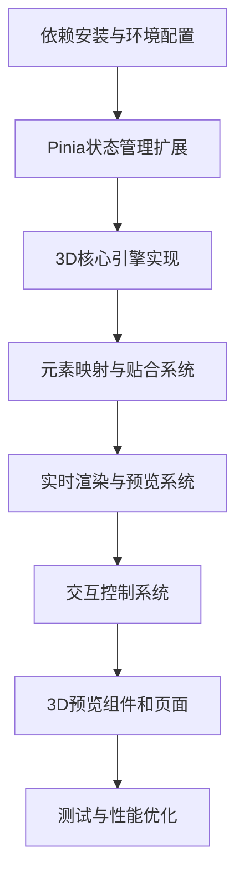

# StyleVault 3D搭配预览 - 任务拆分文档

## 项目信息
- **项目名称**: StyleVault 3D搭配预览系统
- **工作目录**: `/Users/sunxiaokai/Desktop/stylevault-vue-project`
- **技术栈**: Vue 3 + Vite + Pinia + Three.js

## 任务拆分

### 1. 依赖安装与环境配置
**任务ID**: task-3
**优先级**: 高
**输入契约**:
- 前置依赖: 项目已初始化的Vue 3 + Vite项目
- 输入数据: 无
- 环境依赖: Node.js 16+

**输出契约**:
- 输出数据: 更新后的package.json
- 交付物: 安装Three.js及相关依赖
- 验收标准: 依赖安装成功，无错误

**实现约束**:
- 技术栈: npm/yarn
- 接口规范: 遵循项目现有依赖管理方式
- 质量要求: 安装最新稳定版本的Three.js

**依赖关系**:
- 后置任务: 所有3D相关任务
- 并行任务: 无

### 2. Pinia状态管理扩展
**任务ID**: task-4
**优先级**: 高
**输入契约**:
- 前置依赖: 依赖安装完成
- 输入数据: 现有的outfitStore.js和clothingStore.js
- 环境依赖: Pinia已安装

**输出契约**:
- 输出数据: 新增的fitStore.js, threeStore.js, previewStore.js, interactionStore.js
- 交付物: 完整的状态管理模块
- 验收标准: 所有store模块创建成功，与现有store集成良好

**实现约束**:
- 技术栈: Pinia + TypeScript
- 接口规范: 遵循现有store的设计模式
- 质量要求: 类型定义完整，状态管理逻辑清晰

**依赖关系**:
- 后置任务: 3D核心引擎实现
- 并行任务: 无

### 3. 3D核心引擎实现
**任务ID**: task-5
**优先级**: 高
**输入契约**:
- 前置依赖: 依赖安装完成，状态管理扩展完成
- 输入数据: threeStore状态
- 环境依赖: Three.js库

**输出契约**:
- 输出数据: ThreeEngine类及其相关组件
- 交付物: 完整的3D渲染引擎
- 验收标准: 引擎初始化成功，支持模型加载和渲染

**实现约束**:
- 技术栈: Three.js + TypeScript
- 接口规范: 模块化设计，清晰的API
- 质量要求: 性能优化，错误处理完善

**依赖关系**:
- 后置任务: 元素映射与贴合系统
- 并行任务: 无

### 4. 元素映射与贴合系统
**任务ID**: task-6
**优先级**: 中
**输入契约**:
- 前置依赖: 3D核心引擎实现完成
- 输入数据: fitStore状态，clothingStore中的搭配元素
- 环境依赖: ThreeEngine实例

**输出契约**:
- 输出数据: 元素映射逻辑，贴合算法
- 交付物: 完整的元素映射与贴合系统
- 验收标准: 搭配元素能正确映射到3D模型并自然贴合

**实现约束**:
- 技术栈: Three.js + TypeScript
- 接口规范: 与3D引擎和状态管理集成
- 质量要求: 贴合效果自然，性能稳定

**依赖关系**:
- 后置任务: 实时渲染与预览系统
- 并行任务: 无

### 5. 实时渲染与预览系统
**任务ID**: task-7
**优先级**: 中
**输入契约**:
- 前置依赖: 3D核心引擎和元素映射系统实现完成
- 输入数据: previewStore状态，ThreeEngine实例
- 环境依赖: WebGL支持

**输出契约**:
- 输出数据: 实时渲染逻辑，预览管理
- 交付物: 完整的实时渲染与预览系统
- 验收标准: 实时预览流畅，支持多视图

**实现约束**:
- 技术栈: Three.js + TypeScript
- 接口规范: 与状态管理集成
- 质量要求: 30+ FPS稳定渲染

**依赖关系**:
- 后置任务: 交互控制系统
- 并行任务: 无

### 6. 交互控制系统
**任务ID**: task-8
**优先级**: 中
**输入契约**:
- 前置依赖: 实时渲染与预览系统实现完成
- 输入数据: interactionStore状态，ThreeEngine实例
- 环境依赖: 鼠标/键盘/触摸输入支持

**输出契约**:
- 输出数据: 交互控制逻辑，相机控制
- 交付物: 完整的交互控制系统
- 验收标准: 支持视角调整、缩放、旋转等操作

**实现约束**:
- 技术栈: Three.js + TypeScript
- 接口规范: 与状态管理集成
- 质量要求: 交互响应流畅，多设备支持

**依赖关系**:
- 后置任务: 3D预览组件和页面
- 并行任务: 无

### 7. 3D预览组件和页面
**任务ID**: task-9
**优先级**: 中
**输入契约**:
- 前置依赖: 所有核心系统实现完成
- 输入数据: 所有store状态
- 环境依赖: Vue 3组件系统

**输出契约**:
- 输出数据: 3D预览组件，路由配置
- 交付物: 完整的3D预览页面
- 验收标准: 页面加载成功，功能完整

**实现约束**:
- 技术栈: Vue 3 + TypeScript + TailwindCSS
- 接口规范: 遵循现有组件设计模式
- 质量要求: UI美观，交互流畅

**依赖关系**:
- 后置任务: 测试与性能优化
- 并行任务: 无

### 8. 测试与性能优化
**任务ID**: task-10
**优先级**: 低
**输入契约**:
- 前置依赖: 所有功能实现完成
- 输入数据: 完整的3D预览系统
- 环境依赖: 浏览器环境

**输出契约**:
- 输出数据: 性能优化配置，测试报告
- 交付物: 优化后的3D预览系统
- 验收标准: 主流设备上30+ FPS稳定渲染

**实现约束**:
- 技术栈: 浏览器开发者工具，性能分析工具
- 接口规范: 无
- 质量要求: 性能优化明显，无内存泄漏

**依赖关系**:
- 后置任务: 无
- 并行任务: 无

## 任务依赖图

## 执行顺序
1. 依赖安装与环境配置 (task-3)
2. Pinia状态管理扩展 (task-4)
3. 3D核心引擎实现 (task-5)
4. 元素映射与贴合系统 (task-6)
5. 实时渲染与预览系统 (task-7)
6. 交互控制系统 (task-8)
7. 3D预览组件和页面 (task-9)
8. 测试与性能优化 (task-10)

## 验收标准
- 所有任务完成，无错误
- 3D预览系统功能完整
- 性能达到30+ FPS稳定渲染
- 代码质量符合项目规范
- 文档完整，与代码同步

## 风险评估
- **技术风险**: Three.js性能优化可能需要更多时间
- **集成风险**: 与现有系统集成可能遇到兼容性问题
- **时间风险**: 3D功能实现复杂度较高，可能需要调整时间计划

## 缓解策略
- 优先实现核心功能，再进行性能优化
- 定期测试与现有系统的集成
- 预留足够的性能优化时间