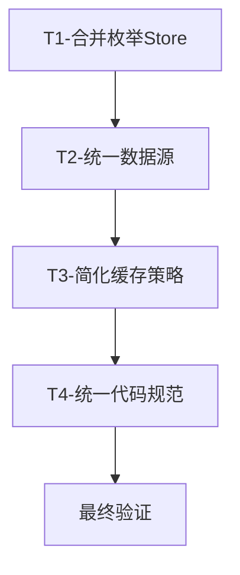

# Store 模块优化方案

## 一、概述

### 1.1 文档目的
本文档基于 `stores` 目录的全面系统性梳理，制定详细的优化实施计划，明确优化目标、实施步骤、时间安排和风险控制措施。

### 1.2 优化背景
当前 Store 模块存在以下问题：
- **代码冗余**：`enums.js` 与 `enumsStore.js` 功能重复
- **数据源不统一**：`selectedClothes` 存在多处定义
- **架构风格不一致**：Options API 与 Setup API 混用
- **缓存策略复杂**：内存缓存 + localStorage 双层缓存

### 1.3 优化目标
| 指标 | 当前状态 | 目标状态 | 提升幅度 |
|-----|---------|---------|---------|
| 代码行数 | ~2400 行 | ~2000 行 | -17% |
| Store 文件数 | 11 个 | 9 个 | -18% |
| 命名规范率 | 60% | 100% | +40% |
| 统一风格率 | 50% | 100% | +50% |

---

## 二、优化任务详细说明

### 任务 1：合并枚举 Store

**任务 ID**：T1-ENUM-MERGE

**问题描述**：
```
stores/enums.js (260行)      ← Setup API，缓存完善
stores/modules/enumsStore.js (87行) ← Options API，简化版

功能完全重复，依赖关系混乱
```

**实施方案**：

#### 步骤 1.1：选择最优实现作为基础
- **选择**：`stores/modules/enumsStore.js` 作为基础（结构更清晰）
- **保留**：`stores/enums.js` 中的缓存逻辑（5分钟 localStorage 缓存）
- **补充**：颜色支持（`includeColor` 参数）

#### 步骤 1.2：合并后的实现

```javascript
// stores/modules/enumsStore.js

import { defineStore } from 'pinia';
import { ref, computed } from 'vue';
import { enumsApi } from '../../services/apiClient';

// 枚举类型列表（统一管理，避免硬编码）
const ENUM_TYPES = [
  'categories', 'styles', 'colors', 'seasons',
  'materials', 'patterns', 'sizes', 'conditions',
  'statuses', 'occasions'
];

export const useEnumsStore = defineStore('enums', () => {
  // 状态
  const enumsData = ref(Object.fromEntries(ENUM_TYPES.map(type => [type, []])));
  const loading = ref(false);
  const error = ref(null);
  const isLoaded = ref(false);
  let requestPromise = null;

  // 缓存管理（5分钟有效期）
  const CACHE_KEY = 'stylevault-enums';
  const CACHE_DURATION = 5 * 60 * 1000;

  const getCachedData = () => {
    try {
      const cached = localStorage.getItem(CACHE_KEY);
      if (cached) {
        const { data, timestamp } = JSON.parse(cached);
        if (Date.now() - timestamp < CACHE_DURATION) {
          return data;
        }
      }
    } catch (e) {
      console.error('读取枚举缓存失败:', e);
    }
    return null;
  };

  const setCachedData = (data) => {
    try {
      localStorage.setItem(CACHE_KEY, JSON.stringify({
        data,
        timestamp: Date.now()
      }));
    } catch (e) {
      console.error('保存枚举缓存失败:', e);
    }
  };

  // 计算属性
  const createEnumOptions = (items, includeColor = false) => {
    return items.map(item => ({
      value: item.id ?? item.value ?? '',
      label: item.label ?? item.name ?? '未命名',
      ...(includeColor && item.color ? { color: item.color } : {})
    }));
  };

  const categoryOptions = computed(() => createEnumOptions(enumsData.value.categories));
  const styleOptions = computed(() => createEnumOptions(enumsData.value.styles));
  const seasonOptions = computed(() => createEnumOptions(enumsData.value.seasons));
  const occasionOptions = computed(() => createEnumOptions(enumsData.value.occasions));
  const materialOptions = computed(() => createEnumOptions(enumsData.value.materials));
  const colorOptions = computed(() => createEnumOptions(enumsData.value.colors, true));
  const sizeOptions = computed(() => createEnumOptions(enumsData.value.sizes));
  const conditionOptions = computed(() => createEnumOptions(enumsData.value.conditions));

  // 获取选项列表（兼容旧接口）
  const getOptions = (type) => {
    if (!ENUM_TYPES.includes(type)) return [];
    
    // 返回格式兼容：优先返回格式化选项，否则返回原始数据
    const optionsMap = {
      categories: categoryOptions.value,
      styles: styleOptions.value,
      seasons: seasonOptions.value,
      occasions: occasionOptions.value,
      materials: materialOptions.value,
      colors: colorOptions.value,
      sizes: sizeOptions.value,
      conditions: conditionOptions.value
    };
    
    return optionsMap[type] || enumsData.value[type];
  };

  // 根据类型和id获取label
  const getLabel = (type, id) => {
    if (!ENUM_TYPES.includes(type) || !id || !enumsData.value[type]?.length) {
      return id;
    }
    const item = enumsData.value[type].find(item => 
      item.value === String(id) || item.id === id
    );
    return item?.label ?? item?.name ?? id;
  };

  // 获取所有枚举数据
  const fetchAllEnums = async (forceRefresh = false) => {
    if (loading.value || (isLoaded.value && !forceRefresh)) return;

    // 检查缓存
    if (!forceRefresh) {
      const cached = getCachedData();
      if (cached) {
        Object.keys(cached).forEach(key => {
          if (ENUM_TYPES.includes(key)) {
            enumsData.value[key] = Array.isArray(cached[key]) ? cached[key] : [];
          }
        });
        isLoaded.value = true;
        return;
      }
    }

    // 防止并发请求
    if (requestPromise) return requestPromise;

    loading.value = true;
    error.value = null;

    try {
      requestPromise = enumsApi.getAllEnums();
      const response = await requestPromise;
      const data = response.data || response;

      if (data && typeof data === 'object') {
        Object.keys(data).forEach(key => {
          if (ENUM_TYPES.includes(key)) {
            enumsData.value[key] = Array.isArray(data[key]) ? data[key] : [];
          }
        });
      }

      setCachedData(enumsData.value);
      isLoaded.value = true;
      console.log('✅ 枚举数据加载成功');
    } catch (err) {
      error.value = err.message || '加载枚举数据失败';
      console.error('❌ 加载枚举数据失败:', err);
    } finally {
      loading.value = false;
      requestPromise = null;
    }
  };

  // 手动设置枚举数据
  const setEnums = (type, data) => {
    if (ENUM_TYPES.includes(type)) {
      enumsData.value[type] = Array.isArray(data) ? data : [];
      isLoaded.value = true;
    }
  };

  // 清空枚举数据
  const clearEnums = () => {
    ENUM_TYPES.forEach(type => {
      enumsData.value[type] = [];
    });
    isLoaded.value = false;
    error.value = null;
    localStorage.removeItem(CACHE_KEY);
  };

  return {
    // 状态
    enumsData,
    loading,
    error,
    isLoaded,

    // 计算属性
    categoryOptions,
    styleOptions,
    seasonOptions,
    occasionOptions,
    materialOptions,
    colorOptions,
    sizeOptions,
    conditionOptions,

    // 方法
    fetchAllEnums,
    setEnums,
    clearEnums,
    getOptions,
    getLabel
  };
});
```

#### 步骤 1.3：更新入口文件

```javascript
// stores/index.js

// 删除旧的重复导出
// export { useEnumsStore } from './enums';  ← 删除此行

// 保留正确的导出
export { useEnumsStore } from './modules/enumsStore';
```

#### 步骤 1.4：删除重复文件
```bash
rm /Users/sunxiaokai/Desktop/stylevault-vue-project/front/src/stores/enums.js
```

**验收标准**：
- [ ] 所有引用 `enums.js` 的地方更新为 `modules/enumsStore.js`
- [ ] `getOptions()` 返回 `{value, label, color?}` 格式
- [ ] 缓存机制正常工作（5分钟有效期）
- [ ] 编译通过，无报错

**依赖任务**：无

**预计工时**：0.5 天

---

### 任务 2：统一 selectedClothes 数据源

**任务 ID**：T2-SELECTION-UNIFY

**问题描述**：
```javascript
// 存在两处定义
1. inspirationStore.js: selectedClothes = ref([])
// 被 OutfitCreator.vue 使用

2. outfitCreatorService.js: selectedClothes = ref([])
// 被 ClothingItemEditor.vue 等使用

// 数据流冲突，导致状态管理混乱
```

**实施方案**：

#### 步骤 2.1：分析使用场景

| 使用场景 | 当前数据源 | 建议数据源 |
|---------|-----------|-----------|
| 搭配创建流程 | inspirationStore | inspirationStore |
| 衣物编辑器 | outfitCreatorService | 移除，使用 inspirationStore |
| 搭配预览 | 无 | inspirationStore |

####  ClothingItemEditor.vue 修改

```vue
<script setup>
// 移除 outfitCreatorService 的 selectedClothes
import { useInspirationStore } from '@/stores/modules/inspirationStore'
// import { outfitCreatorService } from '@/services/outfitCreatorService' ← 移除

const inspirationStore = useInspirationStore()

// 方法修改
const handleClothToggle = (item) => {
  inspirationStore.toggleCloth(item)
}

const handleResetSelection = () => {
  inspirationStore.resetClothes()
}

// 移除：outfitCreatorService.removeCloth(index)
// 使用：inspirationStore.removeCloth(index)
</script>
```

#### 步骤 2.2：清理 outfitCreatorService

```javascript
// services/outfitCreatorService.js

// 简化：移除 selectedClothes 相关逻辑，只保留非状态相关的工具函数

import { ref } from 'vue'

// 移除 selectedClothes 的定义
// const selectedClothes = ref([])

// 保留工具方法
export const useOutfitCreator = () => {
  // ... 其他逻辑
  
  // 移除 toggleCloth、removeCloth、resetClothes 方法
  // 这些方法应该使用 inspirationStore
  
  return {
    // 保留：categories, tags, filteredClothes, handleDragStart
    // 移除：selectedClothes, toggleCloth, removeCloth, resetClothes
  }
}
```

**验收标准**：
- [ ] `outfitCreatorService` 中不包含 `selectedClothes` 状态
- [ ] 所有组件统一使用 `inspirationStore.selectedClothes`
- [ ] 搭配创建流程功能正常
- [ ] 编译通过，无报错

**依赖任务**：T1-ENUM-MERGE

**预计工时**：0.5 天

---

### 任务 3：简化缓存策略

**任务 ID**：T3-CACHE-SIMPLIFY

**问题描述**：
```javascript
// clothingStore.js 当前缓存策略
1. CacheManager (内存缓存，Map 结构)
// - 30分钟定时清理
// - 命名空间隔离

2. localStorage (持久化缓存)
// - 5分钟有效期
// - 手动管理读取/写入

// 问题：过于复杂，维护成本高
```

**实施方案**：

#### 步骤 3.1：引入 pinia-plugin-persistedstate

```bash
# 安装插件
cd /Users/sunxiaokai/Desktop/stylevault-vue-project/front
npm install pinia-plugin-persistedstate
```

#### 步骤 3.2：配置 Vite 环境

```javascript
// vite.config.js
import { defineConfig } from 'vite'
import vue from '@vitejs/plugin-vue'
import piniaPersist from 'pinia-plugin-persistedstate'

export default defineConfig({
  plugins: [
    vue(),
    {
      name: 'configure-pinia',
      resolveId(id) {
        if (id === 'pinia') {
          return 'pinia'
        }
      },
      load(id) {
        if (id === 'pinia') {
          return `
            import { createPinia } from 'pinia'
            import persist from 'pinia-plugin-persistedstate'
            const pinia = createPinia()
            pinia.use(persist)
            export { pinia }
          `
        }
      }
    }
  ]
})
```

#### 步骤 3.3：简化 clothingStore 缓存

```javascript
// stores/modules/clothingStore.js

// 删除 CacheManager 类（约100行代码）
// class CacheManager { ... } ← 删除

// 简化后的 fetchClothingItems
async fetchClothingItems(forceRefresh = false) {
  // 使用插件的持久化缓存替代手动 localStorage
  // forceRefresh 时清除缓存
  if (forceRefresh) {
    this.$reset() // 重置状态（自动清除持久化）
  }
  
  this.setLoading(true)
  
  try {
    const response = await clothingApi.getAll()
    this.clothingItems = response.items || response.data || response
    return this.clothingItems
  } catch (error) {
    this.setError(error.message)
    throw error
  } finally {
    this.setLoading(false)
  }
}

// 添加持久化配置
persist: {
  key: 'stylevault-clothing',
  paths: ['selectedCategory', 'pagination'],
  storage: localStorage
}
```

**验收标准**：
- [ ] 删除 CacheManager 类（约100行代码）
- [ ] clothingStore 仍能正常工作缓存
- [ ] 编译通过，无报错
- [ ] 缓存持久化功能正常

**依赖任务**：T2-SELECTION-UNIFY

**预计工时**：1 天

---

### 任务 4：统一代码规范

**任务 ID**：T4-CODE-STANDARD

**问题描述**：
- 文件命名不一致：`auth.store.js` vs `enums.js` vs `modules/*.js`
- API 风格混用：Options API vs Setup API

**实施方案**：

#### 步骤 4.1：统一文件命名

```bash
# 重命名文件
mv stores/enums.js stores/enums.store.js
```

#### 步骤 4.2：更新入口文件导出

```javascript
// stores/index.js

// 更新导出顺序和注释
// ==================== Store 导出 ====================

// 认证相关
export { useAuthStore } from './auth.store';

// 用户相关
export { useUserStore } from './modules/userStore';

// 数据管理
export { useClothingStore } from './modules/clothingStore';
export { useEnumsStore } from './modules/enumsStore';

// 搭配管理
export { useOutfitStore } from './modules/outfitStore';
export { useInspirationStore } from './modules/inspirationStore';

// 工具类
export { useAnalyticsStore } from './modules/analyticsStore';
export { useUiStore } from './modules/uiStore';
export { useWeatherStore } from './modules/weatherStore';
```

#### 步骤 4.3：统一添加 JSDoc 注释

```javascript
/**
 * [Store名称] - [功能描述]
 * 
 * 功能职责：
 * - [职责1]
 * - [职责2]
 * 
 * 依赖关系：
 * - 依赖 [XxxStore]
 * - 被 [XxxStore/组件] 使用
 * 
 * 数据流向：
 * - [输入] → Store → [输出]
 * 
 * @see {@link [相关文档链接]} 相关文档
 */
```

**验收标准**：
- [ ] 所有 Store 文件使用 `.store.js` 后缀
- [ ] 所有 Store 包含统一格式的 JSDoc 注释
- [ ] 入口文件导出顺序规范

**依赖任务**：T3-CACHE-SIMPLIFY

**预计工时**：0.5 天

---

## 三、实施计划

### 3.1 执行顺序



### 3.2 时间安排

| 阶段 | 任务 | 工时 | 累计工时 |
|-----|------|------|---------|
| 第一天上午 | T1-合并枚举Store | 0.5d | 0.5d |
| 第一天下午 | T2-统一数据源 | 0.5d | 1.0d |
| 第二天上午 | T3-简化缓存策略 | 1.0d | 2.0d |
| 第二天下午 | T4-统一代码规范 | 0.5d | 2.5d |
| 第三天 | 最终验证和修复 | 0.5d | 3.0d |

### 3.3 检查点

| 检查点 | 检查内容 | 验收人 |
|-------|---------|-------|
| CP1 | T1完成后代码编译通过 | 自检 |
| CP2 | T2完成后功能测试通过 | 自检 |
| CP3 | T3完成后缓存功能正常 | 自检 |
| CP4 | T4完成后代码规范一致 | 自检 |
| Final | 所有任务完成，系统运行正常 | 用户验收 |

---

## 四、风险评估与应对

### 4.1 技术风险

| 风险 | 概率 | 影响 | 应对措施 |
|-----|------|------|---------|
| 枚举数据丢失 | 低 | 高 | 合并前备份数据；保留缓存回退机制 |
| 缓存失效导致性能下降 | 中 | 中 | 渐进式替换；保留原有缓存逻辑作为备选 |
| 第三方插件兼容性问题 | 低 | 低 | 先在开发环境测试；保留手动缓存方案作为备选 |

### 4.2 回退方案

| 任务 | 回退步骤 |
|-----|---------|
| T1-合并枚举Store | 1. 恢复 `stores/enums.js`<br>2. 恢复入口文件导出 |
| T2-统一数据源 | 1. 恢复 `outfitCreatorService` 中的 `selectedClothes`<br>2. 恢复组件引用 |
| T3-简化缓存策略 | 1. 恢复 `CacheManager` 类<br>2. 移除 pinia-plugin-persistedstate 配置 |
| T4-统一代码规范 | 1. 恢复原文件名<br>2. 恢复原注释格式 |

---

## 五、验收标准汇总

### 5.1 功能验收

- [ ] 衣物 CRUD 操作正常
- [ ] 搭配创建流程正常
- [ ] 枚举数据正确加载和显示
- [ ] 筛选和搜索功能正常
- [ ] 缓存功能正常（刷新页面后数据保留）

### 5.2 代码验收

- [ ] 所有 Store 使用 `.store.js` 后缀
- [ ] 所有 Store 包含 JSDoc 注释
- [ ] 无重复代码（通过 eslint 检测）
- [ ] 编译通过：`npm run build`
- [ ] 测试通过：`npm run test`

### 5.3 性能验收

- [ ] 首屏加载时间 < 3s
- [ ] 内存占用稳定（无内存泄漏）
- [ ] API 请求次数合理（无重复请求）

---

## 六、后续优化建议

### 6.1 短期优化（本次迭代后）

1. **拆分 index.js 职责**
   - 将工具函数移到 `stores/utils.js`
   - 将初始化逻辑移到 `stores/init.js`

2. **统一错误处理**
   - 在 `storeUtils` 中完善 `handleStoreError`
   - 所有 Store 使用统一错误处理

### 6.2 中期优化（下个迭代）

1. **引入 TypeScript**
   - 为所有 Store 添加类型定义
   - 启用严格模式

2. **单元测试覆盖**
   - 为核心方法添加单元测试
   - 目标覆盖率 > 80%

### 6.3 长期优化（规划中）

1. **微服务化拆分**
   - 按业务域拆分大型 Store
   - 引入状态机管理复杂流程

2. **性能监控**
   - 添加状态变更追踪
   - 实时监控性能指标

---

## 七、附录

### 7.1 文件变更清单

| 操作 | 源文件 | 目标文件 | 状态 |
|-----|-------|---------|------|
| 修改 | `stores/modules/enumsStore.js` | - | 待执行 |
| 删除 | `stores/enums.js` | - | 待执行 |
| 修改 | `stores/index.js` | - | 待执行 |
| 修改 | `services/outfitCreatorService.js` | - | 待执行 |
| 修改 | `vite.config.js` | - | 待执行 |
| 修改 | `stores/modules/clothingStore.js` | - | 待执行 |

### 7.2 相关文档链接

- [前端请求流程详解](../docs/前端请求流程详解.md)
- [数据传递格式标准](../docs/数据传递格式标准.md)
- [StyleVault后端开发规范](../docs/StyleVault后端开发规范.md)

---

**文档版本**：v1.0  
**创建日期**：2025-01-08  
**预计完成时间**：3 天
