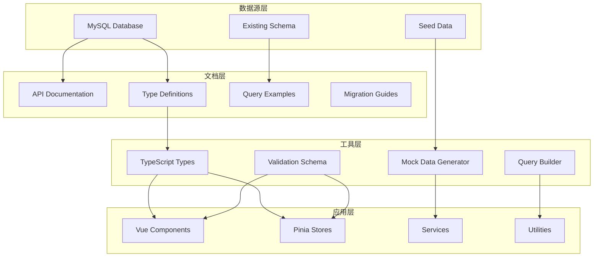
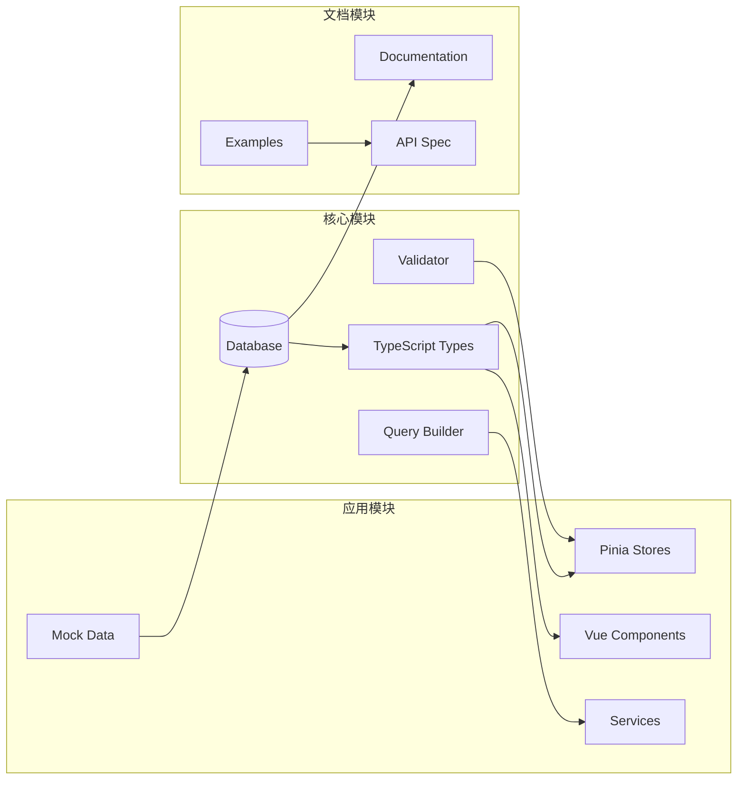
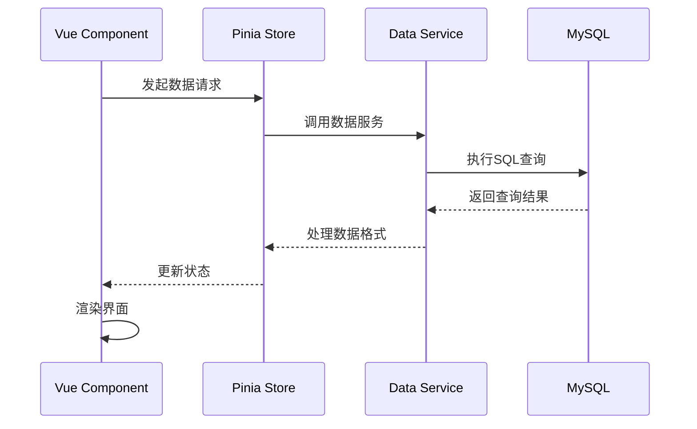

# 数据结构整理 - 系统架构设计

## 整体架构



## 分层设计

### 1. 数据定义层 (Data Definition Layer)

#### 1.1 核心文档结构
```
docs/data-structure/
├── README.md              # 主文档入口
├── schema/
│   ├── tables.md          # 表结构详细说明
│   ├── relationships.md   # 关系图和约束
│   └── constraints.md     # 完整性约束
├── api/
│   ├── queries.md         # 查询示例
│   ├── mutations.md       # 增删改操作
│   └── best-practices.md  # 最佳实践
├── types/
│   ├── typescript.md      # TypeScript类型定义
│   └── validation.md      # 数据验证规则
└── examples/
    ├── seed-data.sql      # 测试数据
    └── sample-queries.sql # 示例查询
```

#### 1.2 类型定义架构
```typescript
// 基础类型定义
interface DatabaseSchema {
  users: User;
  clothing_items: ClothingItem;
  outfits: Outfit;
  attributes: Attribute;
  entity_attributes: EntityAttribute;
}

// 枚举类型
type AttributeCategory = 'season' | 'style' | 'scene' | 'material' | 'color' | 'fit' | 'pattern' | 'category';
type EntityType = 'clothing_item' | 'outfit' | 'user_preference';
type Condition = '全新' | '良好' | '一般' | '较差';

// 关系类型
interface EntityWithAttributes<T> {
  entity: T;
  attributes: Attribute[];
  weights: Record<number, number>;
}
```

### 2. 查询构建层 (Query Builder Layer)

#### 2.1 查询构建器接口
```typescript
interface QueryBuilder {
  // 基础查询
  select<T extends keyof DatabaseSchema>(table: T): Query<T>;
  
  // 条件查询
  where(conditions: WhereCondition[]): QueryBuilder;
  
  // 关联查询
  withAttributes(entityType: EntityType, entityId: number): QueryBuilder;
  
  // 排序和分页
  orderBy(field: string, direction: 'ASC' | 'DESC'): QueryBuilder;
  limit(count: number, offset?: number): QueryBuilder;
}
```

#### 2.2 常用查询模式
```typescript
// 模式1: 获取带属性的实体
const getClothingItemWithAttributes = (id: number) => `
  SELECT ci.*, JSON_ARRAYAGG(
    JSON_OBJECT(
      'id', a.id,
      'category', a.category,
      'name', a.name,
      'value', a.value,
      'weight', ea.weight
    )
  ) as attributes
  FROM clothing_items ci
  LEFT JOIN entity_attributes ea ON ci.id = ea.entity_id AND ea.entity_type = 'clothing_item'
  LEFT JOIN attributes a ON ea.attribute_id = a.id
  WHERE ci.id = ${id}
  GROUP BY ci.id
`;

// 模式2: 按属性筛选
const filterByAttributes = (userId: number, attributes: number[]) => `
  SELECT DISTINCT ci.*
  FROM clothing_items ci
  JOIN entity_attributes ea ON ci.id = ea.entity_id AND ea.entity_type = 'clothing_item'
  WHERE ci.user_id = ${userId}
    AND ea.attribute_id IN (${attributes.join(',')})
  GROUP BY ci.id
  HAVING COUNT(DISTINCT ea.attribute_id) = ${attributes.length}
`;
```

### 3. 数据验证层 (Validation Layer)

#### 3.1 验证规则定义
```typescript
// 字段验证规则
const ValidationRules = {
  clothingItem: {
    name: { required: true, maxLength: 100 },
    brand: { maxLength: 100, optional: true },
    price: { type: 'number', min: 0, optional: true },
    condition: { enum: ['全新', '良好', '一般', '较差'] },
    size: { maxLength: 20, optional: true }
  },
  
  attribute: {
    category: { required: true, enum: AttributeCategories },
    name: { required: true, maxLength: 100 },
    value: { maxLength: 100, optional: true },
    color: { pattern: '^#[0-9A-F]{6}$', optional: true }
  }
};
```

#### 3.2 运行时验证
```typescript
class DataValidator {
  static validateClothingItem(data: any): ValidationResult {
    return this.validate(data, ValidationRules.clothingItem);
  }
  
  static validateAttribute(data: any): ValidationResult {
    return this.validate(data, ValidationRules.attribute);
  }
  
  private static validate(data: any, rules: ValidationRule): ValidationResult {
    // 实现验证逻辑
  }
}
```

### 4. 接口契约定义

#### 4.1 数据访问接口
```typescript
interface ClothingRepository {
  // 基础CRUD
  create(item: CreateClothingItem): Promise<ClothingItem>;
  findById(id: number): Promise<ClothingItem | null>;
  update(id: number, data: UpdateClothingItem): Promise<ClothingItem>;
  delete(id: number): Promise<boolean>;
  
  // 复杂查询
  findByUser(userId: number, options?: QueryOptions): Promise<ClothingItem[]>;
  findByAttributes(userId: number, attributes: number[]): Promise<ClothingItem[]>;
  countByUser(userId: number): Promise<number>;
}

interface AttributeRepository {
  getAllCategories(): Promise<AttributeCategory[]>;
  getByCategory(category: AttributeCategory): Promise<Attribute[]>;
  getByEntity(entityType: EntityType, entityId: number): Promise<Attribute[]>;
  assignAttribute(entityType: EntityType, entityId: number, attributeId: number, weight?: number): Promise<void>;
  removeAttribute(entityType: EntityType, entityId: number, attributeId: number): Promise<void>;
}
```

#### 4.2 响应格式标准
```typescript
interface ApiResponse<T> {
  success: boolean;
  data?: T;
  error?: string;
  meta?: {
    timestamp: string;
    version: string;
  };
}

interface PaginatedResponse<T> extends ApiResponse<T[]> {
  meta: {
    total: number;
    page: number;
    perPage: number;
    hasNext: boolean;
    hasPrev: boolean;
  };
}
```

## 模块依赖关系



## 异常处理策略

### 1. 数据层异常
```typescript
class DatabaseError extends Error {
  constructor(
    message: string,
    public code: string,
    public query?: string,
    public params?: any[]
  ) {
    super(message);
    this.name = 'DatabaseError';
  }
}

// 错误处理中间件
const handleDatabaseError = (error: any): ApiResponse<null> => {
  if (error.code === 'ER_DUP_ENTRY') {
    return { success: false, error: '数据已存在' };
  }
  if (error.code === 'ER_NO_REFERENCED_ROW') {
    return { success: false, error: '关联数据不存在' };
  }
  return { success: false, error: '数据库操作失败' };
};
```

### 2. 验证层异常
```typescript
class ValidationError extends Error {
  constructor(
    message: string,
    public field: string,
    public value: any,
    public rule: string
  ) {
    super(message);
    this.name = 'ValidationError';
  }
}
```

## 性能设计考量

### 1. 查询优化
- **索引策略**: 为所有外键和常用查询字段创建索引
- **分页机制**: 默认分页，防止大数据量查询
- **选择性加载**: 支持按需加载关联数据

### 2. 缓存策略
- **元数据缓存**: attributes表数据全表缓存
- **查询结果缓存**: 热门查询结果Redis缓存
- **用户会话缓存**: 用户偏好设置会话级缓存

### 3. 批量操作
```typescript
interface BatchOperations {
  bulkCreate(items: any[]): Promise<number>;
  bulkUpdate(updates: Array<{id: number, data: any}>): Promise<number>;
  bulkDelete(ids: number[]): Promise<number>;
}
```

## 数据流向图

