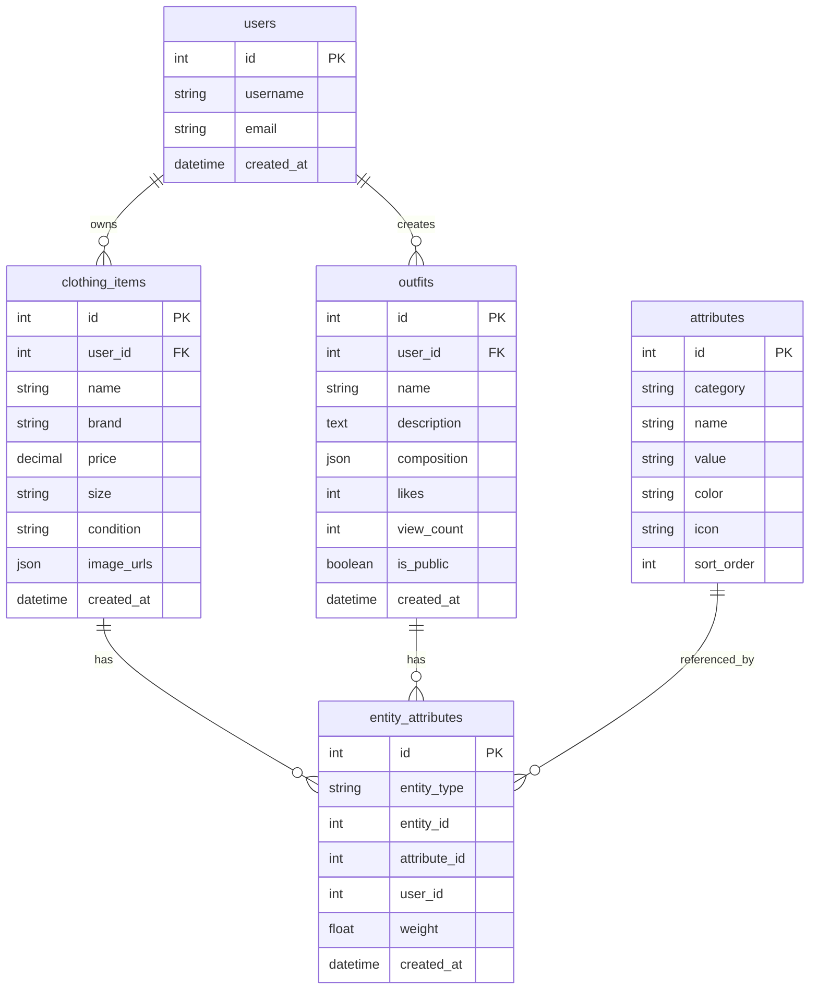

# StyleVault 数据结构开发指南

本指南为开发者提供StyleVault数据结构的完整开发指引，包括环境设置、代码规范、最佳实践和部署流程。

## 🎯 开发目标

- **简化数据结构**：从15个表优化到5个核心表
- **提升扩展性**：支持无限属性扩展，无需修改表结构
- **增强性能**：优化查询性能，减少数据库负载
- **提高开发效率**：提供完整的TypeScript类型和工具函数

## 🚀 快速开始

### 环境要求

- **Node.js**: 18.0.0 或更高版本
- **MySQL**: 8.0 或更高版本
- **npm**: 9.0 或更高版本

### 1. 克隆项目

```bash
git clone https://github.com/your-org/stylevault.git
cd stylevault
```

### 2. 安装依赖

```bash
# 使用arm64架构优化（macOS ARM）
npm install --target_arch=arm64

# 或标准安装
npm install
```

### 3. 配置环境

创建 `.env` 文件：

```bash
# 数据库配置
DB_HOST=localhost
DB_PORT=3306
DB_USER=stylevault
DB_PASSWORD=your_password
DB_NAME=stylevault

# 应用配置
NODE_ENV=development
PORT=3000
JWT_SECRET=your_jwt_secret

# 缓存配置
REDIS_HOST=localhost
REDIS_PORT=6379
```

### 4. 初始化数据库

```bash
# 运行数据库迁移
npm run db:migrate

# 导入初始数据
npm run db:seed
```

### 5. 启动开发服务器

```bash
# 开发模式
npm run dev

# 带热重载的开发模式
npm run dev:hot
```

## 📁 项目结构

```
stylevault/
├── src/
│   ├── types/              # TypeScript类型定义
│   │   └── database.ts     # 数据库类型
│   ├── utils/              # 工具函数
│   │   ├── database.ts     # 数据库工具
│   │   └── validation.ts   # 数据验证
│   ├── services/           # 业务逻辑
│   │   ├── clothing.ts     # 衣物服务
│   │   ├── outfit.ts       # 搭配服务
│   │   └── attribute.ts    # 属性服务
│   ├── api/                # API接口
│   │   ├── routes/         # 路由定义
│   │   └── controllers/    # 控制器
│   └── database/           # 数据库相关
│       ├── migrations/     # 数据库迁移
│       └── seeds/          # 初始数据
├── docs/
│   └── data-structure/     # 数据结构文档
├── tests/                  # 测试文件
└── scripts/                # 脚本工具
```

## 🔧 核心概念

### 数据结构概览

我们采用**终极单表优化方案**，将原来的15个表简化为5个核心表：

1. **users** - 用户基础信息
2. **clothing_items** - 衣物基础信息
3. **outfits** - 搭配基础信息
4. **attributes** - 属性定义（季节、风格、场景等）
5. **entity_attributes** - 实体与属性的关联关系

### 实体关系图



## 📝 开发规范

### TypeScript类型使用

所有数据库操作都使用完整的TypeScript类型定义：

```typescript
// 定义衣物类型
interface ClothingItem {
  id: number;
  user_id: number;
  name: string;
  brand: string;
  price: number;
  size: string;
  condition: 'new' | 'like_new' | 'good' | 'fair' | 'poor';
  image_urls: string[];
  created_at: Date;
  updated_at: Date;
}

// 使用类型安全的查询
const { query, params } = DataAccess.getUserClothingItems(1, {
  priceMin: 100,
  priceMax: 500,
  limit: 20,
});
```

### 查询构建器使用

使用内置的QueryBuilder类构建复杂查询：

```typescript
import { QueryBuilder } from '@/utils/database';

// 构建复杂查询
const qb = new QueryBuilder();
const { query, params } = qb
  .select([
    'ci.*',
    'JSON_ARRAYAGG(JSON_OBJECT("category", a.category, "name", a.name)) as attributes'
  ])
  .from('clothing_items', 'ci')
  .join('entity_attributes ea', 'ci.id = ea.entity_id AND ea.entity_type = "clothing_item"')
  .join('attributes a', 'ea.attribute_id = a.id')
  .where('ci.user_id = ?', 1)
  .groupBy('ci.id')
  .orderBy('ci.created_at', 'DESC')
  .limit(20)
  .build();
```

### 数据验证

所有输入数据都经过严格验证：

```typescript
import { DataValidator } from '@/utils/database';

// 验证衣物数据
const errors = DataValidator.validateClothingItem({
  name: '新T恤',
  brand: 'Adidas',
  price: 299,
  size: 'M',
  condition: 'new',
});

if (errors.length > 0) {
  throw new ValidationError(errors);
}
```

## 🧪 测试策略

### 测试金字塔

1. **单元测试** (70%)
   - 数据验证测试
   - 查询构建器测试
   - 工具函数测试

2. **集成测试** (20%)
   - 数据库操作测试
   - API接口测试
   - 服务层测试

3. **端到端测试** (10%)
   - 完整业务流程测试
   - 性能测试
   - 并发测试

### 运行测试

```bash
# 运行所有测试
npm test

# 运行单元测试
npm run test:unit

# 运行集成测试
npm run test:integration

# 运行性能测试
npm run test:performance

# 生成测试覆盖率报告
npm run test:coverage
```

### 测试数据

使用测试数据集进行开发：

```bash
# 导入测试数据
npm run db:seed:test

# 重置测试数据库
npm run db:reset:test
```

## 📊 性能优化

### 数据库优化

#### 索引策略
```sql
-- 核心索引
CREATE INDEX idx_clothing_items_user_created ON clothing_items(user_id, created_at);
CREATE INDEX idx_entity_attributes_entity ON entity_attributes(entity_type, entity_id);
CREATE INDEX idx_attributes_category ON attributes(category, value);
CREATE INDEX idx_entity_attributes_user ON entity_attributes(user_id, entity_type);
```

#### 查询优化
- 使用JOIN替代子查询
- 合理使用JSON聚合函数
- 避免SELECT *查询
- 使用LIMIT限制结果集

### 缓存策略

```typescript
import { CacheManager } from '@/utils/database';

// 用户数据缓存5分钟
CacheManager.set(`user:${userId}:clothing-items`, data, 300000);

// 属性列表缓存30分钟
CacheManager.set('attributes:list', attributes, 1800000);

// 热门搭配缓存10分钟
CacheManager.set('outfits:popular', popularOutfits, 600000);
```

### 分页优化

```typescript
import { PaginationHelper } from '@/utils/database';

// 计算分页参数
const { offset, limit } = PaginationHelper.calculatePagination(page, limit, 100);

// 验证分页参数
const errors = PaginationHelper.validatePagination(page, limit);
```

## 🔐 安全考虑

### 输入验证

所有输入都经过多层验证：

1. **类型验证** - TypeScript类型检查
2. **格式验证** - 正则表达式验证
3. **业务验证** - 业务规则验证
4. **安全验证** - SQL注入、XSS防护

### 权限控制

```typescript
// 用户权限验证
function checkOwnership(userId: number, entityId: number, entityType: string) {
  return db.query(
    'SELECT 1 FROM entity_attributes WHERE user_id = ? AND entity_type = ? AND entity_id = ?',
    [userId, entityType, entityId]
  );
}
```

### 数据加密

- 敏感字段加密存储
- HTTPS传输加密
- API密钥安全管理

## 🚀 部署流程

### 开发环境

```bash
# 启动开发环境
npm run dev

# 热重载开发
npm run dev:hot
```

### 测试环境

```bash
# 运行测试
npm test

# 生成测试报告
npm run test:report
```

### 生产环境

```bash
# 构建生产版本
npm run build

# 启动生产服务器
npm run start

# 启动PM2进程管理
npm run pm2:start
```

### Docker部署

```bash
# 构建Docker镜像
docker build -t stylevault:latest .

# 运行容器
docker run -d -p 3000:3000 --env-file .env stylevault:latest
```

## 📈 监控和日志

### 应用监控

```typescript
// 性能监控
import { performance } from 'perf_hooks';

const start = performance.now();
const result = await db.query(query, params);
const duration = performance.now() - start;

if (duration > 1000) {
  logger.warn('Slow query detected', { query, duration });
}
```

### 错误日志

```typescript
// 错误处理
import { DatabaseError } from '@/utils/database';

try {
  await db.query(query, params);
} catch (error) {
  throw new DatabaseError(
    'Database query failed',
    error.code,
    query,
    params
  );
}
```

## 🔄 数据迁移

### 从旧版本迁移

```bash
# 运行迁移脚本
npm run migrate:legacy

# 验证数据完整性
npm run validate:migration
```

### 备份策略

```bash
# 创建数据库备份
npm run db:backup

# 恢复数据库备份
npm run db:restore
```

## 📚 最佳实践

### 代码规范

1. **命名规范**
   - 表名使用小写加下划线
   - 字段名使用小写加下划线
   - 类型名使用PascalCase

2. **查询规范**
   - 使用参数化查询
   - 避免SELECT *
   - 合理使用索引

3. **错误处理**
   - 提供详细的错误信息
   - 使用合适的HTTP状态码
   - 记录完整的错误日志

### 性能建议

1. **查询优化**
   - 使用EXPLAIN分析查询
   - 避免全表扫描
   - 合理使用缓存

2. **数据建模**
   - 避免过度规范化
   - 合理使用JSON字段
   - 考虑读写比例

3. **缓存策略**
   - 缓存热点数据
   - 设置合理的TTL
   - 使用缓存穿透保护

## 🆘 故障排除

### 常见问题

#### 数据库连接问题
```bash
# 检查数据库连接
npm run db:check

# 重置数据库连接
npm run db:reset
```

#### 性能问题
```bash
# 检查慢查询
npm run db:slow-queries

# 优化数据库
npm run db:optimize
```

#### 缓存问题
```bash
# 清除所有缓存
npm run cache:clear

# 重置缓存
npm run cache:reset
```

### 调试工具

```bash
# 启动调试模式
npm run debug

# 查看实时日志
npm run logs:tail

# 性能分析
npm run profile
```

## 📞 支持

- **文档**: [数据结构文档](../README.md)
- **API**: [API接口文档](./README.md)
- **测试**: [测试用例](../tests/data-structure.test.ts)
- **工具**: [数据库工具](../src/utils/database.ts)

---

*本指南将持续更新，确保与最新代码保持同步。如有问题，请提交Issue或联系开发团队。*