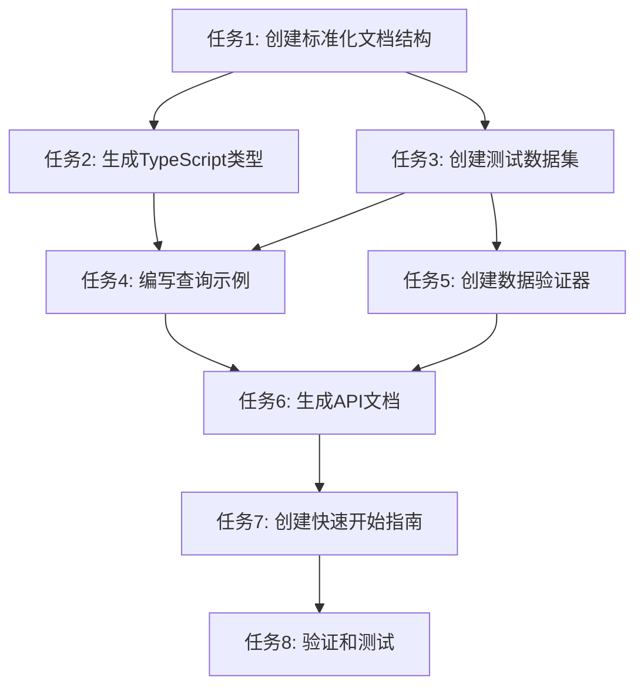

# 数据结构整理 - 任务拆分文档

## 任务总览

将数据结构整理任务拆分为8个原子任务，每个任务可独立执行和验证。

## 任务依赖图



## 原子任务清单

### 任务1: 创建标准化文档结构
**任务ID**: DOC-001
**优先级**: P0 (最高)
**预估工作量**: 30分钟
**前置条件**: 无

#### 输入契约
- 现有数据结构文档: `/数据结构设计.md`
- 项目目录结构已存在

#### 任务内容
创建标准化的文档目录结构：
```
docs/data-structure/
├── README.md              # 主文档入口
├── schema/
│   ├── tables.md          # 表结构详细说明
│   ├── relationships.md   # 关系图和约束
│   └── constraints.md     # 完整性约束
├── api/
│   ├── queries.md         # 查询示例
│   ├── mutations.md       # 增删改操作
│   └── best-practices.md  # 最佳实践
├── types/
│   ├── typescript.md      # TypeScript类型定义
│   └── validation.md      # 数据验证规则
└── examples/
    ├── seed-data.sql      # 测试数据
    └── sample-queries.sql # 示例查询
```

#### 验收标准
- ✅ 所有目录和文件已创建
- ✅ 每个文件包含基础模板
- ✅ README.md作为入口文档
- ✅ 文档间链接正确建立

#### 输出契约
- 文档目录结构完整
- 每个文件有基础内容框架
- 文件间交叉引用正确

---

### 任务2: 生成TypeScript类型定义
**任务ID**: TYP-001
**优先级**: P0
**预估工作量**: 45分钟
**前置条件**: 任务1完成

#### 输入契约
- 数据库表结构定义
- TypeScript项目配置已存在

#### 任务内容
创建完整的TypeScript类型定义：
- 数据库表对应的接口定义
- 枚举类型定义
- 查询参数类型
- 响应数据类型

#### 验收标准
- ✅ 所有表都有对应的TypeScript接口
- ✅ 枚举类型完整覆盖所有分类
- ✅ 类型定义100%匹配数据库字段
- ✅ 包含JSDoc注释

#### 输出契约
- `/src/types/database.ts` - 完整类型定义
- `/src/types/api.ts` - API接口类型
- `/src/types/queries.ts` - 查询参数类型

---

### 任务3: 创建测试数据集
**任务ID**: DAT-001
**优先级**: P0
**预估工作量**: 30分钟
**前置条件**: 任务1完成

#### 输入契约
- 现有attributes表已有31条基础数据
- 数据库连接配置已存在

#### 任务内容
创建完整的测试数据集：
- 3个测试用户
- 15件测试衣物（覆盖所有属性类型）
- 5套测试搭配
- 完整的属性关联数据

#### 测试数据规格
```sql
-- 用户数据
- user1: 普通用户，10件衣物，3套搭配
- user2: 活跃用户，5件衣物，2套搭配
- user3: 新用户，0件衣物，0套搭配

-- 衣物分布
- 季节: 每个季节至少2件
- 风格: 覆盖所有7种风格
- 场景: 覆盖所有7种场景
- 材质: 覆盖6种主要材质
- 色系: 覆盖7种主要色系
```

#### 验收标准
- ✅ 数据完整且符合业务逻辑
- ✅ 所有外键关系正确
- ✅ 包含边界测试数据
- ✅ 数据可重复执行

#### 输出契约
- `/src/mock/database-seed.sql` - 完整测试数据
- `/src/mock/test-data.json` - JSON格式的测试数据
- 数据生成脚本说明文档

---

### 任务4: 编写查询示例
**任务ID**: QRY-001
**优先级**: P1
**预估工作量**: 60分钟
**前置条件**: 任务2和任务3完成

#### 输入契约
- 完整的测试数据集
- TypeScript类型定义

#### 任务内容
创建常用查询的完整示例：

#### 查询类别
1. **基础查询**
   - 获取用户所有衣物
   - 获取衣物详情及属性
   - 获取搭配详情

2. **筛选查询**
   - 按属性筛选衣物
   - 按季节筛选搭配
   - 按风格统计衣物

3. **聚合查询**
   - 用户衣物统计
   - 属性使用频率
   - 搭配热度排行

4. **关联查询**
   - 获取衣物的所有属性
   - 获取搭配的组成衣物
   - 获取用户偏好设置

#### 验收标准
- ✅ 每个查询都有完整SQL
- ✅ 包含TypeScript调用示例
- ✅ 有性能分析说明
- ✅ 包含错误处理示例

#### 输出契约
- `/docs/data-structure/api/queries.md` - 查询示例文档
- `/docs/data-structure/examples/sample-queries.sql` - 可执行SQL文件
- `/src/utils/query-examples.ts` - TypeScript查询示例

---

### 任务5: 创建数据验证器
**任务ID**: VAL-001
**优先级**: P1
**预估工作量**: 45分钟
**前置条件**: 任务2完成

#### 输入契约
- TypeScript类型定义
- 项目验证需求分析

#### 任务内容
创建数据验证工具：
- 表单验证规则
- 数据库约束映射
- 错误消息本地化
- 验证结果格式化

#### 验证规则
```typescript
// 衣物验证规则
const clothingItemRules = {
  name: { required: true, maxLength: 100 },
  brand: { maxLength: 100, optional: true },
  price: { type: 'number', min: 0, optional: true },
  condition: { enum: ['全新', '良好', '一般', '较差'] },
  size: { maxLength: 20, optional: true }
};
```

#### 验收标准
- ✅ 覆盖所有表的验证规则
- ✅ 错误消息清晰明确
- ✅ 支持异步验证
- ✅ 可扩展验证规则

#### 输出契约
- `/src/utils/validators.ts` - 验证器实现
- `/src/constants/validation-messages.ts` - 验证消息
- `/src/types/validation.ts` - 验证类型定义

---

### 任务6: 生成API文档
**任务ID**: API-001
**优先级**: P1
**预估工作量**: 45分钟
**前置条件**: 任务4和任务5完成

#### 输入契约
- 查询示例
- 类型定义
- 验证规则

#### 任务内容
创建完整的API文档：
- RESTful API规范
- 请求响应格式
- 错误码说明
- 认证授权说明

#### API端点规范
```typescript
// 衣物API
GET    /api/clothing-items          # 获取用户衣物列表
GET    /api/clothing-items/:id      # 获取单件衣物详情
POST   /api/clothing-items          # 创建新衣物
PUT    /api/clothing-items/:id      # 更新衣物信息
DELETE /api/clothing-items/:id      # 删除衣物

// 属性API
GET    /api/attributes              # 获取所有属性定义
GET    /api/attributes/:category     # 获取分类下的属性
POST   /api/clothing-items/:id/attributes  # 为衣物添加属性
```

#### 验收标准
- ✅ 所有API端点都有详细说明
- ✅ 包含请求示例和响应示例
- ✅ 错误码完整覆盖
- ✅ 包含认证授权说明

#### 输出契约
- `/docs/data-structure/api/README.md` - API总览
- `/docs/data-structure/api/endpoints.md` - 端点详细说明
- `/docs/data-structure/api/examples.md` - 使用示例

---

### 任务7: 创建快速开始指南
**任务ID**: GUI-001
**优先级**: P2
**预估工作量**: 30分钟
**前置条件**: 任务6完成

#### 输入契约
- 完整的文档体系
- 测试数据集
- API文档

#### 任务内容
创建开发者快速开始指南：
- 环境搭建步骤
- 数据库初始化
- 测试数据导入
- 第一个API调用
- 常见问题解答

#### 快速开始步骤
```bash
# 1. 环境准备
npm install

# 2. 数据库初始化
mysql -u root -p < docs/data-structure/examples/seed-data.sql

# 3. 启动开发环境
npm run dev

# 4. 验证API
curl http://localhost:3000/api/clothing-items
```

#### 验收标准
- ✅ 步骤清晰易懂
- ✅ 包含所有必要命令
- ✅ 有故障排除指南
- ✅ 包含验证步骤

#### 输出契约
- `/docs/data-structure/README.md` - 主文档入口
- `/docs/data-structure/quickstart.md` - 快速开始指南
- `/docs/data-structure/troubleshooting.md` - 故障排除

---

### 任务8: 验证和测试
**任务ID**: TST-001
**优先级**: P2
**预估工作量**: 30分钟
**前置条件**: 所有前置任务完成

#### 输入契约
- 完整的文档体系
- 测试数据集
- 类型定义

#### 任务内容
全面验证所有交付物：
- 文档完整性检查
- 类型定义验证
- 测试数据验证
- 查询示例测试
- 文档链接检查

#### 验证清单
- [ ] 所有文档链接有效
- [ ] TypeScript类型无错误
- [ ] 测试数据可成功导入
- [ ] 查询示例可正常执行
- [ ] API文档与实际一致

#### 验收标准
- ✅ 所有验证项目通过
- ✅ 文档无死链接
- ✅ 代码无TypeScript错误
- ✅ 测试数据完整有效
- ✅ 提供验证报告

#### 输出契约
- `/docs/data-structure/VALIDATION_REPORT.md` - 验证报告
- `/docs/data-structure/COMPLETION_CHECKLIST.md` - 完成清单

## 执行计划

### 阶段1: 基础文档 (任务1-3)
**时间**: 2小时
**并行度**: 任务1和任务2可并行

### 阶段2: 功能实现 (任务4-6)
**时间**: 2.5小时
**并行度**: 任务4和任务5可并行

### 阶段3: 整合验证 (任务7-8)
**时间**: 1小时
**顺序执行**

## 风险评估

### 低风险项
- 文档创建任务 (任务1, 7)
- 类型定义任务 (任务2)
- 测试数据创建 (任务3)

### 中风险项
- 查询示例编写 (任务4) - 需确保性能
- 验证器实现 (任务5) - 需覆盖所有边界情况

### 风险缓解
- 每个任务都有详细的验收标准
- 提供验证脚本自动检查
- 任务间有明确的依赖关系

## 资源需求

### 开发环境
- Node.js 18+
- MySQL 8.0+
- TypeScript 5.0+
- 现有项目依赖

### 工具依赖
- Markdown编辑器
- MySQL客户端
- TypeScript编译器
- 文档生成工具