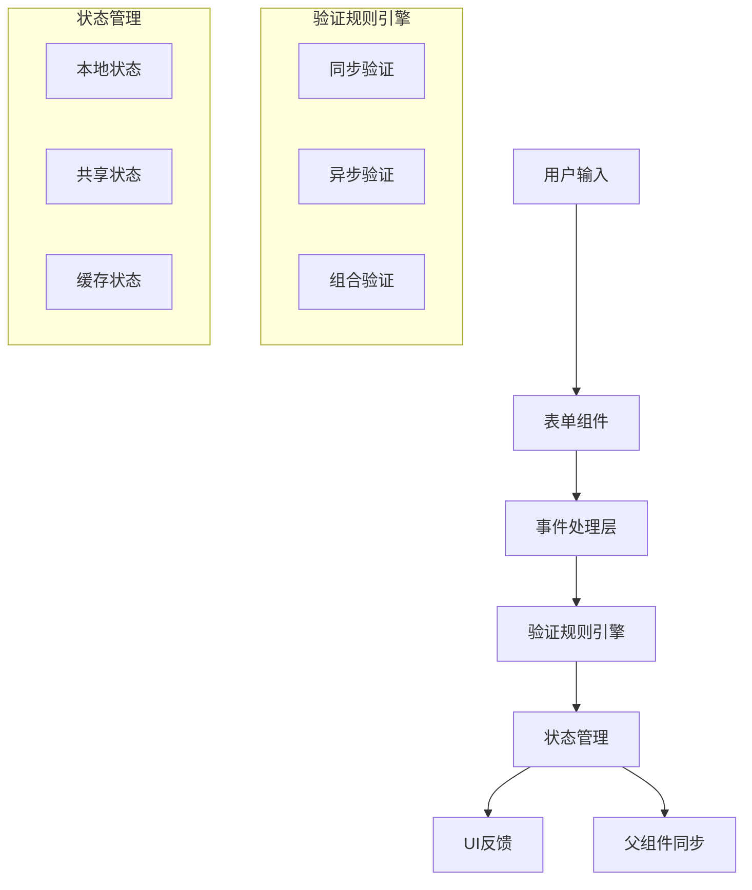
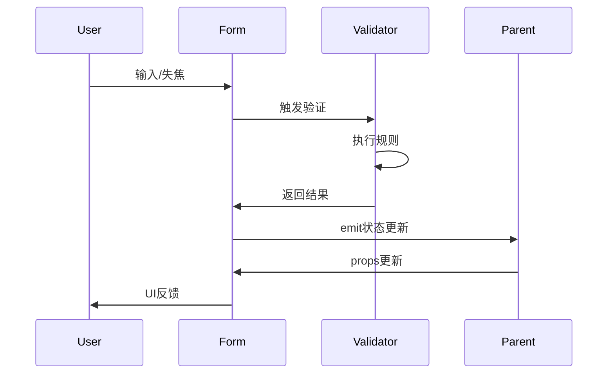

# 表单验证优化架构设计

## 🏗️ 系统架构图



## 🔧 核心组件设计

### 1. 验证规则引擎 (ValidationEngine)

#### 验证规则定义
```typescript
interface ValidationRule {
  type: 'sync' | 'async' | 'composite'
  validator: (value: any, context?: any) => boolean | Promise<boolean>
  message: string | ((value: any) => string)
  priority: number
}

interface ValidationContext {
  field: string
  value: any
  formData: Record<string, any>
  rules: ValidationRule[]
}
```

#### 统一验证规则库
```typescript
// 通用验证规则
const VALIDATION_RULES = {
  username: [
    { validator: minLength(2), message: '用户名至少2位' },
    { validator: maxLength(20), message: '用户名最多20位' },
    { validator: pattern(/^[一-龥a-zA-Z0-9_]+$/), message: '包含非法字符' }
  ],
  email: [
    { validator: pattern(/^[^\s@]+@[^\s@]+\.[^\s@]+$/), message: '邮箱格式不正确' }
  ],
  password: [
    { validator: minLength(6), message: '密码至少6位' },
    { validator: passwordComplexity, message: '密码复杂度不足' }
  ],
  confirmPassword: [
    { validator: matchPassword, message: '两次密码不一致' }
  ]
}
```

### 2. 状态同步机制

#### 状态流设计


#### 状态管理优化
- **本地状态**: 字段级验证状态
- **共享状态**: 表单级验证状态
- **缓存状态**: 异步验证结果缓存

### 3. UI反馈系统

#### 反馈层级
1. **字段级**: 输入框边框颜色、图标
2. **表单级**: 全局错误提示
3. **交互级**: 加载状态、防抖提示

#### 视觉反馈规范
```css
/* 验证状态样式 */
.valid { @apply border-green-500 text-green-600 }
.invalid { @apply border-red-500 text-red-600 }
.pending { @apply border-yellow-500 text-yellow-600 }
```

## 🎯 优化策略

### 1. 验证规则统一
- **RegisterForm** 和 **LoginForm** 使用相同基础规则
- **密码验证** 统一为6位+复杂度要求
- **邮箱验证** 统一格式标准

### 2. 性能优化
- **防抖机制**: 300ms防抖延迟
- **缓存策略**: 异步验证结果缓存5分钟
- **按需验证**: 只在必要时触发验证

### 3. 用户体验增强
- **渐进式验证**: 从简单到复杂的验证顺序
- **智能提示**: 基于输入内容的动态提示
- **无障碍支持**: ARIA标签和键盘导航

## 📋 接口契约定义

### 组件接口
```typescript
interface FormValidationProps {
  form: Record<string, any>
  errors: Record<string, string | null>
  isLoading: boolean
}

interface FormValidationEmits {
  'update:form': [form: Record<string, any>]
  'validate:field': [field: string, error: string | null]
  'form:valid': [isValid: boolean]
}
```

### 验证服务接口
```typescript
interface ValidationService {
  validateField(field: string, value: any, context?: any): Promise<ValidationResult>
  validateForm(formData: Record<string, any>): Promise<FormValidationResult>
  getValidationRules(field: string): ValidationRule[]
}
```

## 🚀 实施优先级

### 高优先级 (立即实施)
1. ✅ 验证触发时机优化 (已完成)
2. ✅ 错误提示消失机制 (已完成)
3. 统一密码验证规则

### 中优先级 (后续优化)
1. 防抖机制实现
2. 验证缓存策略
3. 无障碍支持增强

### 低优先级 (长期规划)
1. 异步验证支持
2. 国际化验证消息
3. 自定义验证规则扩展

## 🔍 风险评估

### 技术风险
- **兼容性**: 与现有代码风格保持一致
- **性能**: 防抖和缓存机制可能影响响应速度
- **可维护性**: 新增验证规则需要更新两处代码

### 缓解措施
- **代码复用**: 提取公共验证逻辑
- **单元测试**: 覆盖所有验证场景
- **渐进式部署**: 分阶段实施变更