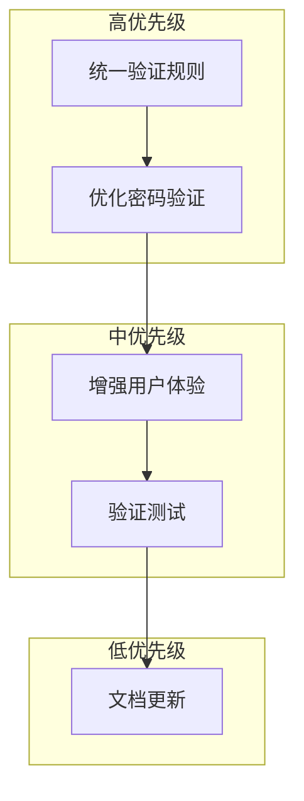

# 表单验证优化任务拆分

## 🎯 任务依赖图

## 📋 原子任务清单

### 🔴 高优先级任务 (立即执行)

#### T1: 统一验证规则标准
**输入契约**:
- RegisterForm.vue 现有验证逻辑
- LoginForm.vue 现有验证逻辑
- 验证规则统一需求

**输出契约**:
- 统一的密码验证规则
- 一致的邮箱验证标准
- 验证规则提取为可复用函数

**实现约束**:
- 保持向后兼容
- 不影响现有用户体验
- 代码风格与项目一致

**验收标准**:
- [ ] LoginForm密码验证与RegisterForm一致
- [ ] 验证规则可复用
- [ ] 所有测试通过

#### T2: 优化密码验证逻辑
**输入契约**:
- 当前密码验证实现
- 用户体验需求

**输出契约**:
- 增强的密码验证规则
- 改进的强度计算
- 优化的错误提示

**实现约束**:
- 最小化代码变更
- 保持UI一致性

**验收标准**:
- [ ] 密码验证规则统一
- [ ] 强度指示器工作正常
- [ ] 错误提示清晰

### 🟡 中优先级任务 (后续优化)

#### T3: 增强用户体验细节
**输入契约**:
- 当前用户交互流程
- 验证反馈机制

**输出契约**:
- 防抖验证机制
- 渐进式验证体验
- 无障碍支持增强

**实现约束**:
- 不影响性能
- 渐进式增强

**验收标准**:
- [ ] 验证防抖工作正常
- [ ] 键盘导航支持
- [ ] 屏幕阅读器兼容

#### T4: 验证测试覆盖
**输入契约**:
- 验证规则实现
- 测试用例需求

**输出契约**:
- 单元测试用例
- 集成测试用例
- 边界条件测试

**实现约束**:
- 覆盖所有验证场景
- 测试代码可维护

**验收标准**:
- [ ] 单元测试覆盖率>90%
- [ ] 边界条件测试完整
- [ ] 集成测试通过

### 🟢 低优先级任务 (长期规划)

#### T5: 文档和代码规范更新
**输入契约**:
- 代码变更记录
- 项目文档结构

**输出契约**:
- 更新API文档
- 验证规则文档
- 使用示例更新

**实现约束**:
- 文档与代码同步
- 示例代码可运行

**验收标准**:
- [ ] 文档完整准确
- [ ] 示例代码可运行
- [ ] 代码注释清晰

## 🎯 任务执行计划

### 第一阶段 (立即执行)
1. **T1-统一验证规则** (预计30分钟)
   - 提取公共验证函数
   - 统一LoginForm密码验证
   - 验证规则一致性检查

2. **T2-优化密码验证** (预计45分钟)
   - 增强密码验证逻辑
   - 优化强度计算
   - 改进错误提示

### 第二阶段 (验证测试)
3. **T3-用户体验增强** (预计60分钟)
   - 实现防抖机制
   - 添加键盘导航
   - 无障碍支持

4. **T4-测试覆盖** (预计45分钟)
   - 编写单元测试
   - 边界条件测试
   - 集成测试验证

### 第三阶段 (文档更新)
5. **T5-文档同步** (预计30分钟)
   - 更新项目文档
   - 添加使用示例
   - 代码注释完善

## 📊 时间估算

| 任务 | 预计时间 | 优先级 | 依赖关系 |
|------|----------|--------|----------|
| T1 | 30分钟 | 高 | 无 |
| T2 | 45分钟 | 高 | T1 |
| T3 | 60分钟 | 中 | T2 |
| T4 | 45分钟 | 中 | T3 |
| T5 | 30分钟 | 低 | T4 |

**总计**: 约3.5小时

## 🔄 执行检查点

每个任务完成后需要验证：
1. ✅ 代码编译无错误
2. ✅ 功能测试通过
3. ✅ 代码风格检查通过
4. ✅ 文档同步更新

## 🚨 风险预警

- **技术风险**: 验证规则变更可能影响现有用户
- **兼容性风险**: 新旧验证规则切换需要平滑过渡
- **性能风险**: 防抖机制可能引入延迟

**缓解措施**:
- 渐进式部署
- 充分测试验证
- 回滚方案准备