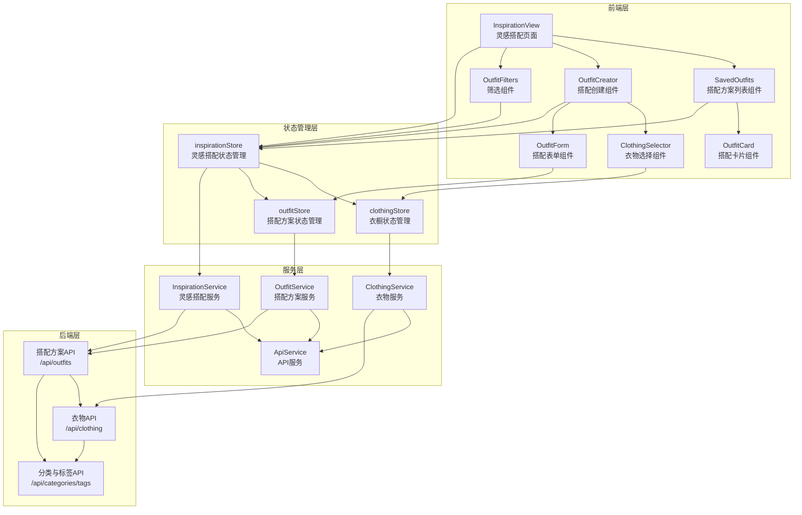
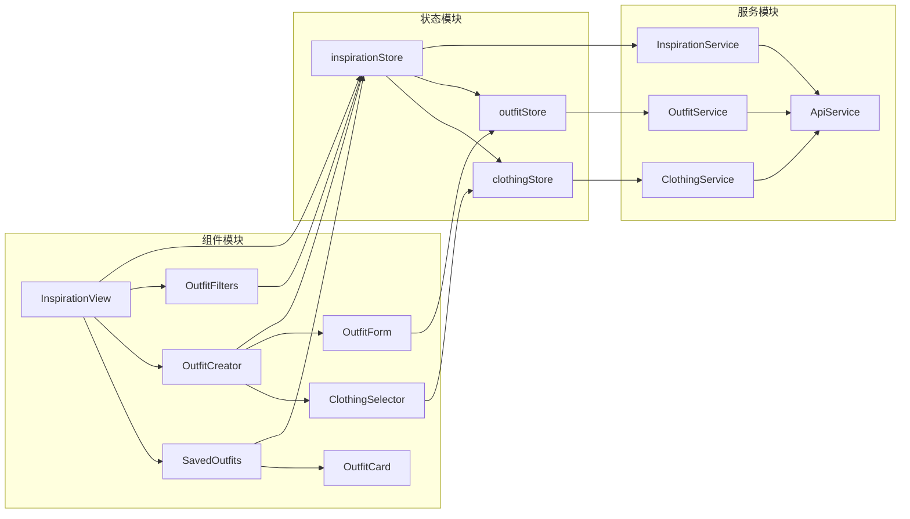
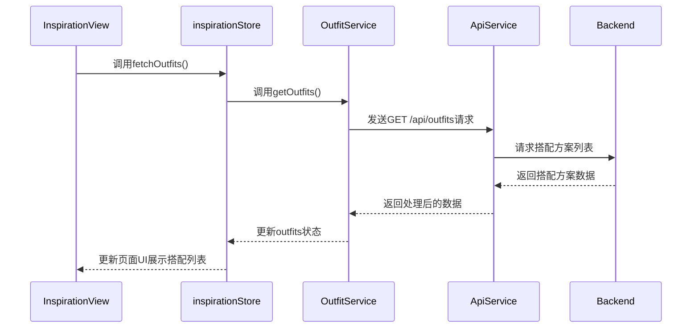
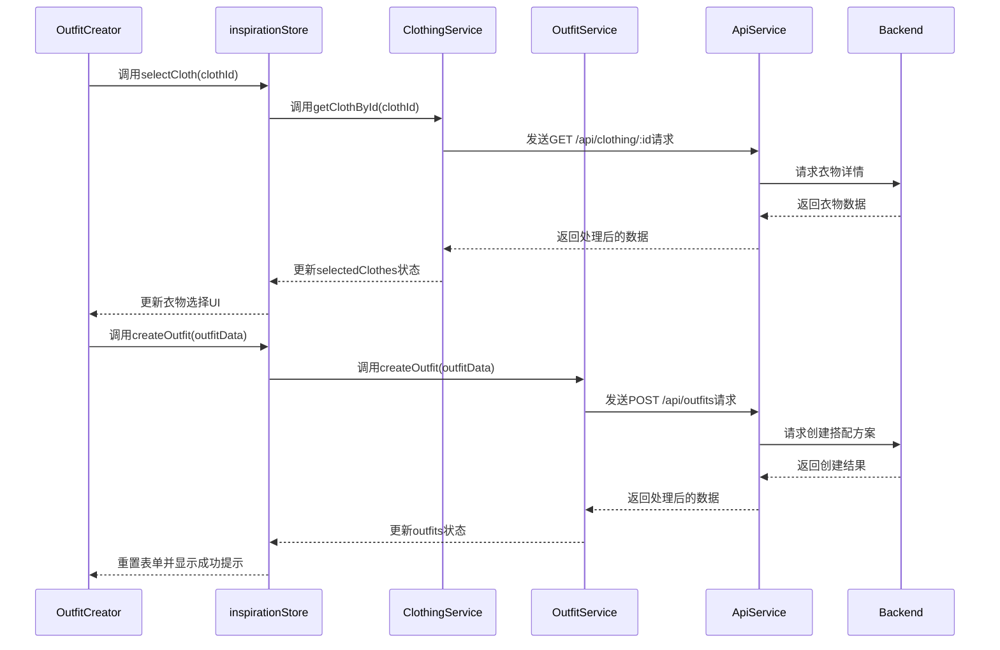
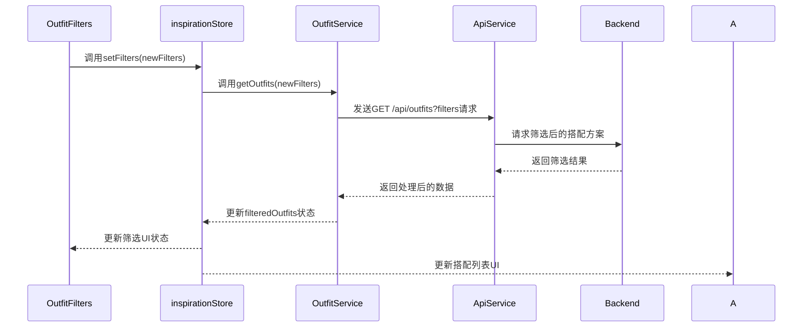

# 灵感搭配页面系统架构设计文档

## 1. 整体架构图



## 2. 分层设计

### 2.1 前端组件层

前端采用原子设计原则，将组件分为以下几层：

#### 2.1.1 页面组件 (Pages)
- **InspirationView**：灵感搭配主页面，负责整体布局和页面逻辑

#### 2.1.2 容器组件 (Organisms)
- **SavedOutfits**：搭配方案列表容器组件
- **OutfitCreator**：搭配创建容器组件
- **OutfitFilters**：筛选功能容器组件

#### 2.1.3 功能组件 (Molecules)
- **OutfitCard**：搭配方案卡片组件
- **ClothingSelector**：衣物选择组件
- **OutfitForm**：搭配信息表单组件

#### 2.1.4 基础组件 (Atoms)
- **Button**：按钮组件
- **Input**：输入框组件
- **Select**：选择框组件
- **Checkbox**：复选框组件

### 2.2 状态管理层

使用Pinia进行状态管理，主要包含以下store：

#### 2.2.1 inspirationStore
- 管理灵感搭配页面的全局状态
- 处理筛选条件和分页信息
- 协调衣物选择和搭配创建流程

#### 2.2.2 clothingStore
- 管理用户衣橱中的衣物数据
- 提供衣物筛选和搜索功能

#### 2.2.3 outfitStore
- 管理用户的搭配方案数据
- 提供搭配方案的CRUD操作

### 2.3 服务层

封装API调用和业务逻辑，主要包含以下服务：

#### 2.3.1 InspirationService
- 处理灵感搭配相关的业务逻辑
- 协调ClothingService和OutfitService

#### 2.3.2 ClothingService
- 封装衣物相关的API调用
- 处理衣物数据的转换和格式化

#### 2.3.3 OutfitService
- 封装搭配方案相关的API调用
- 处理搭配方案数据的转换和格式化

#### 2.3.4 ApiService
- 封装基础的API请求逻辑
- 处理请求拦截、响应拦截和错误处理

### 2.4 后端层

提供RESTful API接口，主要包含以下API：

#### 2.4.1 搭配方案API (/api/outfits)
- 提供搭配方案的CRUD操作
- 支持搭配方案的筛选和搜索

#### 2.4.2 衣物API (/api/clothing)
- 提供衣物的查询和管理功能
- 支持衣物的分类和标签筛选

#### 2.4.3 分类与标签API (/api/categories, /api/tags)
- 提供分类和标签的管理功能
- 支持按类型查询分类和标签

## 3. 核心组件设计

### 3.1 InspirationView (页面组件)

**职责**：
- 整体页面布局和结构
- 协调各个子组件的交互
- 管理页面级别的状态和生命周期

**核心功能**：
- 初始化页面数据
- 处理页面加载状态
- 协调搭配列表和搭配创建功能

### 3.2 SavedOutfits (容器组件)

**职责**：
- 展示用户的搭配方案列表
- 处理搭配方案的分页加载
- 提供搭配方案的操作入口

**核心功能**：
- 搭配方案卡片展示
- 分页加载逻辑
- 搭配方案操作（查看、编辑、删除）

### 3.3 OutfitCreator (容器组件)

**职责**：
- 提供搭配方案创建和编辑界面
- 协调衣物选择和搭配信息填写

**核心功能**：
- 衣物选择器
- 搭配信息表单
- 搭配预览
- 保存搭配方案

### 3.4 OutfitFilters (容器组件)

**职责**：
- 提供搭配方案的筛选和搜索功能
- 更新全局筛选条件

**核心功能**：
- 分类筛选
- 标签筛选
- 关键词搜索
- 多维度筛选（场景、季节、风格）

## 4. 模块依赖关系图



## 5. 接口契约定义

### 5.1 前端组件接口

#### 5.1.1 InspirationView

| 属性 | 类型 | 描述 |
|------|------|------|
| isLoading | boolean | 页面加载状态 |
| outfits | Outfit[] | 搭配方案列表 |
| clothingItems | ClothingItem[] | 衣橱衣物列表 |
| filters | object | 筛选条件 |
| pagination | object | 分页信息 |

| 事件 | 参数 | 描述 |
|------|------|------|
| loadMore | 无 | 加载更多搭配方案 |
| createOutfit | outfitData | 创建新搭配方案 |
| updateOutfit | (id, outfitData) | 更新搭配方案 |
| deleteOutfit | id | 删除搭配方案 |
| setFilters | filters | 设置筛选条件 |

#### 5.1.2 SavedOutfits

| 属性 | 类型 | 描述 |
|------|------|------|
| outfits | Outfit[] | 搭配方案列表 |
| hasMore | boolean | 是否有更多数据 |
| isLoading | boolean | 加载状态 |

| 事件 | 参数 | 描述 |
|------|------|------|
| loadMore | 无 | 加载更多搭配方案 |
| viewOutfit | outfit | 查看搭配方案详情 |
| editOutfit | outfit | 编辑搭配方案 |
| deleteOutfit | outfit | 删除搭配方案 |
| shareOutfit | outfit | 分享搭配方案 |

#### 5.1.3 OutfitCreator

| 属性 | 类型 | 描述 |
|------|------|------|
| clothingItems | ClothingItem[] | 衣橱衣物列表 |
| selectedClothes | ClothingItem[] | 已选择的衣物 |
| outfit | Outfit | 搭配方案数据 |
| isLoading | boolean | 加载状态 |

| 事件 | 参数 | 描述 |
|------|------|------|
| selectCloth | clothingItem | 选择衣物 |
| removeCloth | clothingItem | 移除衣物 |
| saveOutfit | outfitData | 保存搭配方案 |
| cancel | 无 | 取消创建/编辑 |

### 5.2 后端API接口

#### 5.2.1 搭配方案API

##### 获取搭配方案列表
```
GET /api/outfits
```

**请求参数**：
| 参数 | 类型 | 描述 | 可选 |
|------|------|------|------|
| page | number | 页码 | 是，默认1 |
| pageSize | number | 每页数量 | 是，默认12 |
| category | string | 分类筛选 | 是 |
| tags | string[] | 标签筛选 | 是 |
| search | string | 搜索关键词 | 是 |
| scene | string[] | 场景筛选 | 是 |
| season | string[] | 季节筛选 | 是 |
| style | string[] | 风格筛选 | 是 |

**响应格式**：
```json
{
  "success": true,
  "data": {
    "outfits": Outfit[],
    "total": number,
    "page": number,
    "pageSize": number,
    "hasMore": boolean
  },
  "message": "获取搭配方案列表成功"
}
```

##### 创建搭配方案
```
POST /api/outfits
```

**请求体**：
```json
{
  "title": string,
  "description": string,
  "items": string[],
  "category": string,
  "tags": string[],
  "scene": string[],
  "season": string[],
  "style": string[],
  "isPublic": boolean
}
```

**响应格式**：
```json
{
  "success": true,
  "data": Outfit,
  "message": "创建搭配方案成功"
}
```

##### 更新搭配方案
```
PUT /api/outfits/:id
```

**请求体**：同创建搭配方案

**响应格式**：同创建搭配方案

##### 删除搭配方案
```
DELETE /api/outfits/:id
```

**响应格式**：
```json
{
  "success": true,
  "data": null,
  "message": "删除搭配方案成功"
}
```

#### 5.2.2 衣物API

##### 获取衣物列表
```
GET /api/clothing
```

**请求参数**：
| 参数 | 类型 | 描述 | 可选 |
|------|------|------|------|
| category | string | 分类筛选 | 是 |
| tags | string[] | 标签筛选 | 是 |
| search | string | 搜索关键词 | 是 |

**响应格式**：
```json
{
  "success": true,
  "data": ClothingItem[],
  "message": "获取衣物列表成功"
}
```

## 6. 数据流向图

### 6.1 搭配方案列表加载流程



### 6.2 搭配方案创建流程



### 6.3 搭配方案筛选流程



## 7. 异常处理策略

### 7.1 前端异常处理

#### 7.1.1 API请求异常

```javascript
// ApiService.js 示例
async function request(config) {
  try {
    const response = await axios(config);
    return response.data;
  } catch (error) {
    if (error.response) {
      // 服务器返回错误状态码
      console.error('API Error:', error.response.status, error.response.data);
      throw {
        code: error.response.status,
        message: error.response.data.message || '请求失败',
        details: error.response.data.error
      };
    } else if (error.request) {
      // 请求已发送但没有收到响应
      console.error('Network Error:', error.request);
      throw {
        code: 'NETWORK_ERROR',
        message: '网络错误，请检查网络连接',
        details: error.request
      };
    } else {
      // 请求配置错误
      console.error('Request Error:', error.message);
      throw {
        code: 'REQUEST_ERROR',
        message: '请求配置错误',
        details: error.message
      };
    }
  }
}
```

#### 7.1.2 组件异常处理

```javascript
// InspirationView.vue 示例
try {
  await inspirationStore.initialize();
} catch (error) {
  console.error('初始化失败:', error);
  // 显示错误提示
  uiStore.showError(error.message);
}
```

### 7.2 后端异常处理

后端采用统一的错误处理中间件：

```typescript
// 错误处理中间件示例
app.use((err, req, res, next) => {
  console.error(err);
  
  const statusCode = err.statusCode || 500;
  const errorCode = err.code || 'INTERNAL_ERROR';
  const message = err.message || '服务器内部错误';
  
  res.status(statusCode).json({
    success: false,
    error: {
      code: errorCode,
      message: message,
      details: process.env.NODE_ENV === 'development' ? err.stack : undefined
    }
  });
});
```

## 8. 缓存策略

### 8.1 前端缓存策略

#### 8.1.1 衣物数据缓存

```javascript
// clothingStore.js 示例
const clothingItems = ref([]);
const isLoading = ref(false);
const lastFetchTime = ref(0);
const CACHE_DURATION = 5 * 60 * 1000; // 5分钟

const fetchClothingItems = async (forceRefresh = false) => {
  const now = Date.now();
  
  // 如果缓存有效且不强制刷新，则使用缓存数据
  if (clothingItems.value.length > 0 && !forceRefresh && (now - lastFetchTime.value) < CACHE_DURATION) {
    return;
  }
  
  isLoading.value = true;
  try {
    const items = await clothingService.getClothingItems();
    clothingItems.value = items;
    lastFetchTime.value = now;
  } catch (error) {
    console.error('获取衣物数据失败:', error);
  } finally {
    isLoading.value = false;
  }
};
```

#### 8.1.2 搭配方案缓存

```javascript
// inspirationStore.js 示例
const outfits = ref([]);
const filteredOutfits = ref([]);
const isLoading = ref(false);
const filters = reactive({ /* 筛选条件 */ });
const pagination = reactive({ /* 分页信息 */ });

const fetchOutfits = async () => {
  isLoading.value = true;
  try {
    const response = await inspirationService.getOutfits({
      ...filters,
      page: pagination.page,
      pageSize: pagination.pageSize
    });
    
    if (pagination.page === 1) {
      // 第一页时替换数据
      outfits.value = response.outfits;
    } else {
      // 非第一页时追加数据
      outfits.value = [...outfits.value, ...response.outfits];
    }
    
    pagination.hasMore = response.hasMore;
    filteredOutfits.value = outfits.value;
  } catch (error) {
    console.error('获取搭配方案失败:', error);
  } finally {
    isLoading.value = false;
  }
};
```

## 9. 性能优化策略

### 9.1 前端性能优化

1. **组件懒加载**：
   ```javascript
   // 路由配置示例
   const routes = [
     {
       path: '/custom',
       name: 'custom',
       component: () => import('../views/InspirationView.vue')
     }
   ];
   ```

2. **图片懒加载**：
   ```vue
   <!-- OutfitCard.vue 示例 -->
   <template>
     <div class="outfit-card">
       
       <h3>{{ outfit.title }}</h3>
     </div>
   </template>
   ```

3. **虚拟滚动**：
   ```vue
   <!-- SavedOutfits.vue 示例 -->
   <template>
     <div class="saved-outfits">
       <virtual-list
         :data-key="'id'"
         :data-sources="outfits"
         :data-component="OutfitCard"
         :estimate-size="200"
       />
     </div>
   </template>
   ```

### 9.2 后端性能优化

1. **分页查询**：避免一次性返回大量数据
2. **索引优化**：为查询频繁的字段添加索引
3. **数据缓存**：使用Redis缓存热门搭配方案
4. **API限流**：防止恶意请求导致服务器压力过大

## 10. 安全性考虑

### 10.1 前端安全

1. **输入验证**：
   ```javascript
   // OutfitForm.vue 示例
   const validateForm = () => {
     if (!title.value.trim()) {
       errors.title = '请输入搭配标题';
       return false;
     }
     if (selectedClothes.value.length === 0) {
       errors.items = '请至少选择一件衣物';
       return false;
     }
     return true;
   };
   ```

2. **XSS防护**：使用Vue的自动转义功能
3. **CSRF防护**：使用CSRF令牌
4. **API请求安全**：使用HTTPS

### 10.2 后端安全

1. **身份验证**：使用JWT令牌
2. **授权**：基于角色的访问控制
3. **输入验证**：使用验证中间件
4. **SQL注入防护**：使用参数化查询
5. **错误信息安全**：生产环境不返回详细错误信息

---

**文档创建日期**：2023-10-01
**文档版本**：v1.0
**文档作者**：AI Assistant