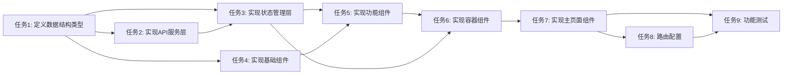

# 灵感搭配页面原子任务拆分文档

## 1. 任务概述

本文档将灵感搭配页面的开发工作拆分为多个原子任务，每个任务都具有明确的输入、输出和验收标准。任务按照依赖关系排序，确保开发流程的顺畅和可预测性。

## 2. 原子任务列表

### 2.1 任务1：定义数据结构类型

**ID**: TASK_001
**优先级**: 高
**类型**: 基础架构

**输入契约**:
- 项目现有的TypeScript类型定义
- 前端组件库的类型要求

**输出契约**:
- `src/types/inspiration.ts` 文件，包含以下接口定义：
  - `ClothingItem`：衣物数据接口
  - `Outfit`：搭配方案接口
  - `Category`：分类数据接口
  - `Tag`：标签数据接口
  - `OutfitFilters`：筛选条件接口
  - `Pagination`：分页信息接口

**实现约束**:
- 类型定义必须符合TypeScript语法规范
- 接口字段必须包含所有需求文档中定义的属性
- 必须使用与现有代码一致的命名规范

**依赖关系**:
- 无前置依赖

### 2.2 任务2：实现API服务层

**ID**: TASK_002
**优先级**: 高
**类型**: 基础架构

**输入契约**:
- 任务1中定义的数据结构类型
- 现有的ApiService基础服务
- 后端API接口文档

**输出契约**:
- `src/services/inspiration.service.ts` 文件
- `src/services/clothing.service.ts` 文件
- `src/services/outfit.service.ts` 文件

**实现约束**:
- 必须继承或使用现有的ApiService
- 必须实现所有需求文档中定义的API接口
- 必须包含错误处理和类型转换
- 必须遵循项目现有的代码规范

**依赖关系**:
- 依赖任务1（数据结构类型定义）

### 2.3 任务3：实现状态管理层

**ID**: TASK_003
**优先级**: 高
**类型**: 核心功能

**输入契约**:
- 任务1中定义的数据结构类型
- 任务2中实现的服务层
- 现有的Pinia store实现模式

**输出契约**:
- `src/stores/modules/inspirationStore.ts` 文件，包含以下功能：
  - 搭配方案列表管理
  - 筛选条件管理
  - 分页信息管理
  - 衣物选择状态管理
  - 搭配创建和编辑状态管理

**实现约束**:
- 必须使用Pinia的Composition API
- 必须遵循项目现有的store实现模式
- 必须包含异步操作的加载状态管理
- 必须实现数据缓存策略

**依赖关系**:
- 依赖任务1（数据结构类型定义）
- 依赖任务2（API服务层实现）

### 2.4 任务4：实现基础组件

**ID**: TASK_004
**优先级**: 中
**类型**: 基础组件

**输入契约**:
- 任务1中定义的数据结构类型
- TailwindCSS设计系统
- 现有的基础组件库

**输出契约**:
- `src/components/atoms/Button.vue`
- `src/components/atoms/Input.vue`
- `src/components/atoms/Select.vue`
- `src/components/atoms/Checkbox.vue`

**实现约束**:
- 必须使用TailwindCSS进行样式设计
- 必须符合项目现有的组件设计规范
- 必须支持响应式设计
- 必须包含必要的事件处理

**依赖关系**:
- 依赖任务1（数据结构类型定义）

### 2.5 任务5：实现功能组件

**ID**: TASK_005
**优先级**: 中
**类型**: 功能组件

**输入契约**:
- 任务1中定义的数据结构类型
- 任务4中实现的基础组件
- 任务3中实现的状态管理层

**输出契约**:
- `src/components/molecules/OutfitCard.vue`：搭配方案卡片组件
- `src/components/molecules/ClothingSelector.vue`：衣物选择组件
- `src/components/molecules/OutfitForm.vue`：搭配表单组件

**实现约束**:
- 必须使用任务4中实现的基础组件
- 必须与状态管理层正确交互
- 必须包含必要的输入验证
- 必须支持响应式设计

**依赖关系**:
- 依赖任务1（数据结构类型定义）
- 依赖任务3（状态管理层实现）
- 依赖任务4（基础组件实现）

### 2.6 任务6：实现容器组件

**ID**: TASK_006
**优先级**: 高
**类型**: 核心组件

**输入契约**:
- 任务1中定义的数据结构类型
- 任务5中实现的功能组件
- 任务3中实现的状态管理层

**输出契约**:
- `src/components/organisms/SavedOutfits.vue`：搭配方案列表组件
- `src/components/organisms/OutfitCreator.vue`：搭配创建组件
- `src/components/organisms/OutfitFilters.vue`：筛选组件

**实现约束**:
- 必须使用任务5中实现的功能组件
- 必须与状态管理层正确交互
- 必须实现复杂的业务逻辑
- 必须支持响应式设计

**依赖关系**:
- 依赖任务1（数据结构类型定义）
- 依赖任务3（状态管理层实现）
- 依赖任务5（功能组件实现）

### 2.7 任务7：实现主页面组件

**ID**: TASK_007
**优先级**: 高
**类型**: 页面集成

**输入契约**:
- 任务1中定义的数据结构类型
- 任务6中实现的容器组件
- 任务3中实现的状态管理层
- 现有的布局组件

**输出契约**:
- `src/views/InspirationView.vue`：灵感搭配主页面

**实现约束**:
- 必须使用任务6中实现的容器组件
- 必须与状态管理层正确交互
- 必须实现页面级别的生命周期管理
- 必须支持响应式设计
- 必须符合项目现有的页面设计规范

**依赖关系**:
- 依赖任务1（数据结构类型定义）
- 依赖任务3（状态管理层实现）
- 依赖任务6（容器组件实现）

### 2.8 任务8：路由配置

**ID**: TASK_008
**优先级**: 中
**类型**: 基础架构

**输入契约**:
- 任务7中实现的主页面组件
- 现有的路由配置

**输出契约**:
- 更新后的 `src/router/index.js` 文件，包含灵感搭配页面的路由配置

**实现约束**:
- 必须遵循项目现有的路由配置规范
- 必须设置正确的路由路径和名称
- 必须添加必要的路由元信息

**依赖关系**:
- 依赖任务7（主页面组件实现）

### 2.9 任务9：功能测试

**ID**: TASK_009
**优先级**: 高
**类型**: 质量保障

**输入契约**:
- 所有已实现的组件和服务
- 需求文档中的验收标准

**输出契约**:
- 测试报告文件
- 修复后的代码（如果有问题）

**实现约束**:
- 必须测试所有核心功能
- 必须测试边界情况和异常情况
- 必须确保页面在不同设备上的兼容性
- 必须使用项目现有的测试框架（Vitest）

**依赖关系**:
- 依赖任务7（主页面组件实现）
- 依赖任务8（路由配置）

## 3. 任务依赖图

## 4. 任务执行顺序

根据任务依赖关系，建议按照以下顺序执行任务：

1. **任务1**：定义数据结构类型
2. **任务4**：实现基础组件（可与任务2、3并行）
3. **任务2**：实现API服务层
4. **任务3**：实现状态管理层
5. **任务5**：实现功能组件
6. **任务6**：实现容器组件
7. **任务7**：实现主页面组件
8. **任务8**：路由配置
9. **任务9**：功能测试

## 5. 任务执行指南

### 5.1 开发环境准备

- 确保Node.js和npm已正确安装
- 确保项目依赖已安装：`npm install`
- 启动开发服务器：`npm run dev`

### 5.2 代码规范

- 遵循项目现有的ESLint和Prettier配置
- 使用Vue 3 Composition API
- 使用TypeScript进行类型定义
- 使用TailwindCSS进行样式设计

### 5.3 测试要求

- 每个组件和服务都必须有对应的单元测试
- 测试覆盖率不低于80%
- 必须测试正常流程、边界条件和异常情况

### 5.4 文档要求

- 每个组件和服务都必须有详细的JSDoc注释
- 必须更新相关的API文档
- 必须记录任何与设计文档不符的实现细节

## 6. 验收标准

每个任务完成后，必须满足以下验收标准：

1. **代码质量**：代码符合项目的ESLint和Prettier规范
2. **功能完整性**：实现了所有需求文档中定义的功能
3. **测试通过**：所有单元测试和集成测试都通过
4. **文档完整**：代码注释和文档齐全
5. **性能达标**：页面加载时间不超过2秒，响应时间不超过1秒

## 7. 风险与缓解措施

| 风险 | 影响 | 缓解措施 |
|------|------|----------|
| 后端API接口变更 | 导致服务层实现需要修改 | 与后端团队保持密切沟通，及时了解接口变更 |
| 组件间依赖冲突 | 导致页面集成失败 | 严格按照任务依赖关系执行，确保组件兼容性 |
| 性能问题 | 影响用户体验 | 实现虚拟滚动、图片懒加载等性能优化措施 |
| 测试不充分 | 导致上线后出现bug | 遵循测试优先原则，确保测试覆盖率 |

---

**文档创建日期**：2023-10-01
**文档版本**：v1.0
**文档作者**：AI Assistant