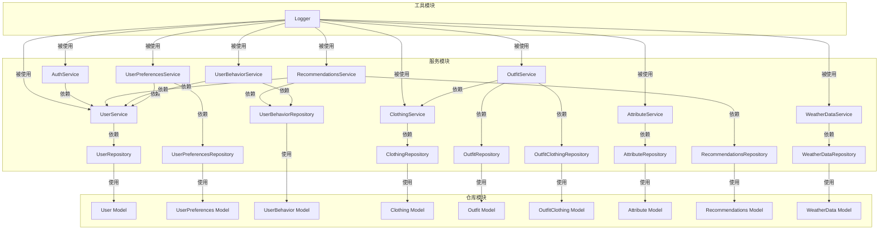
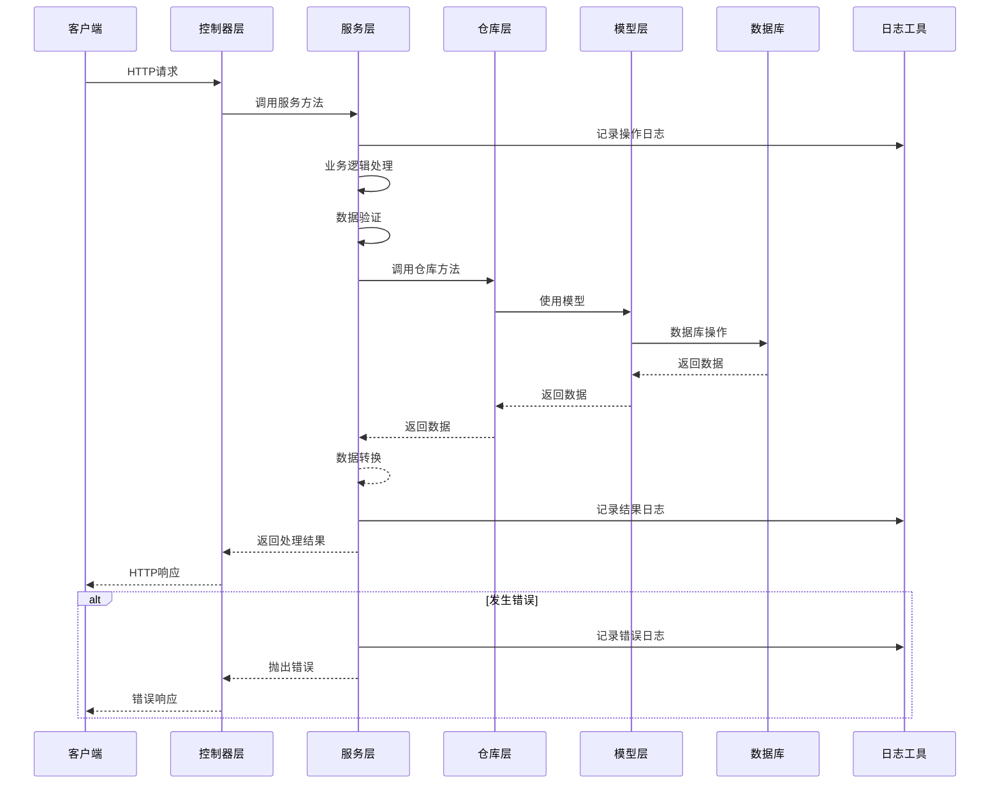

# 服务层开发设计文档

## 整体架构图

```mermaid
flowchart TD
    subgraph "控制器层 (Controllers)" 
        C1[UserController] --> S1[UserService]
        C2[ClothingController] --> S2[ClothingService]
        C3[OutfitController] --> S3[OutfitService]
        C4[AuthController] --> S4[AuthService]
        C5[AttributeController] --> S5[AttributeService]
        C6[RecommendationsController] --> S6[RecommendationsService]
        C7[WeatherController] --> S7[WeatherDataService]
    end

    subgraph "服务层 (Services)" 
        S1 --> R1[UserRepository]
        S2 --> R2[ClothingRepository]
        S3 --> R3[OutfitRepository]
        S3 --> R4[OutfitClothingRepository]
        S3 --> R2
        S5 --> R5[AttributeRepository]
        S6 --> R6[RecommendationsRepository]
        S6 --> R7[UserBehaviorRepository]
        S6 --> R1
        S7 --> R8[WeatherDataRepository]
        S9[UserPreferencesService] --> R9[UserPreferencesRepository]
        S9 --> R1
        S10[UserBehaviorService] --> R7
        S10 --> R1
    end

    subgraph "仓库层 (Repositories)" 
        R1 --> M1[User Model]
        R2 --> M2[Clothing Model]
        R3 --> M3[Outfit Model]
        R4 --> M4[OutfitClothing Model]
        R5 --> M5[Attribute Model]
        R6 --> M6[Recommendations Model]
        R7 --> M7[UserBehavior Model]
        R8 --> M8[WeatherData Model]
        R9 --> M9[UserPreferences Model]
    end

    subgraph "模型层 (Models)" 
        M1 --> DB[(数据库)]
        M2 --> DB
        M3 --> DB
        M4 --> DB
        M5 --> DB
        M6 --> DB
        M7 --> DB
        M8 --> DB
        M9 --> DB
    end

    subgraph "工具层 (Utils)" 
        UT[Logger] -- 日志记录 --> S1
        UT -- 日志记录 --> S2
        UT -- 日志记录 --> S3
        UT -- 日志记录 --> S4
        UT -- 日志记录 --> S5
        UT -- 日志记录 --> S6
        UT -- 日志记录 --> S7
        UT -- 日志记录 --> S9
        UT -- 日志记录 --> S10
    end
```



## 分层设计和核心组件

### 1. 控制器层 (Controllers)
- **功能**: 处理HTTP请求，调用服务层方法，返回响应
- **关键组件**: 各种Controller类，如UserController、ClothingController等
- **交互方式**: 通过路由接收请求，调用对应服务层方法，将结果返回给客户端

### 2. 服务层 (Services)
- **功能**: 实现业务逻辑，数据验证，错误处理，调用仓库层
- **关键组件**: 各种Service类，如UserService、ClothingService等
- **交互方式**: 接收控制器层的调用，执行业务逻辑，调用仓库层进行数据操作，返回处理结果

### 3. 仓库层 (Repositories)
- **功能**: 封装数据访问逻辑，提供CRUD操作
- **关键组件**: 各种Repository类，如UserRepository、ClothingRepository等
- **交互方式**: 被服务层调用，执行SQL操作，返回数据结果

### 4. 模型层 (Models)
- **功能**: 定义数据结构和关联关系
- **关键组件**: 各种Model类，如User、Clothing等
- **交互方式**: 被仓库层使用，映射数据库表结构

### 5. 工具层 (Utils)
- **功能**: 提供通用工具和辅助功能
- **关键组件**: Logger等工具类
- **交互方式**: 被服务层使用，记录日志、执行工具函数等

## 模块依赖关系图



## 接口契约定义

### 1. 服务层通用接口模式

每个服务都应遵循以下接口模式：

```typescript
// 查询选项接口
export interface {Entity}QueryOptions {
  // 通用分页和排序参数
  page?: number;
  limit?: number;
  sortBy?: string;
  sortOrder?: 'ASC' | 'DESC';
  
  // 实体特定参数
  // ...
}

// 创建数据接口
export interface {Entity}CreateData {
  // 创建实体所需的字段
  // ...
}

// 更新数据接口
export interface {Entity}UpdateData {
  // 更新实体所需的字段（可选）
  // ...
}

// 服务类
export class {Entity}Service {
  // 创建实体
  async create(data: {Entity}CreateData): Promise<any>;
  
  // 获取实体列表
  async getAll(options: {Entity}QueryOptions): Promise<any>;
  
  // 获取单个实体
  async getById(id: number, options?: {Entity}QueryOptions): Promise<any | null>;
  
  // 更新实体
  async update(id: number, data: {Entity}UpdateData): Promise<any | null>;
  
  // 删除实体
  async delete(id: number): Promise<boolean>;
  
  // 其他业务方法
  // ...
}
```

### 2. 具体服务接口示例

#### UserService接口

```typescript
// 用户查询选项
export interface UserQueryOptions {
  username?: string;
  email?: string;
  status?: UserStatus;
  registeredAfter?: Date;
  registeredBefore?: Date;
  sortBy?: string;
  sortOrder?: 'ASC' | 'DESC';
  page?: number;
  limit?: number;
}

// 用户创建数据
export interface UserCreateData {
  username: string;
  email: string;
  password: string;
  avatarUrl?: string;
  fullName?: string;
  // ...
}

// 用户更新数据
export interface UserUpdateData {
  username?: string;
  email?: string;
  password?: string;
  avatarUrl?: string;
  fullName?: string;
  status?: UserStatus;
  // ...
}

// UserService类
export class UserService {
  async create(data: UserCreateData): Promise<User>;
  async getAll(options: UserQueryOptions = {}): Promise<User[]>;
  async getById(id: number): Promise<User | null>;
  async update(id: number, data: UserUpdateData): Promise<User | null>;
  async delete(id: number): Promise<boolean>;
  async findByUsername(username: string): Promise<User | null>;
  async findByEmail(email: string): Promise<User | null>;
  // ...
}
```

## 数据流向图



## 异常处理策略

### 1. 错误类型

- **业务逻辑错误**: 如用户不存在、数据验证失败等
- **数据访问错误**: 如数据库连接失败、查询超时等
- **系统错误**: 如服务器内部错误、内存溢出等

### 2. 错误处理流程

1. **捕获异常**: 在服务层方法中使用try-catch捕获所有可能的异常
2. **记录日志**: 使用logger工具记录详细的错误信息
3. **错误转换**: 将底层错误转换为适合上层处理的错误信息
4. **抛出错误**: 抛出包含详细信息的错误，供控制器层处理
5. **统一响应**: 控制器层统一处理错误，返回适当的HTTP响应

### 3. 错误处理示例

```typescript
try {
  // 业务逻辑代码
  // ...
} catch (error) {
  logger.error('操作失败:', error);
  throw new Error(`操作失败: ${error instanceof Error ? error.message : String(error)}`);
}
```

## 设计原则

1. **严格遵循任务范围**：不添加额外的扩展功能
2. **与现有系统架构一致**：保持代码风格、命名规范、设计模式的一致性
3. **复用现有组件和模式**：复用已有的日志工具、错误处理模式等
4. **保持代码简洁**：避免过度设计，保持代码简洁可读
5. **确保类型安全**：严格遵循TypeScript语法规范，确保类型安全
6. **实现用户权限隔离**：确保用户只能访问和操作自己的数据