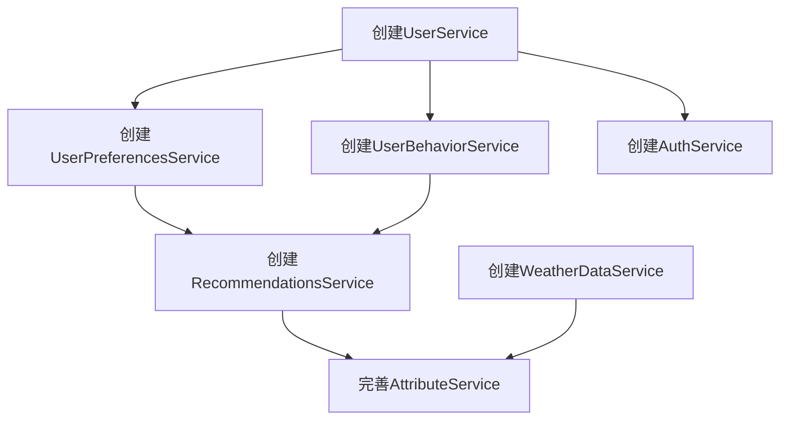

# 服务层开发任务拆分文档

## 任务依赖图

## 子任务拆分

### 任务1: 创建UserService

**输入契约**:
- 前置依赖: UserRepository、User模型已存在
- 输入数据: 无
- 环境依赖: TypeScript编译环境

**输出契约**:
- 输出数据: 无
- 交付物: `src/services/UserService.ts`文件
- 验收标准: 文件创建成功，通过TypeScript编译检查

**实现约束**:
- 技术栈: TypeScript
- 接口规范: 实现完整的CRUD操作
- 质量要求: 代码规范，添加适当注释

**依赖关系**:
- 前置任务: 无
- 后置任务: UserPreferencesService、UserBehaviorService、AuthService

### 任务2: 创建UserPreferencesService

**输入契约**:
- 前置依赖: UserPreferencesRepository、UserPreferences模型已存在，UserService已创建
- 输入数据: 无
- 环境依赖: TypeScript编译环境

**输出契约**:
- 输出数据: 无
- 交付物: `src/services/UserPreferencesService.ts`文件
- 验收标准: 文件创建成功，通过TypeScript编译检查

**实现约束**:
- 技术栈: TypeScript
- 接口规范: 实现完整的CRUD操作
- 质量要求: 代码规范，添加适当注释

**依赖关系**:
- 前置任务: UserService
- 后置任务: RecommendationsService

### 任务3: 创建UserBehaviorService

**输入契约**:
- 前置依赖: UserBehaviorRepository、UserBehavior模型已存在，UserService已创建
- 输入数据: 无
- 环境依赖: TypeScript编译环境

**输出契约**:
- 输出数据: 无
- 交付物: `src/services/UserBehaviorService.ts`文件
- 验收标准: 文件创建成功，通过TypeScript编译检查

**实现约束**:
- 技术栈: TypeScript
- 接口规范: 实现完整的CRUD操作
- 质量要求: 代码规范，添加适当注释

**依赖关系**:
- 前置任务: UserService
- 后置任务: RecommendationsService

### 任务4: 完善AuthService

**输入契约**:
- 前置依赖: AuthService文件已存在，UserService已创建
- 输入数据: 无
- 环境依赖: TypeScript编译环境

**输出契约**:
- 输出数据: 无
- 交付物: 完善的`src/services/AuthService.ts`文件
- 验收标准: 通过TypeScript编译检查

**实现约束**:
- 技术栈: TypeScript
- 接口规范: 与现有代码风格保持一致
- 质量要求: 代码规范，添加适当注释

**依赖关系**:
- 前置任务: UserService
- 后置任务: 无

### 任务5: 创建RecommendationsService

**输入契约**:
- 前置依赖: RecommendationsRepository、Recommendations模型已存在，UserService、UserPreferencesService、UserBehaviorService已创建
- 输入数据: 无
- 环境依赖: TypeScript编译环境

**输出契约**:
- 输出数据: 无
- 交付物: `src/services/RecommendationsService.ts`文件
- 验收标准: 文件创建成功，通过TypeScript编译检查

**实现约束**:
- 技术栈: TypeScript
- 接口规范: 实现完整的CRUD操作
- 质量要求: 代码规范，添加适当注释

**依赖关系**:
- 前置任务: UserService、UserPreferencesService、UserBehaviorService
- 后置任务: AttributeService

### 任务6: 完善AttributeService

**输入契约**:
- 前置依赖: AttributeService文件已存在
- 输入数据: 无
- 环境依赖: TypeScript编译环境

**输出契约**:
- 输出数据: 无
- 交付物: 完善的`src/services/AttributeService.ts`文件
- 验收标准: 通过TypeScript编译检查

**实现约束**:
- 技术栈: TypeScript
- 接口规范: 与现有代码风格保持一致
- 质量要求: 代码规范，添加适当注释

**依赖关系**:
- 前置任务: RecommendationsService、WeatherDataService
- 后置任务: 无

### 任务7: 创建WeatherDataService

**输入契约**:
- 前置依赖: WeatherDataRepository、WeatherData模型已存在
- 输入数据: 无
- 环境依赖: TypeScript编译环境

**输出契约**:
- 输出数据: 无
- 交付物: `src/services/WeatherDataService.ts`文件
- 验收标准: 文件创建成功，通过TypeScript编译检查

**实现约束**:
- 技术栈: TypeScript
- 接口规范: 实现完整的CRUD操作
- 质量要求: 代码规范，添加适当注释

**依赖关系**:
- 前置任务: 无
- 后置任务: AttributeService

## 拆分原则

1. **复杂度可控**: 每个子任务专注于实现一个服务，确保复杂度可控
2. **按功能模块分解**: 按实体类型分解任务，确保任务原子性和独立性
3. **明确的验收标准**: 每个任务都有明确的交付物和验收标准
4. **依赖关系清晰**: 明确任务之间的依赖关系，确保按正确顺序执行
5. **可独立验证**: 每个任务都可以独立编译和测试

## 执行顺序

根据任务依赖关系，建议按以下顺序执行任务:

1. 任务1: 创建UserService
2. 任务2: 创建UserPreferencesService
3. 任务3: 创建UserBehaviorService
4. 任务4: 完善AuthService
5. 任务7: 创建WeatherDataService
6. 任务5: 创建RecommendationsService
7. 任务6: 完善AttributeService

每个任务完成后，应立即运行`npx tsc --noEmit`命令验证编译结果，确保代码质量。