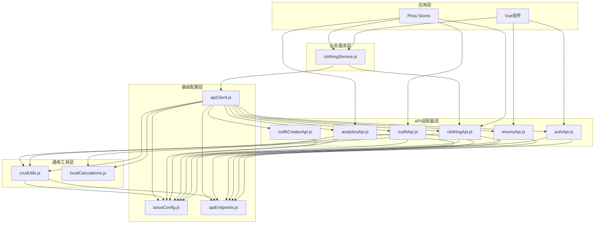
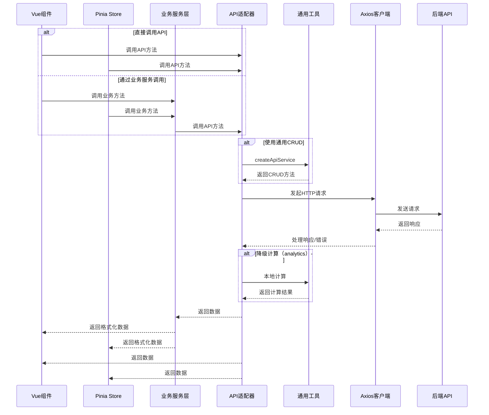
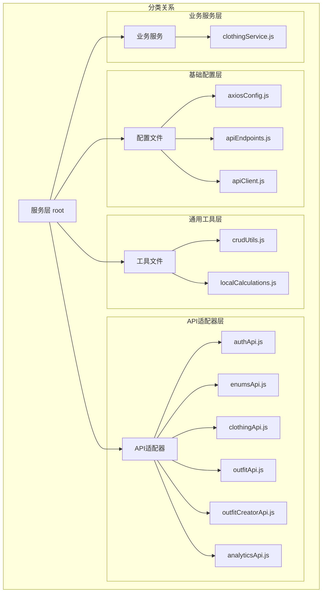
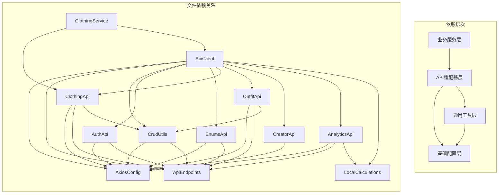

# 服务层架构图

## 1. 整体分层架构

## 2. API调用数据流

## 3. 文件分类关系图

## 4. 依赖层次图

## 5. 服务层调用关系总结

- **基础配置层**：为所有上层提供基础设施，不依赖其他服务层文件
- **通用工具层**：依赖基础配置层，为API适配器层提供工具函数
- **API适配器层**：依赖基础配置层和通用工具层，为业务服务层和应用层提供API调用
- **业务服务层**：依赖API适配器层和apiClient，为应用层提供业务逻辑封装

这种分层设计确保了：
1. **关注点分离**：每一层专注于特定职责
2. **代码复用**：通过通用工具和基础配置实现代码共享
3. **易维护性**：修改特定层不会影响其他层
4. **扩展性**：可以轻松添加新的API适配器或业务服务