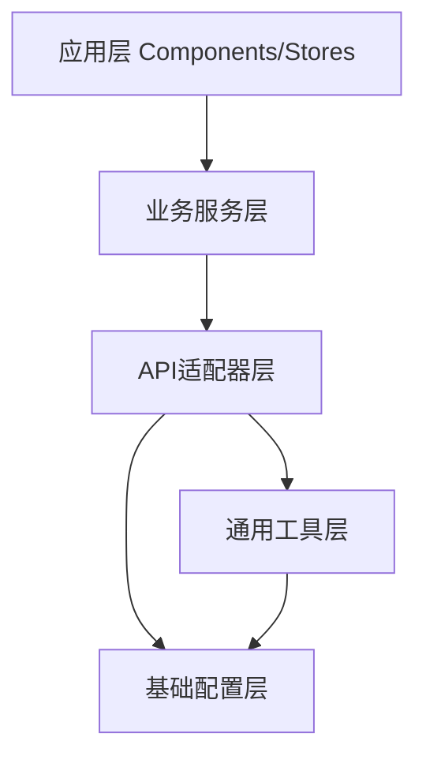
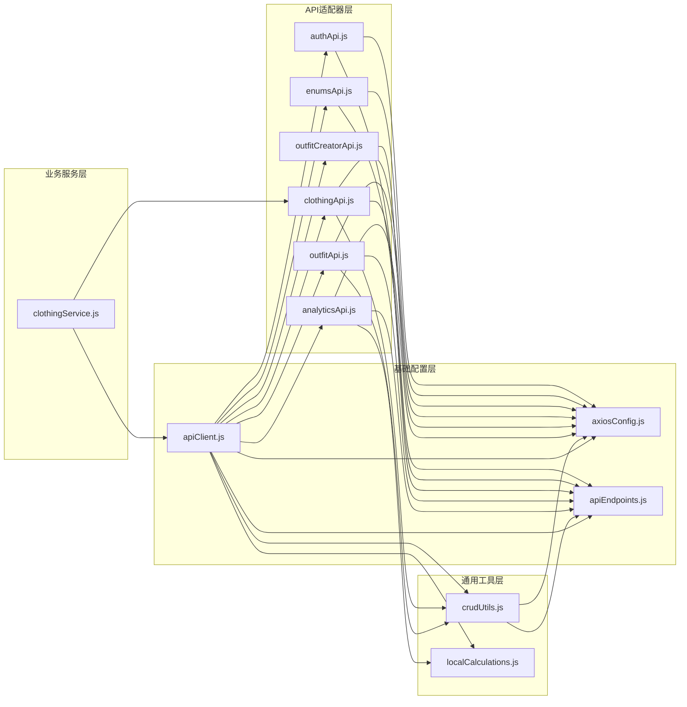
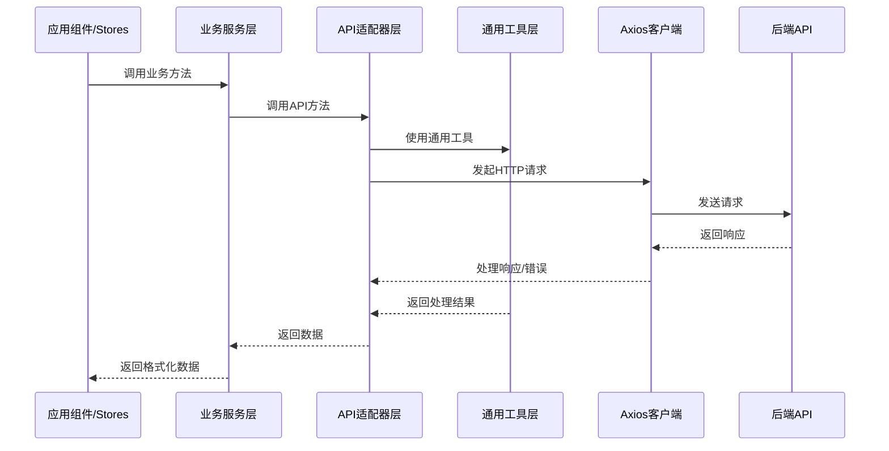

# 服务层文件分类整理 - 设计文档

## 1. 整体架构

StyleVault前端服务层采用了清晰的分层架构设计，包含以下几个主要层次：

## 2. 分层设计与文件分类

### 2.1 基础配置层

**职责**：提供HTTP客户端配置、API端点定义和统一入口

**代表文件**：
- **axiosConfig.js**
  - 创建和配置axios实例
  - 设置请求/响应拦截器
  - 统一错误处理
  - 认证信息处理

- **apiEndpoints.js**
  - 集中管理所有API端点路径
  - 按资源类型组织端点
  - 提供动态端点生成函数

- **apiClient.js**
  - 服务层主入口文件
  - 统一导出所有API服务
  - 导出通用工具和配置

### 2.2 通用工具层

**职责**：提供跨资源的通用功能和工具函数

**代表文件**：
- **crudUtils.js**
  - 提供通用CRUD操作模板
  - 通过工厂函数创建API服务
  - 封装基础的增删改查方法

- **localCalculations.js**
  - 提供本地数据分析计算函数
  - 支持离线降级功能
  - 包含各类统计分析方法

### 2.3 API适配器层

**职责**：封装特定资源的API调用，处理特定业务需求

**代表文件**：
- **authApi.js**
  - 用户认证相关API（登录、注册、登出）
  - 用户信息获取
  - 本地存储操作（token、user信息）

- **enumsApi.js**
  - 枚举类型数据获取
  - 按类型获取枚举值

- **clothingApi.js**
  - 衣物相关CRUD操作
  - 类别管理
  - 收藏功能
  - 搜索功能
  - 批量更新

- **outfitApi.js**
  - 搭配相关CRUD操作
  - 标签筛选
  - 点赞功能

- **outfitCreatorApi.js**
  - 搭配创建器专用API
  - 简化版的衣物和搭配操作

- **analyticsApi.js**
  - 数据分析相关API
  - 提供API调用和本地降级双重机制

### 2.4 业务服务层

**职责**：封装业务逻辑，处理数据转换和验证

**代表文件**：
- **clothingService.js**
  - 封装衣物相关业务逻辑
  - 处理API响应数据格式
  - 错误处理和日志记录
  - 提供统一的数据访问接口

## 3. 模块依赖关系图

## 4. 接口契约定义

### 4.1 基础配置层接口

**axiosConfig.js**
- 导出配置好的axios实例
- 提供请求/响应拦截器配置

**apiEndpoints.js**
- 导出API_ENDPOINTS对象，包含所有端点定义
- 提供静态和动态端点获取方法

**apiClient.js**
- 导出默认的axios实例
- 导出所有API服务和工具函数

### 4.2 通用工具层接口

**crudUtils.js**
- createApiService(resource): 创建特定资源的API服务
- 返回包含getAll、getById、create、update、delete方法的对象

**localCalculations.js**
- 提供多种计算函数：calculateClothingStats、calculateCategoryDistribution等
- 每个函数接收数据，返回计算结果

### 4.3 API适配器层接口

各API适配器提供针对特定资源的方法，如：
- 通用CRUD方法（通过crudUtils创建）
- 资源特定的业务方法

### 4.4 业务服务层接口

**clothingService.js**
- 提供经过业务处理的API方法
- 确保返回数据格式一致性
- 包含错误处理和日志记录

## 5. 数据流向图

## 6. 异常处理策略

服务层采用多层异常处理策略：

1. **基础层**：axiosConfig.js中的响应拦截器提供统一错误处理
2. **API层**：各API适配器可以自定义特定错误处理
3. **服务层**：业务服务层捕获并处理业务相关异常
4. **降级处理**：部分功能（如analyticsApi）提供本地降级计算能力

## 7. 设计原则

1. **单一职责**：每个文件和模块职责单一，专注于特定功能
2. **依赖注入**：通过apiClient统一管理和导出服务，便于依赖注入
3. **代码复用**：通过crudUtils等工具实现代码复用
4. **可维护性**：集中管理API端点，便于后期维护和更新
5. **错误隔离**：多层错误处理，避免错误扩散

## 8. 文件分类总结表

| 分类 | 文件名 | 主要职责 | 依赖文件 |
|------|--------|----------|----------|
| **基础配置层** | axiosConfig.js | HTTP客户端配置和拦截器 | - |
| | apiEndpoints.js | API端点定义和管理 | - |
| | apiClient.js | 服务层统一入口和导出 | 所有其他服务文件 |
| **通用工具层** | crudUtils.js | 通用CRUD操作生成 | axiosConfig.js, apiEndpoints.js |
| | localCalculations.js | 本地数据分析计算 | - |
| **API适配器层** | authApi.js | 认证相关API | axiosConfig.js, apiEndpoints.js |
| | enumsApi.js | 枚举类型API | axiosConfig.js, apiEndpoints.js |
| | clothingApi.js | 衣物相关API | axiosConfig.js, apiEndpoints.js, crudUtils.js |
| | outfitApi.js | 搭配相关API | axiosConfig.js, apiEndpoints.js, crudUtils.js |
| | outfitCreatorApi.js | 搭配创建器API | axiosConfig.js |
| | analyticsApi.js | 数据分析API | axiosConfig.js, apiEndpoints.js, localCalculations.js |
| **业务服务层** | clothingService.js | 衣物业务逻辑封装 | apiClient.js |