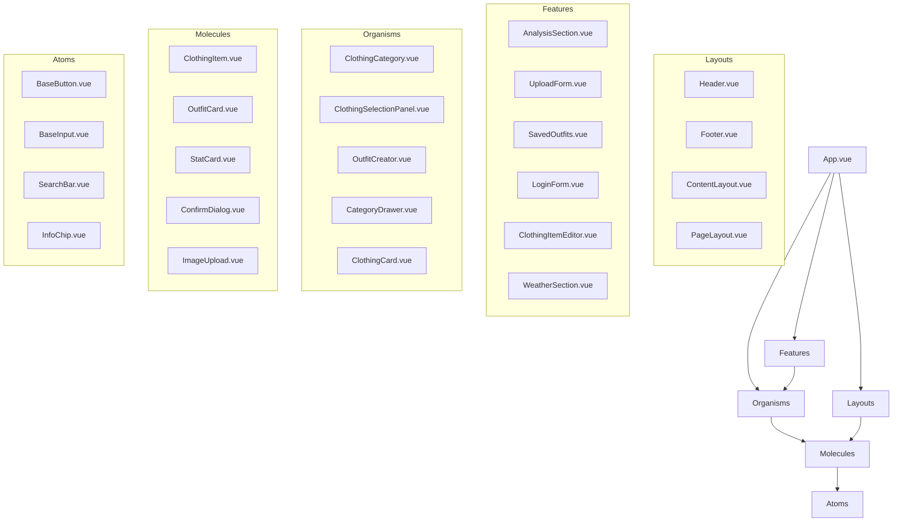
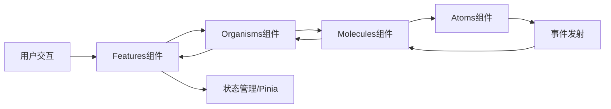

# 组件目录重构任务设计文档

## 整体架构图

## 模块设计

### 1. Atoms模块

**职责**：提供最基础的UI元素

**组件列表**：
- BaseButton.vue
- BaseInput.vue
- SearchBar.vue
- InfoChip.vue
- FeatureCard.vue

**依赖关系**：
- 无外部组件依赖，仅依赖基础库（如Vue、TailwindCSS）

### 2. Molecules模块

**职责**：提供由多个原子组件组成的功能单元

**组件列表**：
- ClothingItem.vue
- OutfitCard.vue
- StatCard.vue
- ConfirmDialog.vue
- FloatingActionButton.vue
- FavoriteToggle.vue
- ImageUpload.vue
- SeasonSelector.vue
- InspirationOutfitCard.vue

**依赖关系**：
- 依赖Atoms模块的组件
- 可能依赖Vue的内置组件和指令

### 3. Organisms模块

**职责**：提供由多个分子组件组成的完整功能模块

**组件列表**：
- ClothingCategory.vue
- ClothingSelectionPanel.vue
- OutfitCreator.vue
- OutfitPreviewPanel.vue
- CategoryDrawer.vue
- ClothingCard.vue
- BasicInfoForm.vue
- UploadModal.vue

**依赖关系**：
- 依赖Molecules模块的组件
- 可能依赖Atoms模块的组件

### 4. Layouts模块

**职责**：提供全局布局结构

**组件列表**：
- Header.vue
- Footer.vue
- ContentLayout.vue
- PageLayout.vue
- DrawerHeader.vue
- WardrobeHeader.vue

**依赖关系**：
- 可能依赖Molecules模块的组件（如FloatingActionButton.vue）

### 5. Features模块

**职责**：提供按业务功能划分的组件集合

**子模块**：
- **analysis**：分析相关组件
- **form**：表单相关组件
- **inspiration**：灵感相关组件
- **login**：登录相关组件
- **wardrobe**：衣橱相关组件
- **weather**：天气相关组件

**依赖关系**：
- 依赖Organisms、Molecules和Atoms模块的组件
- 可能依赖Layouts模块的组件

## 接口规范

### 组件接口

所有组件的Props、Emits和Slots在重构后保持不变。

### 引用路径规范

1. **绝对路径引用**：使用`@/components/`作为根路径
   - 例如：`import BaseButton from '@/components/atoms/BaseButton.vue'`

2. **相对路径引用**：仅在同一功能模块内部使用
   - 例如：`import LoginForm from './LoginForm.vue'`

## 数据流向

## 异常处理策略

1. **编译错误**：使用IDE的全局替换功能确保所有引用路径正确
2. **运行时错误**：进行全面的功能测试，确保所有组件功能正常
3. **命名冲突**：重命名冲突的组件，确保命名唯一且描述性强

## 迁移步骤

1. 创建新的目录结构
2. 移动原子组件到atoms目录
3. 移动分子组件到molecules目录
4. 移动有机体组件到organisms目录
5. 移动布局组件到layouts目录
6. 移动功能模块组件到features目录
7. 更新所有组件内部的引用路径
8. 更新所有页面组件的引用路径
9. 更新App.vue的引用路径
10. 运行编译命令验证
11. 运行开发服务器验证

## 代码质量要求

1. **保持代码风格一致**：遵循项目现有的代码规范
2. **保持组件功能不变**：不修改组件内部逻辑
3. **更新文档**：确保README和其他文档与新的目录结构一致
4. **测试覆盖**：确保所有组件在重构后都能正常工作
