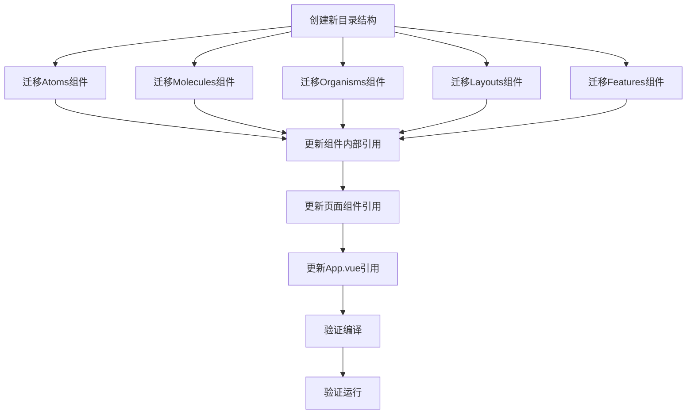

# 组件目录重构任务分解文档

## 任务概述

将`/Users/sunxiaokai/Desktop/stylevault-vue-project/front/src/components/`目录按照新的架构设计进行重构，建立清晰的组件分类体系。

## 任务依赖图

## 原子任务列表

### 任务1: 创建新的目录结构

**输入契约**：
- 现有components目录
- CONSENSUS和DESIGN文档

**输出契约**：
- 新的目录结构已创建

**实现约束**：
- 严格按照DESIGN文档中的目录结构创建

**步骤**：
1. 在`/front/src/components/`目录下创建`atoms`目录
2. 创建`molecules`目录
3. 创建`organisms`目录
4. 创建`layouts`目录
5. 创建`features`目录
6. 在`features`目录下创建`analysis`、`form`、`inspiration`、`login`、`wardrobe`、`weather`子目录

### 任务2: 迁移Atoms组件

**输入契约**：
- 新的atoms目录已创建
- 现有组件文件
- CONSENSUS文档中的组件迁移映射表

**输出契约**：
- 所有Atoms组件已迁移到新目录

**实现约束**：
- 保持组件文件内容不变

**步骤**：
1. 将`ui/atoms/BaseButton.vue`移动到`atoms/BaseButton.vue`
2. 将`ui/atoms/BaseInput.vue`移动到`atoms/BaseInput.vue`
3. 将`ui/atoms/FeatureCard.vue`移动到`atoms/FeatureCard.vue`
4. 将`ui/atoms/SearchBar.vue`移动到`atoms/SearchBar.vue`
5. 将`inspiration/InfoChip.vue`移动到`atoms/InfoChip.vue`

### 任务3: 迁移Molecules组件

**输入契约**：
- 新的molecules目录已创建
- 现有组件文件
- CONSENSUS文档中的组件迁移映射表

**输出契约**：
- 所有Molecules组件已迁移到新目录

**实现约束**：
- 保持组件文件内容不变
- 重命名冲突的组件

**步骤**：
1. 将`ui/molecules/ClothingItem.vue`移动到`molecules/ClothingItem.vue`
2. 将`ui/molecules/OutfitCard.vue`移动到`molecules/OutfitCard.vue`
3. 将`ui/StatCard.vue`移动到`molecules/StatCard.vue`
4. 将`ui/ConfirmDialog.vue`移动到`molecules/ConfirmDialog.vue`
5. 将`ui/FloatingActionButton.vue`移动到`molecules/FloatingActionButton.vue`
6. 将`wardrobe/ClothingItemEditor/FavoriteToggle.vue`移动到`molecules/FavoriteToggle.vue`
7. 将`wardrobe/ClothingItemEditor/ImageUpload.vue`移动到`molecules/ImageUpload.vue`
8. 将`wardrobe/ClothingItemEditor/SeasonSelector.vue`移动到`molecules/SeasonSelector.vue`
9. 将`inspiration/OutfitCard.vue`移动到`molecules/InspirationOutfitCard.vue`（重命名避免冲突）

### 任务4: 迁移Organisms组件

**输入契约**：
- 新的organisms目录已创建
- 现有组件文件
- CONSENSUS文档中的组件迁移映射表

**输出契约**：
- 所有Organisms组件已迁移到新目录

**实现约束**：
- 保持组件文件内容不变

**步骤**：
1. 将`ui/ClothingCategory.vue`移动到`organisms/ClothingCategory.vue`
2. 将`inspiration/ClothingSelectionPanel.vue`移动到`organisms/ClothingSelectionPanel.vue`
3. 将`inspiration/OutfitCreator.vue`移动到`organisms/OutfitCreator.vue`
4. 将`inspiration/OutfitPreviewPanel.vue`移动到`organisms/OutfitPreviewPanel.vue`
5. 将`wardrobe/CategoryDrawer.vue`移动到`organisms/CategoryDrawer.vue`
6. 将`wardrobe/ClothingCard.vue`移动到`organisms/ClothingCard.vue`
7. 将`wardrobe/ClothingItemEditor/BasicInfoForm.vue`移动到`organisms/BasicInfoForm.vue`
8. 将`ui/UploadModal.vue`移动到`organisms/UploadModal.vue`

### 任务5: 迁移Layouts组件

**输入契约**：
- 新的layouts目录已创建
- 现有组件文件
- CONSENSUS文档中的组件迁移映射表

**输出契约**：
- 所有Layouts组件已迁移到新目录

**实现约束**：
- 保持组件文件内容不变

**步骤**：
1. 将`layout/Header.vue`移动到`layouts/Header.vue`
2. 将`layout/Footer.vue`移动到`layouts/Footer.vue`
3. 将`layout/ContentLayout.vue`移动到`layouts/ContentLayout.vue`
4. 将`layout/PageLayout.vue`移动到`layouts/PageLayout.vue`
5. 将`wardrobe/DrawerHeader.vue`移动到`layouts/DrawerHeader.vue`
6. 将`wardrobe/WardrobeHeader.vue`移动到`layouts/WardrobeHeader.vue`

### 任务6: 迁移Features组件

**输入契约**：
- 新的features目录及其子目录已创建
- 现有组件文件
- CONSENSUS文档中的组件迁移映射表

**输出契约**：
- 所有Features组件已迁移到新目录

**实现约束**：
- 保持组件文件内容不变

**步骤**：
1. 将`analysis/AnalysisSection.vue`移动到`features/analysis/AnalysisSection.vue`
2. 将`form/SeasonMultiSelect.vue`移动到`features/form/SeasonMultiSelect.vue`
3. 将`form/UploadForm.vue`移动到`features/form/UploadForm.vue`
4. 将`inspiration/SavedOutfits.vue`移动到`features/inspiration/SavedOutfits.vue`
5. 将`wardrobe/FeaturedOutfits.vue`移动到`features/inspiration/FeaturedOutfits.vue`
6. 将`login/BrandSection.vue`移动到`features/login/BrandSection.vue`
7. 将`login/LoginForm.vue`移动到`features/login/LoginForm.vue`
8. 将`login/RegisterForm.vue`移动到`features/login/RegisterForm.vue`
9. 将`wardrobe/ClothingItemEditor.vue`移动到`features/wardrobe/ClothingItemEditor.vue`
10. 将`wardrobe/EmptyState.vue`移动到`features/wardrobe/EmptyState.vue`
11. 将`wardrobe/FavoriteSection.vue`移动到`features/wardrobe/FavoriteSection.vue`
12. 将`weather/WeatherSection.vue`移动到`features/weather/WeatherSection.vue`

### 任务7: 更新组件内部引用

**输入契约**：
- 所有组件已迁移到新目录
- 现有组件文件中的import语句

**输出契约**：
- 所有组件内部的import语句已更新

**实现约束**：
- 使用绝对路径引用（`@/components/`）

**步骤**：
1. 更新Atoms组件内部的import语句
2. 更新Molecules组件内部的import语句
3. 更新Organisms组件内部的import语句
4. 更新Layouts组件内部的import语句
5. 更新Features组件内部的import语句

### 任务8: 更新页面组件引用

**输入契约**：
- 所有组件已迁移到新目录
- views目录下的页面组件

**输出契约**：
- 所有页面组件的import语句已更新

**实现约束**：
- 使用绝对路径引用（`@/components/`）

**步骤**：
1. 更新`views/AnalysisView.vue`中的import语句
2. 更新`views/InspirationView.vue`中的import语句
3. 更新`views/LoginPage.vue`中的import语句
4. 更新`views/UploadView.vue`中的import语句
5. 更新`views/WardrobeView.vue`中的import语句
6. 更新`views/WeatherView.vue`中的import语句

### 任务9: 更新App.vue引用

**输入契约**：
- 所有组件已迁移到新目录
- App.vue文件

**输出契约**：
- App.vue中的import语句已更新

**实现约束**：
- 使用绝对路径引用（`@/components/`）

**步骤**：
1. 更新App.vue中的Header、Footer和FloatingActionButton组件的import语句

### 任务10: 验证编译

**输入契约**：
- 所有import语句已更新
- 项目依赖已安装

**输出契约**：
- 项目能够正常编译

**实现约束**：
- 运行`npm run build`命令
- 确保没有编译错误

**步骤**：
1. 进入`/front`目录
2. 运行`npm run build`命令
3. 检查编译输出，确保没有错误

### 任务11: 验证运行

**输入契约**：
- 项目能够正常编译

**输出契约**：
- 项目能够正常运行

**实现约束**：
- 运行`npm run dev`命令
- 确保没有运行时错误
- 确保所有组件功能正常

**步骤**：
1. 进入`/front`目录
2. 运行`npm run dev`命令
3. 打开浏览器访问开发服务器
4. 检查所有页面和组件功能

## 验收标准

1. ✅ 所有原子任务已完成
2. ✅ 新的目录结构已创建
3. ✅ 所有组件已迁移到新目录
4. ✅ 所有import语句已更新
5. ✅ 项目能够正常编译
6. ✅ 项目能够正常运行
7. ✅ 所有组件功能保持不变
