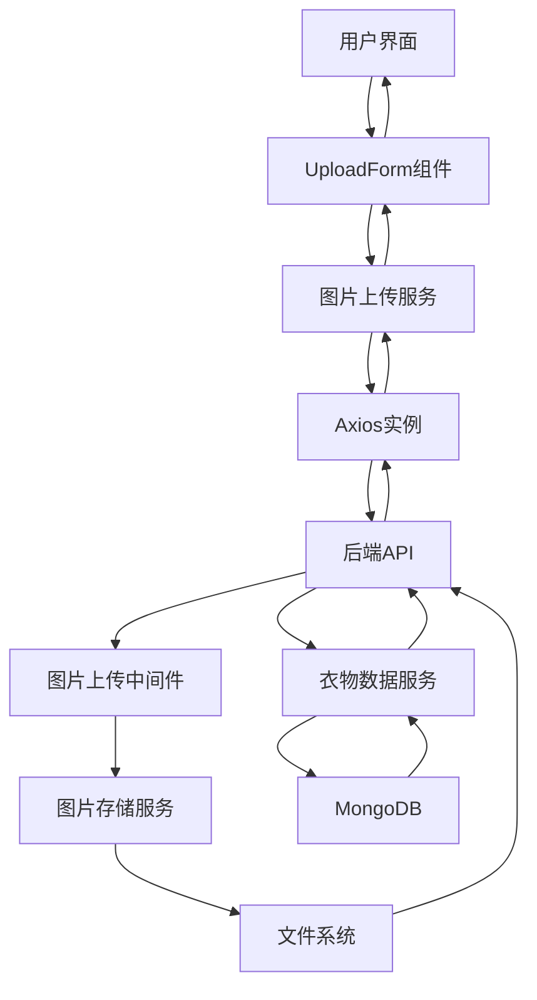
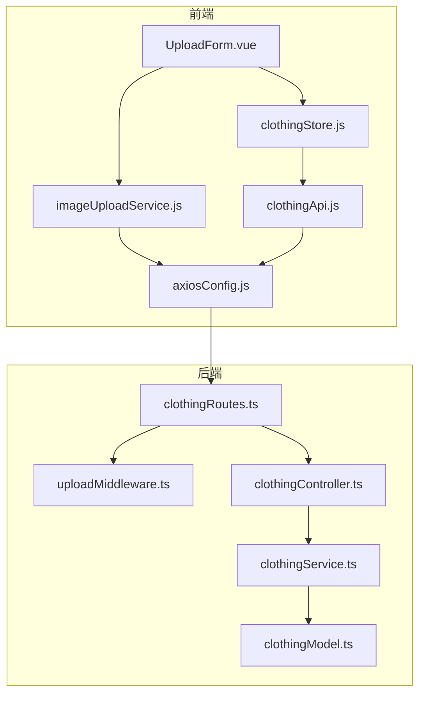
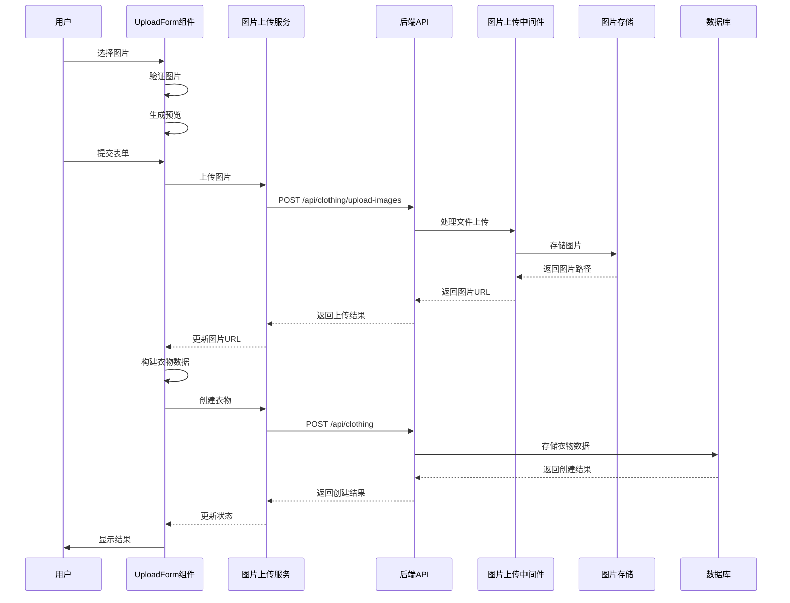

# 图片上传功能实现 - DESIGN 文档

## 整体架构图



## 分层设计

### 前端分层

1. **表现层**
   - **组件**: UploadForm.vue
   - **功能**: 提供用户界面，处理用户交互
   - **文件位置**: `/front/src/components/UploadForm.vue`

2. **服务层**
   - **服务**: imageUploadService.js
   - **功能**: 封装图片上传逻辑，处理API请求
   - **文件位置**: `/front/src/services/imageUploadService.js`

3. **数据层**
   - **存储**: clothingStore.js
   - **功能**: 管理衣物数据，包括图片URL
   - **文件位置**: `/front/src/stores/modules/clothingStore.js`

### 后端分层

1. **接口层**
   - **路由**: clothingRoutes.ts
   - **功能**: 定义API端点，处理HTTP请求
   - **文件位置**: `/backend/src/routes/clothingRoutes.ts`

2. **中间件层**
   - **中间件**: uploadMiddleware.ts
   - **功能**: 处理文件上传，验证文件类型和大小
   - **文件位置**: `/backend/src/middleware/uploadMiddleware.ts`

3. **业务逻辑层**
   - **控制器**: clothingController.ts
   - **功能**: 处理业务逻辑，协调服务层
   - **文件位置**: `/backend/src/controllers/clothingController.ts`

4. **数据层**
   - **服务**: clothingService.ts
   - **功能**: 处理数据持久化，与数据库交互
   - **文件位置**: `/backend/src/services/clothingService.ts`

## 模块依赖关系图



## 接口契约定义

### 1. 图片上传API

**端点**: `POST /api/clothing/upload-images`

**请求方式**: POST

**请求格式**: FormData

**请求参数**:
```javascript
FormData {
  'images[]': File[] // 图片文件数组
}
```

**响应格式**: JSON

**成功响应**:
```json
{
  "success": true,
  "message": "图片上传成功",
  "data": {
    "imageUrls": [
      "http://localhost:3000/uploads/image1.jpg",
      "http://localhost:3000/uploads/image2.jpg"
    ]
  }
}
```

**失败响应**:
```json
{
  "success": false,
  "message": "图片上传失败",
  "error": "错误详情"
}
```

### 2. 创建衣物API

**端点**: `POST /api/clothing`

**请求方式**: POST

**请求格式**: JSON

**请求参数**:
```json
{
  "name": "衣物名称",
  "category": "类别",
  "color": "颜色",
  "season": "季节",
  "occasion": "场合",
  "fit": "版型",
  "fabric": "面料",
  "mainImageUrl": "http://localhost:3000/uploads/main.jpg",
  "imageUrls": [
    "http://localhost:3000/uploads/image1.jpg",
    "http://localhost:3000/uploads/image2.jpg"
  ]
}
```

**响应格式**: JSON

**成功响应**:
```json
{
  "success": true,
  "message": "衣物创建成功",
  "data": {
    "_id": "60d0fe4f5311236168a109ca",
    "name": "衣物名称",
    "category": "类别",
    "color": "颜色",
    "season": "季节",
    "occasion": "场合",
    "fit": "版型",
    "fabric": "面料",
    "mainImageUrl": "http://localhost:3000/uploads/main.jpg",
    "imageUrls": [
      "http://localhost:3000/uploads/image1.jpg",
      "http://localhost:3000/uploads/image2.jpg"
    ],
    "createdAt": "2023-07-19T10:00:00.000Z",
    "updatedAt": "2023-07-19T10:00:00.000Z"
  }
}
```

**失败响应**:
```json
{
  "success": false,
  "message": "衣物创建失败",
  "error": "错误详情"
}
```

## 数据流向图



## 异常处理策略

### 前端异常处理

1. **网络异常**
   - 显示网络错误提示
   - 提供重试机制
   - 记录错误日志

2. **图片验证失败**
   - 显示具体的错误信息（类型/大小不符合要求）
   - 允许用户重新选择图片
   - 清除无效的图片预览

3. **上传失败**
   - 显示上传失败提示
   - 提供重试选项
   - 保留已上传的图片

### 后端异常处理

1. **文件上传异常**
   - 检查文件类型和大小
   - 返回400 Bad Request状态码
   - 提供详细的错误信息

2. **存储异常**
   - 检查文件系统权限
   - 返回500 Internal Server Error状态码
   - 记录错误日志

3. **数据库异常**
   - 检查数据库连接
   - 返回500 Internal Server Error状态码
   - 记录错误日志

## 安全措施

1. **前端安全**
   - 限制文件类型和大小
   - 防止XSS攻击
   - 使用HTTPS传输

2. **后端安全**
   - 验证文件类型和大小
   - 设置文件存储权限
   - 使用UUID生成文件名，防止路径遍历攻击
   - 限制上传文件数量
   - 配置CORS策略

## 性能优化

1. **前端优化**
   - 使用图片压缩（可选）
   - 实现分片上传（大文件）
   - 使用CDN加速图片加载

2. **后端优化**
   - 使用流式传输处理文件
   - 设置适当的缓存策略
   - 实现异步上传处理

## 扩展性考虑

1. **存储扩展**
   - 支持迁移到云存储（AWS S3、阿里云OSS等）
   - 实现存储服务抽象层

2. **功能扩展**
   - 支持图片编辑功能
   - 支持图片AI识别
   - 支持批量上传

3. **性能扩展**
   - 实现分布式存储
   - 支持负载均衡
   - 实现缓存机制

---

*本文档用于设计图片上传功能的系统架构和接口规范，确保实现的一致性和可扩展性。*