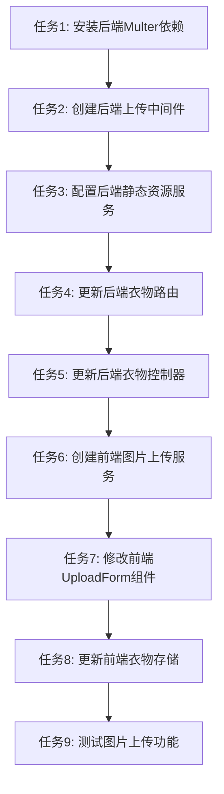

# 图片上传功能实现 - TASK 文档

## 任务拆分清单

### 任务1: 安装后端Multer依赖

**输入契约**:
- 后端项目目录：`/backend/`
- 现有package.json文件

**输出契约**:
- 成功安装multer和@types/multer依赖
- package.json文件更新

**实现约束**:
- 使用npm安装依赖
- 确保依赖版本与现有项目兼容

**依赖关系**:
- 无前置任务
- 后置任务：任务2

### 任务2: 创建后端上传中间件

**输入契约**:
- 后端项目目录：`/backend/`
- 已安装multer依赖

**输出契约**:
- 创建`/backend/src/middleware/uploadMiddleware.ts`文件
- 实现图片上传中间件
- 支持文件类型和大小验证

**实现约束**:
- 使用TypeScript编写
- 遵循现有项目编码规范
- 使用UUID生成文件名

**依赖关系**:
- 前置任务：任务1
- 后置任务：任务3

### 任务3: 配置后端静态资源服务

**输入契约**:
- 后端项目目录：`/backend/`
- app.ts文件

**输出契约**:
- 配置Express静态资源服务
- 允许通过`/uploads/`路径访问图片

**实现约束**:
- 修改app.ts文件
- 遵循现有项目编码规范

**依赖关系**:
- 前置任务：任务2
- 后置任务：任务4

### 任务4: 更新后端衣物路由

**输入契约**:
- 后端项目目录：`/backend/`
- 现有衣物路由文件
- 上传中间件

**输出契约**:
- 更新衣物路由，添加图片上传端点
- 支持多文件上传

**实现约束**:
- 使用TypeScript编写
- 遵循现有项目路由规范

**依赖关系**:
- 前置任务：任务3
- 后置任务：任务5

### 任务5: 更新后端衣物控制器

**输入契约**:
- 后端项目目录：`/backend/`
- 现有衣物控制器文件

**输出契约**:
- 更新衣物控制器，添加图片上传处理逻辑
- 支持创建衣物时关联图片URL

**实现约束**:
- 使用TypeScript编写
- 遵循现有项目控制器规范

**依赖关系**:
- 前置任务：任务4
- 后置任务：任务6

### 任务6: 创建前端图片上传服务

**输入契约**:
- 前端项目目录：`/front/`
- 现有axios配置

**输出契约**:
- 创建`/front/src/services/imageUploadService.js`文件
- 实现图片上传功能
- 支持多文件上传和进度显示

**实现约束**:
- 使用JavaScript编写
- 遵循现有项目服务层规范

**依赖关系**:
- 前置任务：任务5
- 后置任务：任务7

### 任务7: 修改前端UploadForm组件

**输入契约**:
- 前端项目目录：`/front/`
- 现有UploadForm.vue组件
- 图片上传服务

**输出契约**:
- 更新UploadForm.vue组件
- 支持图片上传功能
- 实现图片预览和主图设置

**实现约束**:
- 使用Vue 3 Composition API
- 遵循现有项目组件规范

**依赖关系**:
- 前置任务：任务6
- 后置任务：任务8

### 任务8: 更新前端衣物存储

**输入契约**:
- 前端项目目录：`/front/`
- 现有clothingStore.js文件

**输出契约**:
- 更新衣物存储，支持图片URL处理
- 确保衣物数据与图片URL正确关联

**实现约束**:
- 使用Pinia
- 遵循现有项目存储规范

**依赖关系**:
- 前置任务：任务7
- 后置任务：任务9

### 任务9: 测试图片上传功能

**输入契约**:
- 前后端项目代码
- 测试环境

**输出契约**:
- 验证图片上传功能正常工作
- 确保端到端流程无问题
- 修复发现的bug

**实现约束**:
- 测试所有功能点
- 测试边界情况
- 确保符合验收标准

**依赖关系**:
- 前置任务：任务8
- 无后置任务

## 任务依赖图

## 实现约束

1. **代码规范**:
   - 前端代码遵循ESLint和Prettier配置
   - 后端代码遵循TypeScript和ESLint配置
   - 保持与现有代码风格一致

2. **技术栈**:
   - 前端：Vue 3, Axios, Pinia
   - 后端：Node.js, Express, TypeScript, Multer
   - 数据库：MongoDB

3. **性能要求**:
   - 图片上传速度快
   - 预览加载流畅
   - 不影响系统整体性能

4. **安全要求**:
   - 限制文件类型和大小
   - 使用UUID生成文件名
   - 防止路径遍历攻击
   - 配置CORS策略

## 验收标准

每个任务完成后，需要进行验收，确保符合以下标准：

1. **代码质量**:
   - 代码符合项目编码规范
   - 没有语法错误
   - 没有逻辑错误

2. **功能完整性**:
   - 实现了所有要求的功能
   - 与现有系统集成良好

3. **性能**:
   - 代码执行效率高
   - 没有明显的性能瓶颈

4. **可维护性**:
   - 代码结构清晰
   - 有适当的注释
   - 易于扩展和修改

---

*本文档用于拆分图片上传功能实现任务，确保每个任务原子化、可独立执行和验证。*