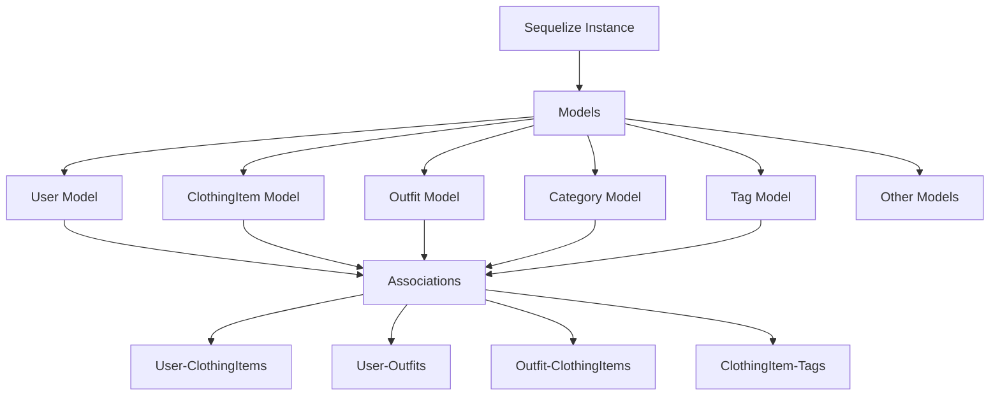

# 任务2设计文档：数据库模型和Sequelize配置

## 整体架构



## 分层设计

### 1. 数据库配置层 (`src/config/database.ts`)
- Sequelize实例配置
- 连接池管理
- 环境适配

### 2. 模型定义层 (`src/models/`)
- 基础模型 (`BaseModel`)
- 业务模型 (10个数据表)
- 模型间关联定义

### 3. 数据验证层
- 模型级验证规则
- 自定义验证器
- 错误处理

### 4. 迁移管理层
- 迁移文件生成
- 种子数据脚本
- 版本控制

## 模型设计

### 基础模型 (`BaseModel`)
```typescript
abstract class BaseModel {
  id: number;
  createdAt: Date;
  updatedAt: Date;
  deletedAt: Date | null;
}
```

### 核心模型关系

```mermaid
classDiagram
    User ||--o{ ClothingItem : owns
    User ||--o{ Outfit : creates
    User ||--o{ UserPreference : has
    
    ClothingItem ||--o{ OutfitItem : included in
    Outfit ||--o{ OutfitItem : contains
    
    ClothingItem }o--|| Category : belongs to
    ClothingItem }o--o{ Tag : tagged with
    
    Category ||--o{ Category : parent-child
    Tag ||--o{ ClothingTag : used by
```

## 接口契约

### 模型关联定义
- **User** → ClothingItem (一对多)
- **User** → Outfit (一对多)
- **ClothingItem** → Category (多对一)
- **ClothingItem** → Tag (多对多)
- **Outfit** → ClothingItem (多对多，通过OutfitItem)

### 数据验证规则
- 邮箱格式验证
- 数值范围验证
- 必填字段验证
- 枚举值验证

## 异常处理策略
- 数据库连接失败重试
- 模型验证错误统一处理
- 关联数据完整性保护