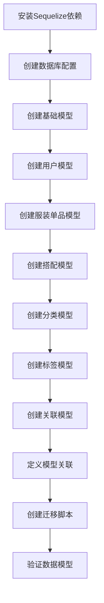

# 任务2原子化任务清单：数据库模型和Sequelize配置

## 任务依赖图

## 原子任务列表

### 任务2.1: 安装Sequelize依赖
**输入契约**: package.json已存在
**输出契约**: 安装完成，package.json更新
**实现约束**: 使用ARM64架构优化

### 任务2.2: 创建数据库配置
**输入契约**: 环境变量配置完成
**输出契约**: database.ts配置文件
**实现约束**: 支持开发/生产环境切换

### 任务2.3: 创建基础模型
**输入契约**: Sequelize配置完成
**输出契约**: BaseModel抽象类
**实现约束**: 包含通用字段和软删除支持

### 任务2.4: 创建用户模型 (User)
**输入契约**: 基础模型+数据库设计文档
**输出契约**: User.ts模型文件
**实现约束**: 包含邮箱验证、密码哈希

### 任务2.5: 创建服装单品模型 (ClothingItem)
**输入契约**: 用户模型+分类模型
**输出契约**: ClothingItem.ts模型文件
**实现约束**: 支持图片URL、尺寸、颜色等字段

### 任务2.6: 创建搭配模型 (Outfit)
**输入契约**: 用户模型
**输出契约**: Outfit.ts模型文件
**实现约束**: 包含标题、描述、场合等字段

### 任务2.7: 创建分类模型 (Category)
**输入契约**: 基础模型
**输出契约**: Category.ts模型文件
**实现约束**: 支持层级分类结构

### 任务2.8: 创建标签模型 (Tag)
**输入契约**: 基础模型
**输出契约**: Tag.ts模型文件
**实现约束**: 支持标签颜色、使用统计

### 任务2.9: 创建关联模型
**输入契约**: 主要模型已创建
**输出契约**: 
- OutfitItem.ts (搭配单品关联)
- ClothingTag.ts (服装标签关联)
- UserPreference.ts (用户偏好)
- Analytics.ts (分析数据)
- Upload.ts (文件上传)

### 任务2.10: 定义模型关联
**输入契约**: 所有模型文件
**输出契约**: associations.ts关联定义文件
**实现约束**: 正确定义所有外键关系

### 任务2.11: 创建迁移脚本
**输入契约**: 模型定义完成
**输出契约**: 迁移文件和种子数据
**实现约束**: 支持回滚操作

### 任务2.12: 验证数据模型
**输入契约**: 所有模型和关联
**输出契约**: 测试验证报告
**实现约束**: 运行迁移并验证数据完整性

## 任务优先级
1. **P0** (阻塞): 任务2.1-2.3 (基础配置)
2. **P1** (高): 任务2.4-2.8 (核心模型)
3. **P2** (中): 任务2.9-2.10 (关联模型)
4. **P3** (低): 任务2.11-2.12 (验证测试)