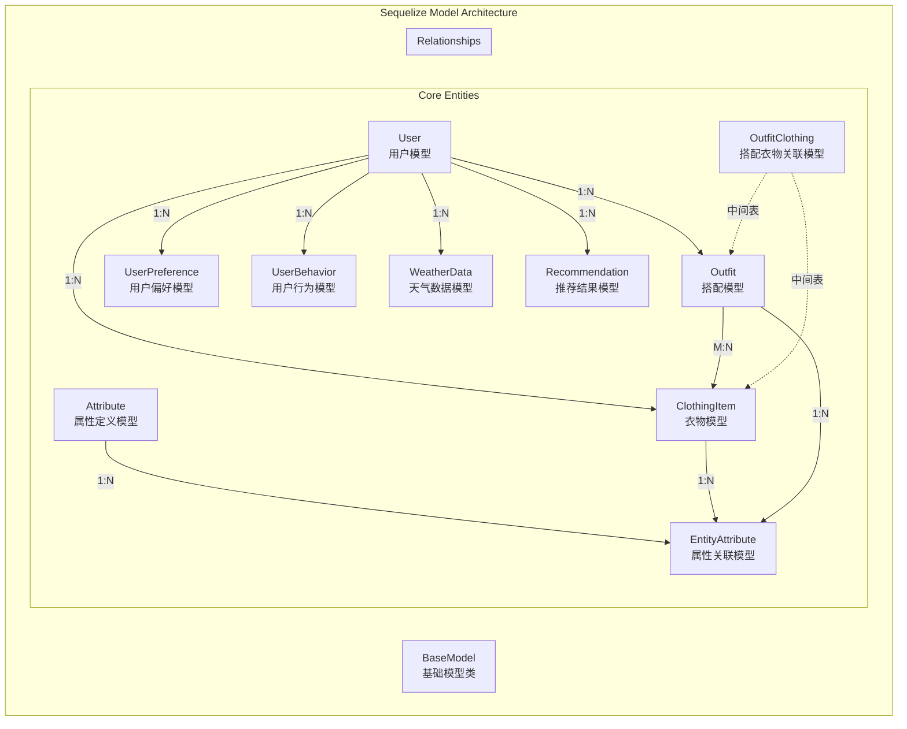

# 任务6: Sequelize ORM装饰器模式数据模型设计 - 架构设计文档

## 系统架构概览



## 模型分层架构

### 1. 基础层 (Base Layer)
- **BaseModel**: 所有模型的抽象基类
- 提供公共字段（id, createdAt, updatedAt, deletedAt）
- 定义通用方法和静态工具

### 2. 实体层 (Entity Layer)
按照业务领域划分的核心实体模型

### 3. 关联层 (Association Layer)
- 集中管理模型间关系定义
- 避免循环依赖
- 提供关系查询优化

## 核心模型设计

### BaseModel 基础模型
```typescript
// 基础抽象模型，提供公共功能
export abstract class BaseModel<T extends Model> extends Model {
  @PrimaryKey
  @AutoIncrement
  @Column(DataType.INTEGER)
  id!: number;

  @CreatedAt
  @Column(DataType.DATE)
  createdAt!: Date;

  @UpdatedAt
  @Column(DataType.DATE)
  updatedAt!: Date;

  @DeletedAt
  @Column(DataType.DATE)
  deletedAt?: Date;
}
```

### User 用户模型
```typescript
@Table({ tableName: 'users', paranoid: true, timestamps: true })
export class User extends BaseModel<User> {
  // 基础信息
  @Column({ type: DataType.STRING(50), allowNull: false, unique: true })
  username!: string;

  @Column({ type: DataType.STRING(100), allowNull: false, unique: true })
  email!: string;

  @Column({ type: DataType.STRING(255), allowNull: false, field: 'password_hash' })
  passwordHash!: string;

  @Column({ type: DataType.STRING(255), field: 'avatar_url' })
  avatarUrl?: string;

  // JSON字段
  @Column({ type: DataType.JSON, field: 'preferences' })
  preferences?: UserPreferences;

  @Column({ type: DataType.JSON, field: 'style_profile' })
  styleProfile?: StyleProfile;

  // 关联关系
  @HasMany(() => ClothingItem)
  clothingItems?: ClothingItem[];

  @HasMany(() => Outfit)
  outfits?: Outfit[];

  @HasMany(() => UserPreference)
  userPreferences?: UserPreference[];

  @HasMany(() => UserBehavior)
  behaviors?: UserBehavior[];

  @HasMany(() => WeatherData)
  weatherData?: WeatherData[];

  @HasMany(() => Recommendation)
  recommendations?: Recommendation[];
}
```

### ClothingItem 衣物模型
```typescript
@Table({ tableName: 'clothing_items', paranoid: true })
export class ClothingItem extends BaseModel<ClothingItem> {
  @ForeignKey(() => User)
  @Column({ type: DataType.INTEGER, allowNull: false, field: 'user_id' })
  userId!: number;

  @Column({ type: DataType.STRING(100), allowNull: false })
  name!: string;

  @Column({ type: DataType.STRING(100) })
  brand?: string;

  @Column({ type: DataType.DECIMAL(10, 2) })
  price?: number;

  @Column({ type: DataType.DATE, field: 'purchase_date' })
  purchaseDate?: Date;

  @Column({ type: DataType.STRING(20) })
  size?: string;

  @Column({ 
    type: DataType.ENUM('全新', '良好', '一般', '较差'),
    field: 'condition' 
  })
  condition?: '全新' | '良好' | '一般' | '较差';

  @Column({ type: DataType.TEXT })
  notes?: string;

  @Column({ type: DataType.JSON, field: 'image_urls' })
  imageUrls?: string[];

  @Column({ type: DataType.STRING(255), field: 'main_image_url' })
  mainImageUrl?: string;

  // 冗余字段
  @Column({ type: DataType.INTEGER, field: 'category_id' })
  categoryId?: number;

  @Column({ type: DataType.INTEGER, field: 'color_id' })
  colorId?: number;

  @Column({ type: DataType.INTEGER, field: 'style_id' })
  styleId?: number;

  @Column({ type: DataType.JSON })
  metadata?: ClothingMetadata;

  @Column({ type: DataType.BOOLEAN, field: 'is_public', defaultValue: false })
  isPublic!: boolean;

  // 关联关系
  @BelongsTo(() => User)
  user!: User;

  @BelongsToMany(() => Outfit, () => OutfitClothing)
  outfits?: Outfit[];

  @HasMany(() => EntityAttribute)
  attributes?: EntityAttribute[];
}
```

### Outfit 搭配模型
```typescript
@Table({ tableName: 'outfits', paranoid: true })
export class Outfit extends BaseModel<Outfit> {
  @ForeignKey(() => User)
  @Column({ type: DataType.INTEGER, allowNull: false, field: 'user_id' })
  userId!: number;

  @Column({ type: DataType.STRING(100), allowNull: false })
  name!: string;

  @Column({ type: DataType.TEXT })
  description?: string;

  @Column({ type: DataType.STRING(255), field: 'thumbnail_url' })
  thumbnailUrl?: string;

  @Column({ type: DataType.JSON, allowNull: false })
  composition!: OutfitComposition;

  @Column({ type: DataType.TEXT, field: 'styling_tips' })
  stylingTips?: string;

  @Column({ type: DataType.INTEGER, defaultValue: 0 })
  likes!: number;

  @Column({ type: DataType.INTEGER, field: 'view_count', defaultValue: 0 })
  viewCount!: number;

  @Column({ type: DataType.INTEGER, field: 'share_count', defaultValue: 0 })
  shareCount!: number;

  @Column({ type: DataType.BOOLEAN, field: 'is_public', defaultValue: false })
  isPublic!: boolean;

  @Column({ type: DataType.BOOLEAN, field: 'is_featured', defaultValue: false })
  isFeatured!: boolean;

  @Column({ type: DataType.JSON })
  metadata?: OutfitMetadata;

  // 关联关系
  @BelongsTo(() => User)
  user!: User;

  @BelongsToMany(() => ClothingItem, () => OutfitClothing)
  clothingItems?: ClothingItem[];

  @HasMany(() => EntityAttribute)
  attributes?: EntityAttribute[];
}
```

### Attribute 属性定义模型
```typescript
@Table({ tableName: 'attributes' })
export class Attribute extends BaseModel<Attribute> {
  @Column({ 
    type: DataType.ENUM('season', 'style', 'scene', 'material', 'color', 'fit', 'pattern', 'occasion'),
    allowNull: false 
  })
  category!: AttributeCategory;

  @Column({ type: DataType.STRING(100), allowNull: false })
  name!: string;

  @Column({ type: DataType.STRING(100) })
  value?: string;

  @Column({ type: DataType.STRING(100), field: 'display_name' })
  displayName?: string;

  @Column({ type: DataType.STRING(7) })
  color?: string;

  @Column({ type: DataType.STRING(50) })
  icon?: string;

  @ForeignKey(() => Attribute)
  @Column({ type: DataType.INTEGER, field: 'parent_id' })
  parentId?: number;

  @Column({ type: DataType.INTEGER, field: 'sort_order', defaultValue: 0 })
  sortOrder!: number;

  @Column({ type: DataType.BOOLEAN, field: 'is_active', defaultValue: true })
  isActive!: boolean;

  @Column({ type: DataType.JSON })
  metadata?: any;

  // 关联关系
  @HasMany(() => Attribute)
  children?: Attribute[];

  @BelongsTo(() => Attribute)
  parent?: Attribute;

  @HasMany(() => EntityAttribute)
  entityAttributes?: EntityAttribute[];
}
```

## 类型定义系统

### 核心接口定义
```typescript
// 用户偏好设置接口
export interface UserPreferences {
  theme?: 'light' | 'dark' | 'auto';
  language?: 'zh-CN' | 'en-US';
  notifications?: {
    email?: boolean;
    push?: boolean;
    recommendations?: boolean;
  };
}

// 风格画像接口
export interface StyleProfile {
  primaryStyle?: string;
  colorPreferences?: string[];
  brandPreferences?: string[];
  sizeProfile?: {
    tops?: string;
    bottoms?: string;
    shoes?: string;
  };
}

// 衣物元数据接口
export interface ClothingMetadata {
  wearCount?: number;
  lastWorn?: Date;
  favorite?: boolean;
  rating?: number;
  tags?: string[];
}

// 搭配组成接口
export interface OutfitComposition {
  top?: number; // clothing_item_id
  bottom?: number;
  shoes?: number;
  accessories?: number[];
  outerwear?: number;
}

// 搭配元数据接口
export interface OutfitMetadata {
  season?: string[];
  occasions?: string[];
  tags?: string[];
  weatherSuitable?: {
    minTemp?: number;
    maxTemp?: number;
  };
}
```

## 关联关系配置

### 关联配置策略
1. **集中管理**: 在associations/index.ts中统一配置
2. **避免循环依赖**: 模型先定义，关系后配置
3. **类型安全**: 所有关联都有完整的TypeScript类型

### 关联配置示例
```typescript
// src/models/associations/index.ts
import { User } from '../entities/User';
import { ClothingItem } from '../entities/ClothingItem';
import { Outfit } from '../entities/Outfit';
// ... 其他模型

export function setupAssociations() {
  // User 关联
  User.hasMany(ClothingItem, { 
    foreignKey: 'userId', 
    as: 'clothingItems' 
  });
  
  User.hasMany(Outfit, { 
    foreignKey: 'userId', 
    as: 'outfits' 
  });

  // ClothingItem 关联
  ClothingItem.belongsTo(User, { 
    foreignKey: 'userId', 
    as: 'user' 
  });
  
  ClothingItem.belongsToMany(Outfit, {
    through: () => OutfitClothing,
    foreignKey: 'clothingId',
    otherKey: 'outfitId',
    as: 'outfits'
  });

  // Outfit 关联
  Outfit.belongsTo(User, { 
    foreignKey: 'userId', 
    as: 'user' 
  });
  
  Outfit.belongsToMany(ClothingItem, {
    through: () => OutfitClothing,
    foreignKey: 'outfitId',
    otherKey: 'clothingId',
    as: 'clothingItems'
  });
}
```

## 索引优化策略

### 索引配置原则
1. **主键索引**: 自动创建
2. **外键索引**: 自动创建，手动确认
3. **查询索引**: 基于业务查询模式
4. **复合索引**: 多字段查询优化
5. **唯一索引**: 业务唯一约束

### 关键索引定义
```typescript
// 在模型装饰器中配置
@Table({
  tableName: 'users',
  indexes: [
    { name: 'idx_users_email', fields: ['email'] },
    { name: 'idx_users_username', fields: ['username'] }
  ]
})

@Table({
  tableName: 'clothing_items',
  indexes: [
    { name: 'idx_clothing_user_id', fields: ['user_id'] },
    { name: 'idx_clothing_category', fields: ['category_id', 'user_id'] },
    { name: 'idx_clothing_public', fields: ['is_public', 'user_id'] }
  ]
})
```

## 验证规则系统

### 模型级验证
```typescript
@Table({ tableName: 'users' })
export class User extends BaseModel<User> {
  @Column({ 
    type: DataType.STRING(50), 
    allowNull: false,
    unique: true,
    validate: {
      len: [3, 50],
      isAlphanumeric: true
    }
  })
  username!: string;

  @Column({ 
    type: DataType.STRING(100), 
    allowNull: false,
    unique: true,
    validate: {
      isEmail: true,
      len: [5, 100]
    }
  })
  email!: string;
}
```

## 模型初始化配置

### 数据库连接配置
```typescript
// src/models/index.ts
import { Sequelize } from 'sequelize-typescript';
import { setupAssociations } from './associations';
import * as models from './entities';

const sequelize = new Sequelize({
  ...databaseConfig,
  models: Object.values(models),
  modelMatch: (filename, member) => {
    return filename.substring(0, filename.indexOf('.model')) === member.toLowerCase();
  }
});

// 设置关联关系
setupAssociations();

export { sequelize };
export * from './entities';
```