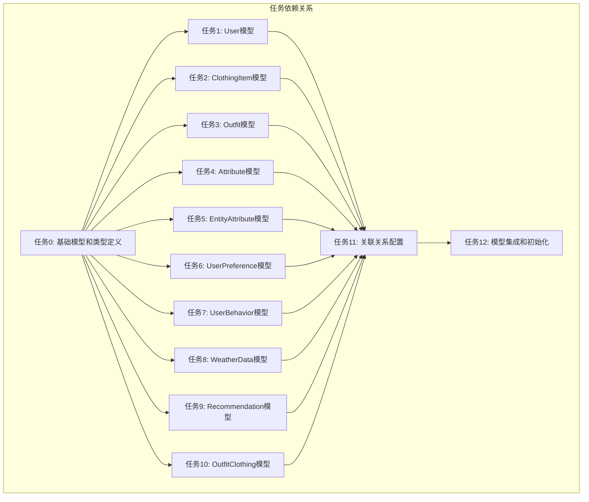

# 任务6: Sequelize ORM装饰器模式数据模型设计 - 任务拆分文档

## 任务依赖关系图



## 任务清单与详细规范

### 任务0: 基础模型和类型定义 [前置任务]
**优先级**: 🔴 P0 - 阻塞所有其他任务
**复杂度**: ⭐⭐
**预估时间**: 30分钟

#### 输入契约
- 项目已配置sequelize-typescript
- 已存在decorator.types.ts
- 数据库设计文档完整

#### 输出契约
- `src/models/base/BaseModel.ts` - 基础抽象模型
- `src/models/types/model.types.ts` - 核心类型定义
- 所有接口和枚举定义

#### 实现约束
- 使用abstract class定义BaseModel
- 包含id, createdAt, updatedAt, deletedAt字段
- 提供基础验证方法
- TypeScript类型100%覆盖

#### 验收标准
- [ ] BaseModel可继承使用
- [ ] 所有类型定义完整
- [ ] 无TypeScript类型错误

---

### 任务1: User模型实现
**优先级**: 🔴 P1
**复杂度**: ⭐⭐⭐
**依赖**: 任务0
**预估时间**: 45分钟

#### 输入契约
- 任务0完成的基础模型
- 用户表结构定义
- 关联关系设计文档

#### 输出契约
- `src/models/entities/User.ts`
- 完整的User模型定义
- 字段验证规则

#### 字段定义
```typescript
- id: number (主键)
- username: string (唯一, 3-50字符)
- email: string (唯一, 邮箱格式)
- passwordHash: string (密码哈希)
- avatarUrl?: string (头像URL)
- preferences?: UserPreferences (JSON)
- styleProfile?: StyleProfile (JSON)
```

#### 关联关系
- HasMany: ClothingItem[]
- HasMany: Outfit[]
- HasMany: UserPreference[]
- HasMany: UserBehavior[]
- HasMany: WeatherData[]
- HasMany: Recommendation[]

#### 验收标准
- [ ] 所有字段正确定义
- [ ] 验证规则完整
- [ ] 关联关系配置正确
- [ ] 索引配置合理

---

### 任务2: ClothingItem模型实现
**优先级**: 🔴 P1
**复杂度**: ⭐⭐⭐⭐
**依赖**: 任务0
**预估时间**: 60分钟

#### 输入契约
- 任务0完成的基础模型
- 衣物表结构定义
- User模型已定义

#### 输出契约
- `src/models/entities/ClothingItem.ts`
- 完整的ClothingItem模型定义

#### 字段定义
```typescript
- id: number (主键)
- userId: number (外键 -> User)
- name: string (衣物名称)
- brand?: string (品牌)
- price?: number (价格)
- purchaseDate?: Date (购买日期)
- size?: string (尺码)
- condition?: '全新' | '良好' | '一般' | '较差'
- notes?: string (备注)
- imageUrls?: string[] (图片URL数组)
- mainImageUrl?: string (主图URL)
- categoryId?: number (分类ID)
- colorId?: number (颜色ID)
- styleId?: number (风格ID)
- metadata?: ClothingMetadata (JSON)
- isPublic: boolean (是否公开)
```

#### 关联关系
- BelongsTo: User
- BelongsToMany: Outfit[] (通过OutfitClothing)
- HasMany: EntityAttribute[]

#### 验收标准
- [ ] 所有字段正确定义
- [ ] 枚举类型正确配置
- [ ] JSON字段类型安全
- [ ] 冗余字段配置正确

---

### 任务3: Outfit模型实现
**优先级**: 🔴 P1
**复杂度**: ⭐⭐⭐⭐
**依赖**: 任务0
**预估时间**: 60分钟

#### 输入契约
- 任务0完成的基础模型
- 搭配表结构定义
- User模型已定义

#### 输出契约
- `src/models/entities/Outfit.ts`
- 完整的Outfit模型定义

#### 字段定义
```typescript
- id: number (主键)
- userId: number (外键 -> User)
- name: string (搭配名称)
- description?: string (描述)
- thumbnailUrl?: string (缩略图URL)
- composition: OutfitComposition (JSON)
- stylingTips?: string (搭配技巧)
- likes: number (点赞数)
- viewCount: number (查看次数)
- shareCount: number (分享次数)
- isPublic: boolean (是否公开)
- isFeatured: boolean (是否精选)
- metadata?: OutfitMetadata (JSON)
```

#### 关联关系
- BelongsTo: User
- BelongsToMany: ClothingItem[] (通过OutfitClothing)
- HasMany: EntityAttribute[]

#### 验收标准
- [ ] 所有字段正确定义
- [ ] JSON字段类型安全
- [ ] 统计字段默认值正确
- [ ] 布尔字段配置正确

---

### 任务4: Attribute模型实现
**优先级**: 🔴 P1
**复杂度**: ⭐⭐⭐
**依赖**: 任务0
**预估时间**: 45分钟

#### 输入契约
- 任务0完成的基础模型
- 属性定义表结构

#### 输出契约
- `src/models/entities/Attribute.ts`
- 完整的Attribute模型定义

#### 字段定义
```typescript
- id: number (主键)
- category: AttributeCategory (枚举)
- name: string (属性名称)
- value?: string (属性值代码)
- displayName?: string (显示名称)
- color?: string (颜色代码)
- icon?: string (图标)
- parentId?: number (自引用外键)
- sortOrder: number (排序)
- isActive: boolean (是否启用)
- metadata?: any (扩展元数据)
```

#### 关联关系
- HasMany: Attribute[] (子属性)
- BelongsTo: Attribute (父属性)
- HasMany: EntityAttribute[]

#### 枚举定义
```typescript
type AttributeCategory = 
  | 'season' 
  | 'style' 
  | 'scene' 
  | 'material' 
  | 'color' 
  | 'fit' 
  | 'pattern' 
  | 'occasion';
```

#### 验收标准
- [ ] 枚举类型正确定义
- [ ] 自引用关系配置正确
- [ ] 排序字段默认值正确

---

### 任务5: EntityAttribute模型实现
**优先级**: 🔴 P1
**复杂度**: ⭐⭐⭐⭐
**依赖**: 任务0, 任务4
**预估时间**: 45分钟

#### 输入契约
- 任务0完成的基础模型
- 属性关联表结构
- Attribute模型已定义

#### 输出契约
- `src/models/entities/EntityAttribute.ts`
- 完整的EntityAttribute模型定义

#### 字段定义
```typescript
- id: number (主键)
- entityType: EntityType (枚举: 'clothing_item' | 'outfit' | 'user_preference')
- entityId: number (实体ID)
- attributeId: number (外键 -> Attribute)
- userId?: number (外键 -> User)
- weight: number (权重 0-1)
- notes?: string (备注)
```

#### 关联关系
- BelongsTo: Attribute
- BelongsTo: User (可选)

#### 复合唯一索引
- (entityType, entityId, attributeId, userId)

#### 验收标准
- [ ] 复合唯一索引配置正确
- [ ] 枚举类型正确定义
- [ ] 权重字段验证正确

---

### 任务6: UserPreference模型实现
**优先级**: 🔴 P1
**复杂度**: ⭐⭐⭐
**依赖**: 任务0, 任务1
**预估时间**: 30分钟

#### 输入契约
- 任务0完成的基础模型
- 用户偏好表结构
- User模型已定义

#### 输出契约
- `src/models/entities/UserPreference.ts`
- 完整的UserPreference模型定义

#### 字段定义
```typescript
- id: number (主键)
- userId: number (外键 -> User)
- preferenceType: PreferenceType (枚举)
- preferenceData: any (JSON)
- isActive: boolean (是否启用)
```

#### 枚举定义
```typescript
type PreferenceType = 
  | 'color' 
  | 'style' 
  | 'scene' 
  | 'season' 
  | 'brand' 
  | 'occasion';
```

#### 关联关系
- BelongsTo: User

#### 验收标准
- [ ] JSON字段类型安全
- [ ] 唯一约束配置正确
- [ ] 枚举类型正确定义

---

### 任务7: UserBehavior模型实现
**优先级**: 🔴 P1
**复杂度**: ⭐⭐⭐
**依赖**: 任务0, 任务1
**预估时间**: 30分钟

#### 输入契约
- 任务0完成的基础模型
- 用户行为日志表结构
- User模型已定义

#### 输出契约
- `src/models/entities/UserBehavior.ts`
- 完整的UserBehavior模型定义

#### 字段定义
```typescript
- id: number (主键)
- userId: number (外键 -> User)
- actionType: ActionType (枚举)
- targetType: TargetType (枚举)
- targetId: number (目标ID)
- duration?: number (持续时间ms)
- metadata?: any (行为元数据)
```

#### 枚举定义
```typescript
type ActionType = 'view' | 'like' | 'share' | 'click' | 'filter';
type TargetType = 'clothing' | 'outfit' | 'category' | 'attribute';
```

#### 索引配置
- 复合索引: (userId, actionType, createdAt)

#### 验收标准
- [ ] 复合索引配置正确
- [ ] 枚举类型正确定义
- [ ] 时间字段自动管理

---

### 任务8: WeatherData模型实现
**优先级**: 🔴 P1
**复杂度**: ⭐⭐⭐
**依赖**: 任务0, 任务1
**预估时间**: 30分钟

#### 输入契约
- 任务0完成的基础模型
- 天气数据表结构
- User模型已定义

#### 输出契约
- `src/models/entities/WeatherData.ts`
- 完整的WeatherData模型定义

#### 字段定义
```typescript
- id: number (主键)
- userId: number (外键 -> User)
- location: string (地理位置)
- date: Date (日期)
- temperature?: number (温度)
- weatherCondition?: string (天气状况)
- humidity?: number (湿度)
- windSpeed?: number (风速)
- metadata?: any (扩展数据)
```

#### 唯一约束
- (userId, location, date)

#### 验收标准
- [ ] 唯一约束配置正确
- [ ] 地理位置字段索引
- [ ] 日期字段索引

---

### 任务9: Recommendation模型实现
**优先级**: 🔴 P1
**复杂度**: ⭐⭐⭐
**依赖**: 任务0, 任务1
**预估时间**: 30分钟

#### 输入契约
- 任务0完成的基础模型
- 推荐结果表结构
- User模型已定义

#### 输出契约
- `src/models/entities/Recommendation.ts`
- 完整的Recommendation模型定义

#### 字段定义
```typescript
- id: number (主键)
- userId: number (外键 -> User)
- recommendationType: RecommendationType (枚举)
- targetId: number (目标ID)
- score: number (推荐得分 0-1)
- reason?: string (推荐理由)
- isClicked: boolean (是否点击)
- isLiked: boolean (是否点赞)
- expiresAt?: Date (过期时间)
```

#### 枚举定义
```typescript
type RecommendationType = 
  | 'outfit' 
  | 'clothing' 
  | 'category' 
  | 'combination';
```

#### 索引配置
- (userId, recommendationType)
- (expiresAt)

#### 验收标准
- [ ] 枚举类型正确定义
- [ ] 得分字段验证正确
- [ ] 过期时间索引配置

---

### 任务10: OutfitClothing模型实现
**优先级**: 🔴 P1
**复杂度**: ⭐⭐⭐
**依赖**: 任务0, 任务2, 任务3
**预估时间**: 30分钟

#### 输入契约
- 任务0完成的基础模型
- 搭配衣物关联表结构
- ClothingItem和Outfit模型已定义

#### 输出契约
- `src/models/entities/OutfitClothing.ts`
- 完整的中间表模型定义

#### 字段定义
```typescript
- id: number (主键)
- outfitId: number (外键 -> Outfit)
- clothingId: number (外键 -> ClothingItem)
- position: number (位置)
- area?: string (区域: '上装' | '下装' 等)
```

#### 唯一约束
- (outfitId, clothingId)

#### 关联关系
- BelongsTo: Outfit
- BelongsTo: ClothingItem

#### 验收标准
- [ ] 中间表配置正确
- [ ] 唯一约束配置正确
- [ ] 关联关系双向配置

---

### 任务11: 关联关系配置
**优先级**: 🔴 P1
**复杂度**: ⭐⭐⭐⭐⭐
**依赖**: 任务1-10全部完成
**预估时间**: 45分钟

#### 输入契约
- 所有实体模型已完成
- 关联关系设计文档

#### 输出契约
- `src/models/associations/index.ts`
- 完整的关联关系配置

#### 配置内容
- 所有一对一关系
- 所有一对多关系
- 所有多对多关系
- 级联操作配置
- 关联别名配置

#### 关联关系清单
1. User 1:N ClothingItem
2. User 1:N Outfit
3. User 1:N UserPreference
4. User 1:N UserBehavior
5. User 1:N WeatherData
6. User 1:N Recommendation
7. Outfit M:N ClothingItem (通过OutfitClothing)
8. Attribute 1:N EntityAttribute
9. ClothingItem 1:N EntityAttribute
10. Outfit 1:N EntityAttribute
11. Attribute自引用 1:N (父子关系)

#### 验收标准
- [ ] 所有关联关系配置正确
- [ ] 无循环依赖问题
- [ ] 级联操作配置合理
- [ ] 关联别名清晰

---

### 任务12: 模型集成和初始化
**优先级**: 🔴 P1
**复杂度**: ⭐⭐⭐
**依赖**: 任务11完成
**预估时间**: 30分钟

#### 输入契约
- 所有模型和关联已完成
- 数据库配置已存在

#### 输出契约
- `src/models/index.ts` - 模型导出和初始化
- `src/models/entities/index.ts` - 实体模型导出
- 数据库连接测试

#### 集成内容
- 模型注册
- 关联配置应用
- 数据库连接测试
- 模型导出

#### 验收标准
- [ ] 所有模型可正确注册
- [ ] 数据库连接成功
- [ ] 模型同步无错误
- [ ] 类型导出完整

## 任务执行顺序

### 并行执行策略
- **并行组1**: 任务1-4 (User, ClothingItem, Outfit, Attribute)
- **并行组2**: 任务5-10 (EntityAttribute, UserPreference, UserBehavior, WeatherData, Recommendation, OutfitClothing)
- **顺序执行**: 任务0 → 并行组1 → 并行组2 → 任务11 → 任务12

### 时间估算
- **总时间**: 6-7小时
- **并行优化**: 3-4小时 (利用并行执行)
- **缓冲时间**: 额外30% (1-1.5小时)

## 风险识别

### 高风险点
1. **关联关系配置**: 可能出现循环依赖
2. **JSON字段类型**: 复杂JSON结构定义
3. **复合索引**: 唯一约束配置错误

### 缓解措施
1. 关联关系集中管理
2. 使用接口定义JSON结构
3. 索引配置后验证

## 测试验证计划

### 单元测试要点
1. 模型定义验证
2. 关联关系测试
3. 验证规则测试
4. 索引配置验证

### 集成测试要点
1. 数据库同步测试
2. 关联查询测试
3. 事务操作测试