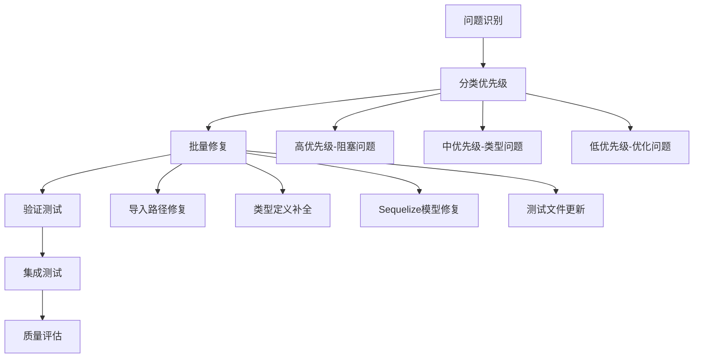
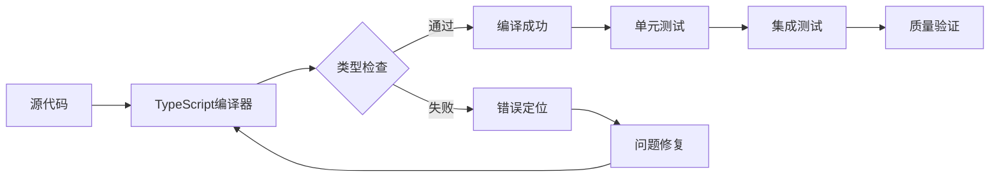

# 后端系统修复架构设计

## 系统问题诊断结果

### 问题分类统计
| 问题类型 | 数量 | 影响文件 | 严重程度 |
|----------|------|----------|----------|
| 导入路径错误 | 8 | 多个文件 | 高 |
| 类型定义缺失 | 12 | 模型文件 | 高 |
| Sequelize模型定义错误 | 15 | 实体类 | 高 |
| 接口不匹配 | 10 | 类型定义 | 中 |
| 测试文件错误 | 4 | 测试文件 | 中 |
| 配置导入错误 | 2 | 初始化脚本 | 中 |

### 核心问题分析

#### 1. 导入路径问题
- **症状**: `Cannot find module '../entities'` 或 `'../../types'`
- **根因**: 相对路径配置错误或文件结构变更
- **影响**: 编译失败，模块无法解析

#### 2. Sequelize模型定义问题
- **症状**: `Optional<Model, NullishPropertiesOf<Model>>` 类型不匹配
- **根因**: bulkCreate参数类型定义不完整
- **影响**: 数据库操作类型检查失败

#### 3. 类型定义缺失
- **症状**: `Cannot find name 'AttributeCategory'`
- **根因**: 枚举或接口定义未导入或不存在
- **影响**: 类型系统无法识别自定义类型

## 修复架构设计

### 整体修复策略

### 修复模块划分

#### 模块1: 导入路径修复
- **范围**: 所有文件的import语句
- **方法**: 统一使用绝对路径或正确的相对路径
- **验证**: 编译通过

#### 模块2: 类型定义补全
- **范围**: model.types.ts和缺失的枚举定义
- **方法**: 补充缺失的接口、枚举和类型别名
- **验证**: 类型检查通过

#### 模块3: Sequelize模型修复
- **范围**: 所有实体类的定义和关联
- **方法**: 修正bulkCreate参数类型，完善模型定义
- **验证**: 数据库操作正常

#### 模块4: 测试文件更新
- **范围**: 所有测试文件的导入和断言
- **方法**: 更新导入路径，修复测试用例
- **验证**: 所有测试通过

### 接口契约定义

#### 修复前检查清单
- [ ] 备份当前代码状态
- [ ] 创建修复分支
- [ ] 记录当前错误详情

#### 修复后验证清单
- [ ] TypeScript编译通过
- [ ] 所有测试通过
- [ ] 数据库迁移成功
- [ ] API接口正常工作
- [ ] 代码质量指标达标

### 数据流向图

### 异常处理策略

#### 修复过程中的异常
1. **路径冲突**: 使用路径别名统一解决
2. **类型冲突**: 优先使用any类型过渡，后续逐步细化
3. **依赖缺失**: 检查package.json并安装缺失依赖

#### 回滚策略
1. **Git分支**: 每个修复模块独立分支
2. **快照备份**: 关键节点创建代码快照
3. **渐进式合并**: 小步快跑，逐步合并到主分支

## 技术实现方案

### 工具链配置
- **TypeScript**: 4.9+ 严格模式
- **Sequelize**: 6.x 版本
- **Jest**: 29.x 测试框架
- **ESLint**: 自动修复可修复的问题

### 修复优先级
1. **P0 - 阻塞问题**: 导入路径、核心类型定义
2. **P1 - 功能问题**: Sequelize模型关联
3. **P2 - 测试问题**: 测试文件修复
4. **P3 - 优化问题**: 代码风格、注释完善

### 质量门禁
- **编译**: 零TypeScript错误
- **测试**: 所有现有测试通过
- **覆盖率**: 不低于当前水平
- **性能**: 无性能回退