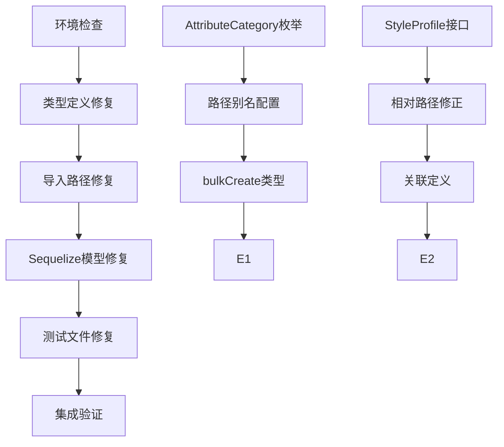

# 后端系统修复任务分解

## 任务依赖关系图

## 原子任务列表

### 任务1: 环境检查和准备
**任务ID**: TASK-7-001
**优先级**: P0
**预估时间**: 30分钟

**输入契约**:
- 当前代码库状态
- TypeScript配置(tsconfig.json)
- package.json依赖列表

**输出契约**:
- 环境状态报告
- 备份创建确认
- 修复分支创建

**实现约束**:
- 不修改任何源代码
- 创建可回滚的备份

**验收标准**:
- [ ] 成功创建备份分支
- [ ] 环境检查通过
- [ ] 依赖安装成功

---

### 任务2: 类型定义修复
**任务ID**: TASK-7-002
**优先级**: P0
**预估时间**: 45分钟

**输入契约**:
- model.types.ts文件
- 缺失的类型定义列表

**输出契约**:
- 完整的AttributeCategory枚举
- 补全的StyleProfile等接口
- 所有类型定义正确导入

**实现约束**:
- 保持向后兼容
- 遵循现有命名规范

**验收标准**:
- [ ] AttributeCategory枚举定义完整
- [ ] 所有缺失接口补全
- [ ] 类型检查通过相关文件

**依赖关系**: 依赖TASK-7-001完成

---

### 任务3: 导入路径修复
**任务ID**: TASK-7-003
**优先级**: P0
**预估时间**: 60分钟

**输入契约**:
- 所有import语句列表
- 正确的相对路径映射

**输出契约**:
- 修正的import路径
- 统一的导入规范

**实现约束**:
- 使用相对路径而非绝对路径
- 保持导入语义不变

**验收标准**:
- [ ] 所有"Cannot find module"错误修复
- [ ] 导入路径一致性检查通过
- [ ] 编译错误减少50%以上

**依赖关系**: 依赖TASK-7-002完成

---

### 任务4: Sequelize模型修复
**任务ID**: TASK-7-004
**优先级**: P0
**预估时间**: 90分钟

**输入契约**:
- 所有实体类定义
- bulkCreate使用场景
- 模型关联定义

**输出契约**:
- 正确的Sequelize类型定义
- 修复的bulkCreate参数类型
- 完善的模型关联

**实现约束**:
- 保持数据库schema不变
- 不破坏现有API

**验收标准**:
- [ ] 所有Sequelize类型错误修复
- [ ] bulkCreate参数类型正确
- [ ] 模型关联定义完整

**依赖关系**: 依赖TASK-7-003完成

---

### 任务5: 测试文件修复
**任务ID**: TASK-7-005
**优先级**: P1
**预估时间**: 45分钟

**输入契约**:
- 所有测试文件
- 修复后的模型定义
- 正确的导入路径

**输出契约**:
- 可编译的测试文件
- 更新的测试用例

**实现约束**:
- 保持测试覆盖率
- 修复断言错误

**验收标准**:
- [ ] 所有测试文件编译通过
- [ ] 测试用例运行成功
- [ ] 测试覆盖率不下降

**依赖关系**: 依赖TASK-7-004完成

---

### 任务6: 集成验证
**任务ID**: TASK-7-006
**优先级**: P1
**预估时间**: 30分钟

**输入契约**:
- 修复后的完整代码库
- 测试数据库配置
- 运行环境

**输出契约**:
- 集成测试报告
- 性能基准测试结果
- 部署验证报告

**实现约束**:
- 使用测试数据库
- 不影响生产环境

**验收标准**:
- [ ] 完整编译通过
- [ ] 所有测试通过
- [ ] 数据库迁移成功
- [ ] API接口正常工作

**依赖关系**: 依赖TASK-7-005完成

## 任务执行计划

### 第一阶段 (P0优先级)
1. **TASK-7-001**: 环境检查 (30分钟)
2. **TASK-7-002**: 类型定义修复 (45分钟) - 并行执行
3. **TASK-7-003**: 导入路径修复 (60分钟)
4. **TASK-7-004**: Sequelize模型修复 (90分钟)

### 第二阶段 (P1优先级)
5. **TASK-7-005**: 测试文件修复 (45分钟)
6. **TASK-7-006**: 集成验证 (30分钟)

### 总体时间估算
- **总时间**: 4-5小时
- **关键路径**: TASK-7-001 → TASK-7-002 → TASK-7-003 → TASK-7-004 → TASK-7-005 → TASK-7-006
- **并行机会**: TASK-7-002和TASK-7-003部分可并行

## 风险识别与应对

### 高风险项
1. **类型定义冲突**: 可能导致运行时错误
   - **应对**: 逐步修复，每个类型单独验证

2. **数据库兼容性问题**: 模型变更可能影响现有数据
   - **应对**: 使用测试数据库验证，确保schema兼容

### 中风险项
1. **测试用例失效**: 修复可能导致测试断言失败
   - **应对**: 更新测试用例而非删除

2. **依赖版本冲突**: 修复可能需要更新依赖
   - **应对**: 锁定版本，避免大版本升级

## 质量检查点

### 每个任务的检查点
- **编译检查**: 每个任务完成后运行`tsc --noEmit`
- **测试检查**: 运行相关测试用例
- **代码审查**: 检查变更的合理性

### 最终验收标准
- [ ] TypeScript编译零错误
- [ ] 所有单元测试通过
- [ ] 集成测试通过
- [ ] 代码覆盖率达标
- [ ] 性能基准测试通过