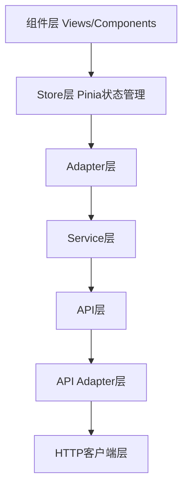

# StyleVault 前端请求流程详解

## 1. 概述

StyleVault前端项目采用了多层架构设计模式，确保代码组织清晰、职责分明、易于维护和扩展。本文档详细说明前端请求从触发到完成所经过的完整层次结构，以及各层的职责和实现方式。

## 2. 前端请求架构层次

StyleVault前端项目的请求流程包含以下7个主要层次：



## 3. 各层详细说明

### 3.1 组件层 (Views/Components)

**职责**：
- 用户界面渲染和交互处理
- 调用store层方法获取和管理数据
- 处理用户事件和业务操作

**代表文件**：
- `src/views/WardrobeView.vue`
- `src/components/wardrobe/` 目录下的各组件

**关键实现**：
```javascript
// 在组件中初始化数据的典型方式
async function initializeData() {
  try {
    // 先获取枚举数据
    await enumsStore.fetchAllEnums();
    // 并行获取分类和衣物数据
    await Promise.all([
      clothingStore.fetchCategories(),
      clothingStore.fetchClothingItems()
    ]);
  } catch (error) {
    console.error('初始化数据失败:', error);
    showToast('数据加载失败，请稍后重试', 'error');
  }
}

// 在组件挂载时调用初始化方法
onMounted(() => {
  initializeData();
});
```

### 3.2 Store层 (Pinia状态管理)

**职责**：
- 集中管理应用状态
- 处理业务逻辑
- 实现缓存机制减少重复请求
- 添加请求锁防止并发重复请求
- 调用adapter层获取数据

**代表文件**：
- `src/stores/modules/clothingStore.js`
- `src/stores/enums.js`

**关键实现**：
```javascript
// Store中的数据获取方法示例
async fetchCategories(forceRefresh = false) {
  const cacheKey = 'categories';

  // 防止重复请求
  if (this.loading && !forceRefresh) return this.categories;

  // 检查缓存
  if (!forceRefresh && getCachedData(cacheKey)) {
    this.categories = getCachedData(cacheKey);
    return this.categories;
  }

  this.setLoading(true);
  this.clearError();

  try {
    // 调用adapter层
    const response = await clothingAdapter.fetchCategories();
    // 数据处理和缓存...
    this.categories = processedData;
    setCachedData(cacheKey, processedData);
    return this.categories;
  } catch (error) {
    this.setError('获取分类数据失败');
    throw error;
  } finally {
    this.setLoading(false);
  }
}
```

### 3.3 Adapter层

**职责**：
- 连接store和service层
- 处理错误提示和用户反馈
- 数据格式转换和适配

**代表文件**：
- `src/adapters/clothingAdapter.js`
- `src/adapters/outfitAdapter.js`
- `src/adapters/analyticsAdapter.js`

**关键实现**：
```javascript
export class ClothingAdapter {
  constructor() {
    this.service = clothingService;
  }

  // 获取所有衣物，并处理错误和加载状态
  async fetchClothingItems() {
    try {
      const items = await this.service.getClothingItems();
      return items;
    } catch (error) {
      showToast('获取衣物列表失败', 'error');
      throw error;
    }
  }
}
```

### 3.4 Service层

**职责**：
- 封装业务逻辑服务
- 调用API层方法
- 统一错误处理

**代表文件**：
- `src/services/clothingService.js`
- `src/services/baseService.js`
- `src/services/outfitService.js`

**关键实现**：
```javascript
export default class ClothingService extends BaseService {
  constructor() {
    super('clothing');
  }

  // 获取所有衣物
  async getClothingItems() {
    try {
      const response = await clothingApi.getClothingItems();
      return response.data;
    } catch (error) {
      this.handleError(error, '获取衣物列表失败');
      throw error;
    }
  }
}
```

### 3.5 API层

**职责**：
- 定义具体API方法
- 调用API Adapter层
- 简单的错误处理和日志记录

**代表文件**：
- `src/services/api/clothingApi.js`
- `src/services/api/outfitApi.js`

**关键实现**：
```javascript
export default {
  // 获取所有衣物
  getClothingItems: async () => {
    try {
      return await clothingAdaptorApi.getClothingItems();
    } catch (error) {
      console.error('获取衣物列表失败:', error);
      throw error;
    }
  },
  
  // 其他API方法...
}
```

### 3.6 API Adapter层

**职责**：
- 定义具体API端点和请求方法
- 调用HTTP客户端执行实际请求
- 设置具体的API路径和参数

**代表文件**：
- `src/services/api/adapter.js`

**关键实现**：
```javascript
// 衣物API适配器
export const clothingAdaptorApi = {
  // 获取所有衣物类别
  getCategories: async () => {
    return apiClient.get('/categories');
  },

  // 获取所有衣物
  getClothingItems: async () => {
    return apiClient.get('/clothing');
  },

  // 根据类别获取衣物
  getClothingItemsByCategory: async categoryId => {
    return apiClient.get(`/clothing/category/${categoryId}`);
  },
  
  // 其他API方法...
};
```

### 3.7 HTTP客户端层

**职责**：
- 底层HTTP请求处理
- 配置axios实例
- 请求/响应拦截器
- 统一错误处理
- 认证信息处理

**代表文件**：
- `src/services/api/adapter.js` (包含apiClient定义)
- `src/services/http.client.js`

**关键实现**：
```javascript
// 创建axios实例
const apiClient = axios.create({
  baseURL: process.env.VUE_APP_API_BASE_URL || 'http://localhost:3000/api/v1',
  timeout: 10000,
  headers: {
    'Content-Type': 'application/json',
  },
});

// 请求拦截器
apiClient.interceptors.request.use(
  config => {
    // 添加token等认证信息
    const token = localStorage.getItem('token');
    if (token) {
      config.headers.Authorization = `Bearer ${token}`;
    }
    return config;
  },
  error => {
    return Promise.reject(error);
  }
);

// 响应拦截器
apiClient.interceptors.response.use(
  response => {
    // 统一处理响应数据
    return response.data;
  },
  error => {
    // 统一处理错误
    if (error.response) {
      switch (error.response.status) {
        case 401:
          // 处理未授权
          console.error('未授权访问，请登录');
          break;
        case 404:
          // 处理未找到
          console.error('请求的资源不存在');
          break;
        case 500:
          // 处理服务器错误
          console.error('服务器错误，请稍后再试');
          break;
        default:
          // 处理其他错误
          console.error(`请求错误: ${error.response.status}`);
      }
    } else {
      // 处理网络错误等
      console.error('网络错误，请检查您的网络连接');
    }
    return Promise.reject(error);
  }
);
```

## 4. 完整请求流程

### 4.1 请求发起流程

1. **组件层**触发请求（如用户加载页面、点击按钮）
2. **Store层**接收请求，检查缓存和加载状态，添加请求锁防止并发
3. **Adapter层**连接store和service，处理用户反馈和错误提示
4. **Service层**封装业务逻辑，调用API方法
5. **API层**定义具体接口方法
6. **API Adapter层**指定API端点和参数
7. **HTTP客户端层**执行实际请求，应用拦截器

### 4.2 响应处理流程

1. **HTTP客户端层**接收响应，通过拦截器处理
2. **API Adapter层**返回原始响应数据
3. **API层**接收数据并传递给service层
4. **Service层**处理数据并返回给adapter层
5. **Adapter层**处理任何错误并返回数据给store层
6. **Store层**更新状态，缓存数据，释放请求锁
7. **组件层**响应状态变化，更新UI展示

## 5. 关键设计特点

### 5.1 多层解耦
- 每层职责清晰，便于维护和扩展
- 依赖关系单向流动，降低耦合度

### 5.2 性能优化
- **缓存机制**：store层实现本地缓存，减少重复请求
- **请求防重**：使用请求锁机制防止并发重复请求
- **防抖处理**：对搜索等频繁操作进行防抖优化

### 5.3 错误处理
- **统一错误处理**：在adapter和service层统一处理错误
- **用户友好提示**：通过toast组件提供清晰的错误反馈
- **错误状态管理**：在store中维护错误状态

### 5.4 安全机制
- **认证集成**：在HTTP客户端层自动添加认证token
- **环境变量配置**：使用环境变量管理API基础URL

## 6. 代码优化建议

### 6.1 错误处理优化
- 建议在adapter层统一处理错误日志，避免每个service都记录相同的错误信息
- 考虑增加错误类型区分，针对不同错误类型提供更具体的用户提示

### 6.2 缓存策略优化
- 目前缓存时间固定为5分钟，可考虑根据数据类型设置不同的缓存策略
- 增加缓存失效机制，例如在数据更新后主动清理相关缓存

### 6.3 请求锁机制优化
- 确保在所有异步请求方法中都正确实现请求锁机制
- 为不同类型的请求（如获取、创建、更新、删除）设置独立的请求锁

### 6.4 类型安全
- 考虑在API层和service层增加类型定义，提高代码健壮性
- 使用TypeScript对关键数据结构进行类型标注

## 7. 总结

StyleVault前端项目采用的多层架构设计使得代码结构清晰，便于维护和扩展。通过组件层、Store层、Adapter层、Service层、API层、API Adapter层和HTTP客户端层的协同工作，实现了从用户界面到后端API的完整请求流程。这种架构不仅提供了良好的代码组织方式，还通过缓存、请求防重等机制提高了应用性能，通过统一的错误处理和用户反馈提升了用户体验。