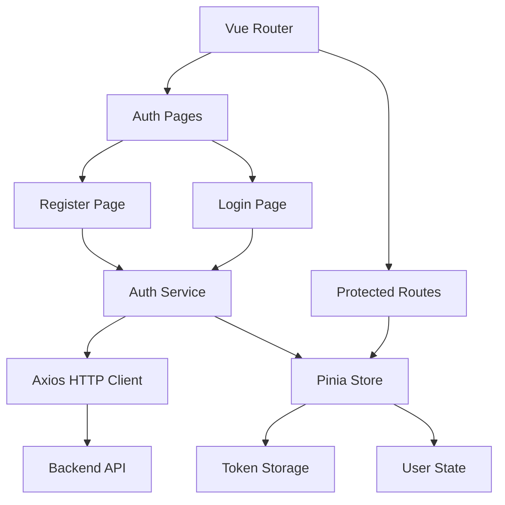

# 前端集成架构设计

## 整体架构



## 分层设计

### 1. 视图层 (Pages)
- `Register.vue` - 注册页面
- `Login.vue` - 登录页面
- `Dashboard.vue` - 受保护页面示例

### 2. 服务层 (Services)
- `auth.service.ts` - 认证相关API调用
- `http.client.ts` - Axios实例配置

### 3. 状态管理层 (Store)
- `auth.store.ts` - 用户认证状态管理

### 4. 路由层 (Router)
- 路由保护守卫
- 重定向逻辑

## 接口契约

### AuthService接口
```typescript
interface AuthService {
  register(data: RegisterData): Promise<AuthResponse>
  login(credentials: LoginData): Promise<AuthResponse>
  logout(): void
  getToken(): string | null
  isAuthenticated(): boolean
}
```

### Pinia Store接口
```typescript
interface AuthStore {
  user: User | null
  token: string | null
  isAuthenticated: boolean
  login(credentials: LoginData): Promise<void>
  register(data: RegisterData): Promise<void>
  logout(): void
}
```

## 数据流向
1. 用户填写表单 → 组件验证
2. 调用AuthService → API请求
3. 更新Pinia Store → 状态持久化
4. 路由导航 → 权限验证

## 异常处理策略
- API错误：统一错误提示
- 网络错误：重试机制
- 验证错误：表单级错误显示
- 认证失败：跳转登录页