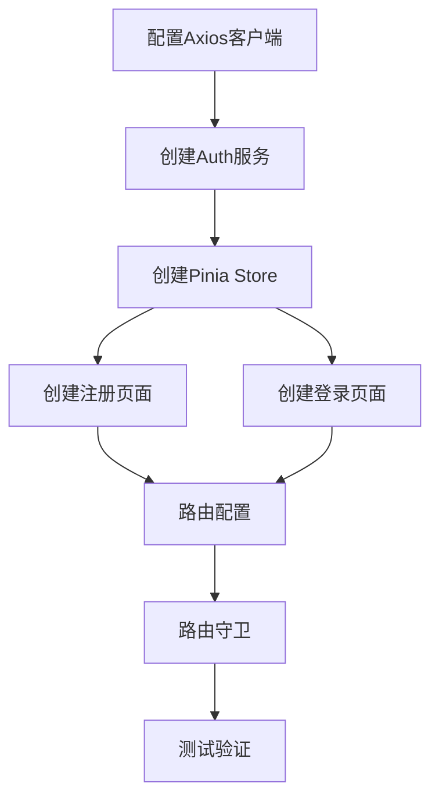

# 前端集成任务拆分

## 任务依赖图

## 原子任务列表

### 任务1: 配置Axios客户端
**输入契约**: 后端API地址 `http://localhost:3000/api/v1`
**输出契约**: 配置好的Axios实例，包含请求/响应拦截器
**实现约束**: TypeScript + Axios
**验收标准**: 
- 自动附加token到请求头
- 统一错误处理
- 支持跨域请求

### 任务2: 创建Auth服务
**输入契约**: Axios客户端
**输出契约**: AuthService类，包含注册/登录方法
**实现约束**: 使用async/await，错误处理
**验收标准**:
- register方法返回用户数据
- login方法返回token和用户信息
- 错误信息友好

### 任务3: 创建Pinia Store
**输入契约**: AuthService
**输出契约**: auth.store.ts，包含状态和actions
**实现约束**: Pinia最佳实践，持久化存储
**验收标准**:
- 登录状态持久化
- token自动保存到localStorage
- 登出清除所有数据

### 任务4: 创建注册页面
**输入契约**: Pinia Store，注册表单验证规则
**输出契约**: Register.vue组件
**实现约束**: TailwindCSS样式，响应式设计
**验收标准**:
- 表单验证实时反馈
- 错误信息友好显示
- 移动端适配良好

### 任务5: 创建登录页面
**输入契约**: Pinia Store，登录表单验证规则
**输出契约**: Login.vue组件
**实现约束**: 与注册页面样式一致
**验收标准**:
- 记住登录状态选项
- 忘记密码链接占位
- 表单验证完整

### 任务6: 路由配置
**输入契约**: 登录/注册页面组件
**输出契约**: 路由配置文件
**实现约束**: Vue Router 4.x
**验收标准**:
- /register 注册页面
- /login 登录页面
- /dashboard 受保护页面

### 任务7: 路由守卫
**输入契约**: Pinia Store状态
**输出契约**: 路由守卫逻辑
**实现约束**: 全局前置守卫
**验收标准**:
- 未登录用户重定向到登录页
- 已登录用户访问登录页重定向到首页
- 支持returnUrl参数

### 任务8: 测试验证
**输入契约**: 完整前端应用
**输出契约**: 测试报告
**实现约束**: 手动测试 + 控制台验证
**验收标准**:
- 注册流程完整测试
- 登录流程完整测试
- 路由保护功能验证