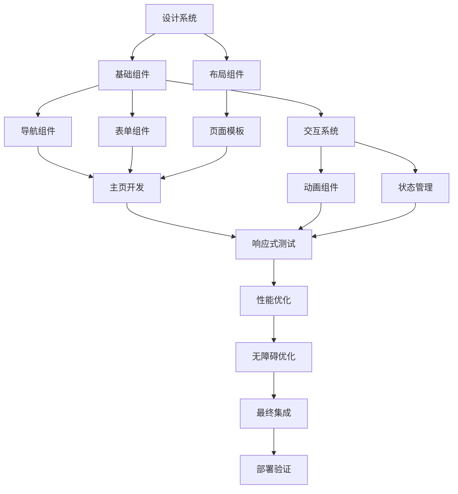

# 前端页面设计任务分解文档

## 项目总览
- **总工期**: 2天
- **任务数量**: 15个原子任务
- **并行度**: 样式系统、组件开发、页面集成并行进行
- **依赖关系**: 基础组件优先，页面集成最后

## 任务依赖图



## 任务详细分解

### 阶段1: 设计系统建立 (第1天上午)

#### 任务1: 设计令牌扩展
- **编号**: DS-001
- **预估时间**: 2小时
- **前置条件**: 项目已克隆，依赖已安装
- **具体步骤**:
  1. 扩展Tailwind配置，添加设计令牌
  2. 创建颜色、间距、圆角等设计变量
  3. 建立响应式断点系统
  4. 创建CSS自定义属性
- **验收标准**: Tailwind配置成功扩展，设计令牌可用
- **输出物**: 更新的`tailwind.config.js`，`src/styles/design-tokens.css`

#### 任务2: 基础样式重置
- **编号**: DS-002
- **预估时间**: 1小时
- **前置条件**: DS-001完成
- **具体步骤**:
  1. 创建全局样式文件
  2. 重置浏览器默认样式
  3. 设置基础字体和排版
  4. 建立无障碍基础样式
- **验收标准**: 样式重置完成，基础排版统一
- **输出物**: `src/styles/global.css`，`src/styles/reset.css`

### 阶段2: 基础组件开发 (第1天下午)

#### 任务3: 按钮组件系统
- **编号**: COMP-001
- **预估时间**: 2小时
- **前置条件**: DS-002完成
- **具体步骤**:
  1. 创建BaseButton基础组件
  2. 实现4种按钮变体：primary, secondary, outline, ghost
  3. 添加3种尺寸：sm, md, lg
  4. 实现交互状态：hover, active, disabled
  5. 添加加载状态显示
- **验收标准**: 按钮组件功能完整，样式一致
- **输出物**: `src/components/ui/BaseButton.vue`

#### 任务4: 卡片组件系统
- **编号**: COMP-002
- **预估时间**: 1.5小时
- **前置条件**: COMP-001完成
- **具体步骤**:
  1. 创建BaseCard基础组件
  2. 实现卡片阴影系统
  3. 添加卡片头部、内容、尾部插槽
  4. 实现卡片悬停效果
  5. 添加卡片加载骨架屏
- **验收标准**: 卡片组件可复用，样式美观
- **输出物**: `src/components/ui/BaseCard.vue`

#### 任务5: 输入框组件系统
- **编号**: COMP-003
- **预估时间**: 2小时
- **前置条件**: COMP-002完成
- **具体步骤**:
  1. 创建BaseInput基础组件
  2. 实现标签、占位符、错误状态
  3. 添加输入验证和实时反馈
  4. 实现密码显示/隐藏切换
  5. 添加输入图标支持
- **验收标准**: 输入组件功能完整，用户体验良好
- **输出物**: `src/components/ui/BaseInput.vue`, `src/components/ui/BaseForm.vue`

### 阶段3: 布局组件开发 (第1天晚上)

#### 任务6: 响应式导航栏
- **编号**: LAYOUT-001
- **预估时间**: 2.5小时
- **前置条件**: COMP-001完成
- **具体步骤**:
  1. 创建HeaderNavigation组件
  2. 实现桌面端导航菜单
  3. 实现移动端汉堡菜单
  4. 添加响应式断点处理
  5. 实现菜单展开/收起动画
- **验收标准**: 导航栏在所有设备上正常工作
- **输出物**: `src/components/layout/HeaderNavigation.vue`

#### 任务7: 页面容器组件
- **编号**: LAYOUT-002
- **预估时间**: 1.5小时
- **前置条件**: LAYOUT-001完成
- **具体步骤**:
  1. 创建PageContainer页面容器
  2. 实现固定头部和可滚动主体
  3. 添加页面间距和内边距
  4. 实现最大宽度限制
  5. 添加页面加载状态
- **验收标准**: 页面容器可复用，布局合理
- **输出物**: `src/components/layout/PageContainer.vue`

#### 任务8: 网格布局系统
- **编号**: LAYOUT-003
- **预估时间**: 1小时
- **前置条件**: LAYOUT-002完成
- **具体步骤**:
  1. 创建ResponsiveGrid响应式网格
  2. 实现12列网格系统
  3. 添加响应式列数调整
  4. 实现间距控制
  5. 添加网格项对齐方式
- **验收标准**: 网格系统灵活可配置
- **输出物**: `src/components/layout/ResponsiveGrid.vue`

### 阶段4: 页面开发 (第2天上午)

#### 任务9: 主页英雄区域
- **编号**: PAGE-001
- **预估时间**: 2小时
- **前置条件**: LAYOUT-003完成
- **具体步骤**:
  1. 创建HeroSection组件
  2. 实现全屏渐变背景
  3. 添加主标题和副标题
  4. 实现CTA按钮区域
  5. 添加滚动指示器
- **验收标准**: 英雄区域视觉冲击力强，响应式良好
- **输出物**: `src/components/sections/HeroSection.vue`

#### 任务10: 功能特性展示
- **编号**: PAGE-002
- **预估时间**: 1.5小时
- **前置条件**: PAGE-001完成
- **具体步骤**:
  1. 创建FeaturesSection组件
  2. 设计3×2网格布局
  3. 创建功能卡片组件
  4. 添加图标和描述
  5. 实现悬停动画效果
- **验收标准**: 功能展示清晰，动画流畅
- **输出物**: `src/components/sections/FeaturesSection.vue`

#### 任务11: 数据统计展示
- **编号**: PAGE-003
- **预估时间**: 1小时
- **前置条件**: PAGE-002完成
- **具体步骤**:
  1. 创建StatsSection组件
  2. 设计数据卡片样式
  3. 添加数字动画效果
  4. 实现响应式布局
  5. 添加加载状态
- **验收标准**: 数据展示直观，动画吸引人
- **输出物**: `src/components/sections/StatsSection.vue`

### 阶段5: 交互系统 (第2天下午)

#### 任务12: 动画系统
- **编号**: ANIM-001
- **预估时间**: 1.5小时
- **前置条件**: PAGE-003完成
- **具体步骤**:
  1. 创建动画配置文件
  2. 实现页面切换动画
  3. 添加组件进入/离开动画
  4. 实现滚动触发动画
  5. 添加微交互效果
- **验收标准**: 动画自然流畅，不影响性能
- **输出物**: `src/composables/useAnimation.js`, `src/styles/animations.css`

#### 任务13: 表单验证系统
- **编号**: FORM-001
- **预估时间**: 1.5小时
- **前置条件**: COMP-003完成
- **具体步骤**:
  1. 创建表单验证组合式函数
  2. 实现实时验证规则
  3. 添加错误提示样式
  4. 实现表单提交处理
  5. 添加成功反馈动画
- **验收标准**: 表单验证准确，用户体验良好
- **输出物**: `src/composables/useFormValidation.js`

#### 任务14: 性能优化
- **编号**: PERF-001
- **预估时间**: 1小时
- **前置条件**: ANIM-001完成
- **具体步骤**:
  1. 实现图片懒加载
  2. 添加组件懒加载
  3. 优化字体加载
  4. 实现缓存策略
  5. 添加性能监控
- **验收标准**: 页面加载时间<3秒，交互响应<100ms
- **输出物**: `src/composables/usePerformance.js`

#### 任务15: 无障碍优化
- **编号**: A11Y-001
- **预估时间**: 1小时
- **前置条件**: PERF-001完成
- **具体步骤**:
  1. 添加ARIA标签和描述
  2. 实现键盘导航支持
  3. 优化色彩对比度
  4. 添加屏幕阅读器支持
  5. 测试无障碍功能
- **验收标准**: 通过WCAG 2.1 AA级标准
- **输出物**: `src/composables/useAccessibility.js`

## 每日详细计划

### 第1天: 基础构建日
**上午 (9:00-12:00)**
- 9:00-10:00: 任务1 - 设计系统建立
- 10:00-11:00: 任务2 - 基础样式重置
- 11:00-12:00: 任务3 - 按钮组件系统

**下午 (14:00-18:00)**
- 14:00-15:30: 任务4 - 卡片组件系统
- 15:30-17:30: 任务5 - 输入框组件系统
- 17:30-18:00: 任务6 - 响应式导航栏(开始)

**晚上 (19:00-21:00)**
- 19:00-20:30: 任务6 - 响应式导航栏(完成)
- 20:30-21:00: 任务7 - 页面容器组件

### 第2天: 页面集成日
**上午 (9:00-12:00)**
- 9:00-10:00: 任务8 - 网格布局系统
- 10:00-12:00: 任务9 - 主页英雄区域

**下午 (14:00-18:00)**
- 14:00-15:30: 任务10 - 功能特性展示
- 15:30-16:30: 任务11 - 数据统计展示
- 16:30-17:30: 任务12 - 动画系统
- 17:30-18:00: 任务13 - 表单验证系统

**晚上 (19:00-21:00)**
- 19:00-20:00: 任务14 - 性能优化
- 20:00-21:00: 任务15 - 无障碍优化

## 技术栈和工具

### 核心技术
- **框架**: Vue 3.5.19 + Composition API
- **样式**: TailwindCSS 3.4.17
- **图标**: FontAwesome 6.7.2
- **动画**: Vue Transition + CSS动画
- **验证**: 自定义组合式函数

### 开发工具
- **构建**: Vite 7.1.3
- **测试**: Vitest 3.2.4
- **代码检查**: ESLint + Prettier
- **浏览器**: Chrome DevTools

### 设计工具
- **原型**: Figma (可选)
- **图标**: FontAwesome
- **颜色**: TailwindCSS色彩系统
- **字体**: Inter字体族

## 文件结构规划

```
src/
├── components/
│   ├── ui/
│   │   ├── BaseButton.vue
│   │   ├── BaseCard.vue
│   │   ├── BaseInput.vue
│   │   └── BaseForm.vue
│   ├── layout/
│   │   ├── HeaderNavigation.vue
│   │   ├── PageContainer.vue
│   │   └── ResponsiveGrid.vue
│   └── sections/
│       ├── HeroSection.vue
│       ├── FeaturesSection.vue
│       └── StatsSection.vue
├── composables/
│   ├── useAnimation.js
│   ├── useFormValidation.js
│   ├── usePerformance.js
│   └── useAccessibility.js
├── styles/
│   ├── design-tokens.css
│   ├── global.css
│   ├── reset.css
│   └── animations.css
└── views/
    └── HomeView.vue
```

## 性能指标

### 加载性能
- **首次内容绘制 (FCP)**: <1.5秒
- **最大内容绘制 (LCP)**: <2.5秒
- **首次输入延迟 (FID)**: <100ms
- **累积布局偏移 (CLS)**: <0.1

### 交互性能
- **按钮响应时间**: <50ms
- **动画帧率**: 60fps
- **滚动性能**: 平滑无卡顿
- **内存使用**: <100MB

## 无障碍标准

### WCAG 2.1 AA级要求
- **色彩对比**: 4.5:1 (正常文本)
- **键盘导航**: 完整支持Tab键
- **屏幕阅读器**: ARIA标签完整
- **触摸目标**: 最小44×44像素
- **错误提示**: 清晰可理解

## 测试策略

### 测试类型
- **单元测试**: 组件功能测试
- **集成测试**: 组件组合测试
- **视觉测试**: 响应式布局测试
- **无障碍测试**: 键盘和屏幕阅读器测试

### 测试工具
- **Vitest**: 单元测试框架
- **Vue Test Utils**: 组件测试
- **Chrome DevTools**: 性能分析
- **axe-core**: 无障碍测试

## 验收检查清单

### 功能验收
- [ ] 所有组件在不同设备上正常显示
- [ ] 导航菜单在移动端可正常展开/收起
- [ ] 表单验证准确及时
- [ ] 动画效果流畅自然
- [ ] 加载状态完整显示

### 设计验收
- [ ] 色彩搭配符合品牌调性
- [ ] 排版层次分明，信息清晰
- [ ] 视觉元素统一，风格一致
- [ ] 响应式布局适配良好
- [ ] 无障碍设计符合标准

### 技术验收
- [ ] 代码符合Vue3最佳实践
- [ ] 组件可复用性强
- [ ] 性能优化到位
- [ ] 测试覆盖率>80%
- [ ] 文档完整更新

### 用户体验验收
- [ ] 页面加载时间<3秒
- [ ] 交互响应时间<100ms
- [ ] 触摸目标大小合适
- [ ] 键盘导航完整
- [ ] 错误提示清晰