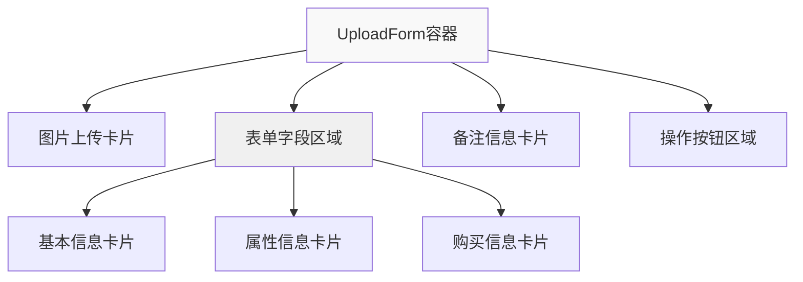

# 卡片间距优化设计方案

## 设计目标
统一UploadForm.vue中所有卡片区域的垂直间距，确保视觉一致性

## 当前问题分析
- 图片上传区域：mb-10 (40px)
- 表单字段区域：space-y-8 (32px) 内部间距
- 备注信息卡片：mb-10 (40px) 但位于表单区域外
- 存在内外间距差异

## 统一方案
### 方案选择：统一32px间距
基于TailwindCSS标准间距系统，选择`space-y-8`（32px）作为统一标准

### 技术实现
1. **移除不一致的mb-10类**
2. **统一使用space-y-8容器包裹**
3. **确保响应式布局不受影响**

### 架构图

### 间距规范
- 卡片间垂直间距：32px (space-y-8)
- 卡片内边距：24px (p-6)
- 响应式：保持现有md:p-8适配

## 兼容性保证
- 保持现有卡片样式不变
- 仅调整容器间距类
- 不影响响应式断点