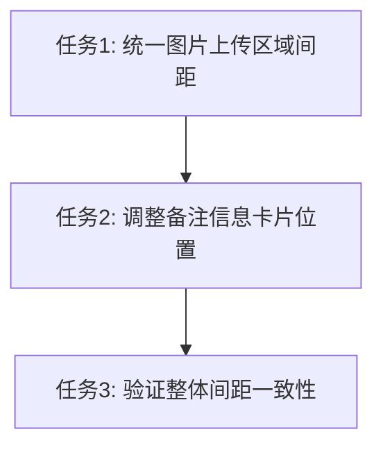

# 卡片间距优化任务清单

## 任务依赖图

## 原子任务详情

### 任务1: 统一图片上传区域间距
**输入契约**:
- UploadForm.vue文件可编辑
- 当前图片区域使用mb-10类

**输出契约**:
- 移除mb-10类
- 纳入space-y-8统一间距系统

**实现约束**:
- 保持图片上传区域功能不变
- 仅调整间距类名

### 任务2: 调整备注信息卡片位置
**输入契约**:
- 备注卡片当前在表单区域外
- 使用mb-10类

**输出契约**:
- 将备注卡片移入统一间距容器
- 移除mb-10类
- 保持卡片样式不变

### 任务3: 验证整体间距一致性
**输入契约**:
- 所有间距调整完成
- 浏览器预览可用

**输出契约**:
- 所有卡片间距统一为32px
- 响应式布局正常
- 视觉一致性验证通过

## 技术规范
- **间距单位**: TailwindCSS space-y-8 (32px)
- **文件路径**: front/src/components/form/UploadForm.vue
- **验证方式**: 浏览器预览 + 元素检查