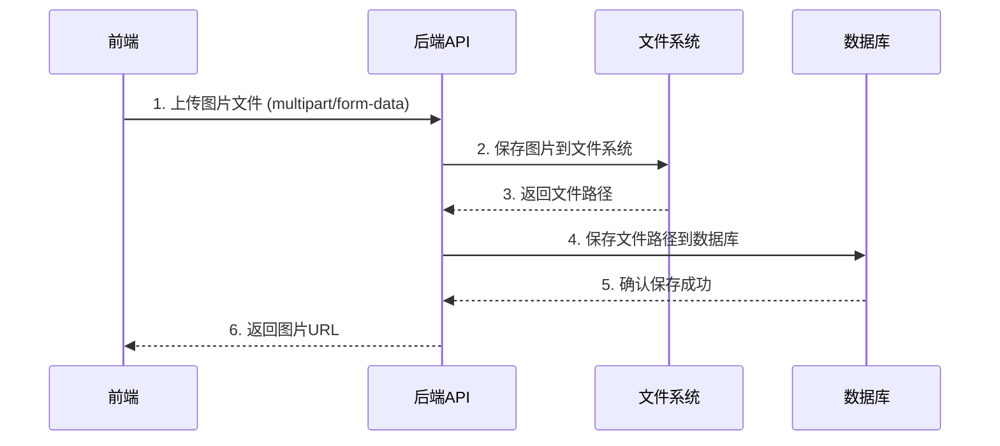

# 图片上传方案设计

## 1. 方案概述

当前项目中，图片仅以URL形式存储在数据库中，不支持实际图片文件的上传和保存。为了实现实际图片的保存功能，我们需要设计一套完整的图片上传解决方案。

## 2. 技术方案比较

| 方案 | 实现方式 | 优点 | 缺点 | 适用场景 |
|------|---------|------|------|---------|
| **方案1：Base64编码存储** | 前端将图片转换为Base64编码，直接存储到数据库 | 实现简单，无需额外文件存储 | 增加30%文件大小，数据库压力大，查询性能差 | 小图片、临时存储 |
| **方案2：服务器文件系统存储** | 后端接收文件上传并存储到服务器文件系统，数据库存储文件路径 | 文件存储与数据库分离，性能较好 | 需要管理文件存储，考虑命名、路径、备份等 | 中等规模项目，可控性要求高 |
| **方案3：云存储服务** | 前端直接上传到云存储（如AWS S3、阿里云OSS），后端存储文件URL | 无需管理文件服务器，扩展性好 | 增加成本，需要额外云服务配置 | 大规模项目，高可用性要求 |
| **方案4：数据库BLOB存储** | 直接将图片文件存储到数据库BLOB字段 | 数据管理集中 | 数据库性能下降，备份迁移困难 | 极少使用，仅适合特殊场景 |

## 3. 推荐方案

考虑到当前项目规模和需求，**推荐使用方案2：服务器文件系统存储**。

### 3.1 方案架构



### 3.2 实现细节

#### 3.2.1 后端实现

1. **安装文件上传中间件**

```bash
npm install multer @types/multer
```

2. **创建图片上传配置**

```typescript
// backend/src/config/uploadConfig.ts
import multer from 'multer';
import path from 'path';
import { appConfig } from './index';

// 确保上传目录存在
import fs from 'fs';
if (!fs.existsSync(appConfig.uploadPath)) {
  fs.mkdirSync(appConfig.uploadPath, { recursive: true });
}

// 配置multer
const storage = multer.diskStorage({
  destination: (req, file, cb) => {
    cb(null, appConfig.uploadPath);
  },
  filename: (req, file, cb) => {
    // 生成唯一文件名
    const uniqueSuffix = Date.now() + '-' + Math.round(Math.random() * 1E9);
    const ext = path.extname(file.originalname);
    cb(null, `${file.fieldname}-${uniqueSuffix}${ext}`);
  }
});

// 文件过滤器
const fileFilter = (req: any, file: Express.Multer.File, cb: multer.FileFilterCallback) => {
  const allowedTypes = appConfig.allowedFileTypes.map(type => `.${type}`);
  const fileExt = path.extname(file.originalname).toLowerCase();
  
  if (allowedTypes.includes(fileExt)) {
    cb(null, true);
  } else {
    cb(new Error(`不支持的文件类型。允许的类型: ${appConfig.allowedFileTypes.join(', ')}`));
  }
};

const upload = multer({
  storage,
  fileFilter,
  limits: {
    fileSize: appConfig.maxFileSize
  }
});

export default upload;
```

3. **创建图片上传路由和控制器**

```typescript
// backend/src/routes/upload.ts
import express from 'express';
import { authMiddleware } from '../middleware/auth';
import { uploadController } from '../controllers/UploadController';
import upload from '../config/uploadConfig';

const router = express.Router();

// 需要认证的路由
router.use(authMiddleware);

// 图片上传路由
router.post('/upload/image', upload.single('image'), uploadController.uploadImage);

// 获取图片路由
router.get('/uploads/:filename', uploadController.getImage);

export default router;
```

```typescript
// backend/src/controllers/UploadController.ts
import { Request, Response } from 'express';
import path from 'path';
import fs from 'fs';
import { appConfig } from '../config';

class UploadController {
  async uploadImage(req: Request, res: Response) {
    try {
      if (!req.file) {
        return res.status(400).json({
          success: false,
          message: '未找到上传的图片'
        });
      }

      // 构建图片URL
      const imageUrl = `${req.protocol}://${req.get('host')}/api/v1/uploads/${req.file.filename}`;

      res.json({
        success: true,
        message: '图片上传成功',
        data: {
          filename: req.file.filename,
          originalname: req.file.originalname,
          mimetype: req.file.mimetype,
          size: req.file.size,
          url: imageUrl
        }
      });
    } catch (error) {
      console.error('图片上传错误:', error);
      res.status(500).json({
        success: false,
        message: '图片上传失败',
        error: error instanceof Error ? error.message : String(error)
      });
    }
  }

  async getImage(req: Request, res: Response) {
    try {
      const { filename } = req.params;
      const imagePath = path.join(appConfig.uploadPath, filename);

      // 检查文件是否存在
      if (!fs.existsSync(imagePath)) {
        return res.status(404).json({
          success: false,
          message: '图片不存在'
        });
      }

      // 返回图片文件
      res.sendFile(imagePath);
    } catch (error) {
      console.error('获取图片错误:', error);
      res.status(500).json({
        success: false,
        message: '获取图片失败'
      });
    }
  }
}

export const uploadController = new UploadController();
```

4. **更新路由注册**

```typescript
// backend/src/routes/index.ts
import express from 'express';
import healthRoutes from './health';
import authRoutes from './auth';
import clothingRoutes from './clothing';
import outfitRoutes from './outfit';
import preferencesRoutes from './preferences';
import uploadRoutes from './upload'; // 新增
import { clothingController } from '../controllers/clothingController';

const router = express.Router();

// API版本前缀
const API_PREFIX = '/api/v1';

// 路由注册
router.use('/health', healthRoutes);
router.use('/auth', authRoutes);
router.use('/', clothingRoutes);
router.use('/', outfitRoutes);
router.use('/', preferencesRoutes);
router.use('/', uploadRoutes); // 新增

// 添加枚举数据的重定向路由，解决前端调用路径不匹配问题
router.get('/enums/all', clothingController.getAllEnums);

// 导出带前缀的路由
export default (app: express.Application) => {
  app.use(API_PREFIX, router);
};
```

#### 3.2.2 前端实现

1. **创建图片上传服务**

```javascript
// front/src/services/api/uploadApi.js
import apiClient from '../core/axiosConfig';

// 上传API
const uploadApi = {
  uploadImage: async (imageFile) => {
    const formData = new FormData();
    formData.append('image', imageFile);
    
    return apiClient.post('/upload/image', formData, {
      headers: {
        'Content-Type': 'multipart/form-data'
      }
    });
  }
};

export default uploadApi;
```

2. **更新UploadForm.vue中的图片处理逻辑**

```javascript
// 更新processImageFile函数
import uploadApi from '@/services/api/uploadApi';

// 处理图片文件
const processImageFile = async (file) => {
  // 验证文件类型
  if (!IMAGE_CONFIG.ACCEPT_TYPES.includes(file.type)) {
    showToast(`请上传${IMAGE_CONFIG.ACCEPT_TYPES.map(type => type.split('/')[1]).join('/')}格式的图片`, 'error');
    return;
  }

  // 验证文件大小
  if (file.size > IMAGE_CONFIG.MAX_SIZE) {
    showToast(`图片大小不能超过${IMAGE_CONFIG.MAX_SIZE / 1024 / 1024}MB`, 'error');
    return;
  }

  try {
    // 显示上传中提示
    showToast('图片上传中...', 'loading');
    
    // 上传图片到服务器
    const response = await uploadApi.uploadImage(file);
    
    // 释放旧的URL
    if (clothingItem.image && imageObjectURLs.value.includes(clothingItem.image)) {
      URL.revokeObjectURL(clothingItem.image);
    }
    
    // 使用服务器返回的图片URL
    const imageUrl = response.data.url;
    clothingItem.image = imageUrl;
    
    // 保存预览URL
    imageObjectURLs.value.push(imageUrl);
    
    showToast('图片上传成功', 'success');
  } catch (error) {
    showToast('图片上传失败，请重试', 'error');
    console.error('图片上传错误:', error);
  }
};

// 更新saveClothes函数中的图片处理逻辑
// 移除占位符替换逻辑，直接使用上传的图片URL
const saveClothes = async () => {
  // ... 其他代码不变 ...
  
  try {
    const today = new Date().toISOString().split('T')[0];
    let validatedMainImageUrl = clothingItem.image || null;

    // 不再需要替换为占位符，直接使用上传的图片URL
    
    const itemToSubmit = {
      // ... 其他字段不变 ...
      imageUrls: validatedMainImageUrl ? [validatedMainImageUrl] : [],
      mainImageUrl: validatedMainImageUrl,
      // ... 其他字段不变 ...
    };
    
    // ... 其他代码不变 ...
  } catch (error) {
    // ... 错误处理不变 ...
  }
};
```

3. **更新API端点配置**

```javascript
// front/src/services/core/apiEndpoints.js
// 在API_ENDPOINTS中添加上传相关的端点
const API_ENDPOINTS = {
  // ... 其他端点不变 ...
  upload: {
    image: '/upload/image'
  }
};
```

#### 3.2.3 配置说明

1. **后端配置**

在`.env`文件中配置以下参数：

```env
# 上传配置
UPLOAD_PATH=./uploads
MAX_FILE_SIZE=5242880 # 5MB
ALLOWED_FILE_TYPES=jpg,jpeg,png,webp
```

2. **前端配置**

在`.env`文件中配置API基础URL：

```env
VITE_API_BASE_URL=http://localhost:3000/api/v1
```

## 4. 测试和验证

### 4.1 测试步骤

1. 启动后端服务：`npm run dev`
2. 启动前端服务：`npm run dev`
3. 进入上传页面，选择一张图片上传
4. 检查服务器`uploads`目录是否有上传的图片文件
5. 检查数据库中是否存储了正确的图片URL
6. 查看衣物详情页，确认图片能够正常显示

### 4.2 验证要点

- 图片能够成功上传并保存到服务器
- 数据库中存储的是正确的图片URL
- 前端能够正确显示上传的图片
- 错误处理（文件类型错误、文件大小超限等）正常工作

## 5. 性能和安全考虑

### 5.1 性能优化

- 限制上传图片的大小和类型
- 考虑图片压缩和 resize
- 使用CDN加速图片访问

### 5.2 安全考虑

- 验证上传文件的类型和大小
- 生成唯一的文件名，防止文件覆盖
- 限制上传目录的权限
- 考虑添加文件内容验证，防止恶意文件上传
- 对上传接口添加认证和授权

## 6. 扩展方案

### 6.1 支持多图片上传

当前方案只支持单图片上传，可以扩展为支持多图片上传：

1. 后端修改为使用`upload.array('images', 5)`（支持最多5张图片）
2. 前端修改为使用`formData.append('images', file)`多次添加图片文件

### 6.2 图片压缩和优化

在前端上传前对图片进行压缩和优化，可以使用`compressorjs`等库：

```javascript
import Compressor from 'compressorjs';

const compressImage = (file) => {
  return new Promise((resolve, reject) => {
    new Compressor(file, {
      quality: 0.8,
      maxWidth: 1920,
      maxHeight: 1080,
      success: (compressedFile) => {
        resolve(compressedFile);
      },
      error: (error) => {
        reject(error);
      }
    });
  });
};
```

### 6.3 切换到云存储

如果未来需要更高的扩展性，可以考虑切换到云存储服务：

1. 后端实现云存储上传逻辑
2. 前端可以直接上传到云存储，或通过后端中转
3. 数据库中只存储云存储的文件URL

## 7. 总结

本方案实现了完整的图片上传和保存功能，包括：

- 后端文件上传API的实现
- 服务器文件系统的图片存储
- 前端图片上传和预览功能
- 完整的错误处理和验证机制

通过这个方案，用户可以上传实际的图片文件，而不仅仅是图片URL，从而提升应用的功能和用户体验。