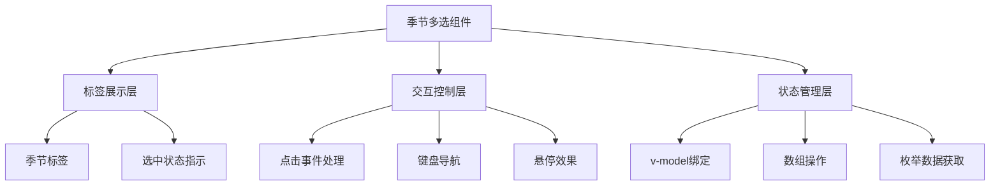

# 季节多选样式优化 - 架构设计

## 整体架构



## 组件设计

### 1. 标签展示层 (Template)
- 使用 `div.grid` 创建流式布局
- 每个季节选项渲染为独立的标签按钮
- 选中状态使用背景色和图标区分

### 2. 交互控制层 (Script)
- `toggleSeason(season)` 方法处理选中/取消
- 键盘导航支持 (Tab键切换，Enter键选择)
- 悬停和焦点状态管理

### 3. 状态管理层 (Props/Emit)
- `v-model` 双向绑定 `clothingItem.seasons`
- 从 `enumsStore` 获取季节选项数据
- 实时同步选中状态到父组件

## 样式规范

### 标签样式
```css
/* 未选中状态 */
.season-tag {
  @apply px-3 py-2 rounded-lg border cursor-pointer transition-all;
  @apply text-sm font-medium;
  @apply hover:bg-gray-50 hover:border-gray-300;
}

/* 选中状态 */
.season-tag.selected {
  @apply bg-indigo-50 border-indigo-300 text-indigo-700;
  @apply ring-2 ring-indigo-500 ring-opacity-50;
}

/* 焦点状态 */
.season-tag:focus {
  @apply outline-none ring-2 ring-indigo-500;
}
```

### 布局系统
- 容器: `grid grid-cols-2 sm:grid-cols-4 gap-2`
- 移动端: 2列布局
- 桌面端: 4列布局
- 间距: 8px网格系统

## 接口定义

### Props
- `modelValue`: string[] - 选中的季节数组
- `options`: {value: string, label: string}[] - 季节选项

### Events
- `update:modelValue`: 选中状态变化时触发

### Methods
- `toggleSeason(season: string)`: 切换季节选中状态
- `isSelected(season: string): boolean`: 检查季节是否选中