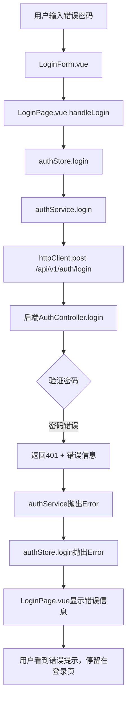

# 密码错误登录问题 - 架构设计文档

## 整体架构图

## 核心组件分析

### 1. 前端认证流程
- **LoginPage.vue**: 处理用户交互和错误显示
- **auth.store.js**: 状态管理，正确处理错误
- **auth.service.js**: 封装API调用，统一错误处理
- **http.client.js**: 基础HTTP配置

### 2. 后端认证流程
- **AuthController.login**: 验证用户凭据
- **错误响应格式**: `{success: false, message: "邮箱或密码错误", error: {...}}`

## 问题定位

### 当前状态验证
- ✅ 后端返回正确的错误格式
- ✅ 前端API路径配置正确
- ✅ auth.store.js已修复数据结构问题
- ❓ 需要验证实际登录流程

### 可能的问题点
1. **测试数据问题**：测试用户可能不存在
2. **网络请求问题**：可能存在CORS或网络错误
3. **前端错误处理**：可能存在未捕获的异常
4. **浏览器缓存**：可能存在认证状态缓存

## 验证策略
1. 使用真实存在的测试用户
2. 监控网络请求和响应
3. 检查浏览器控制台错误
4. 验证错误处理链路