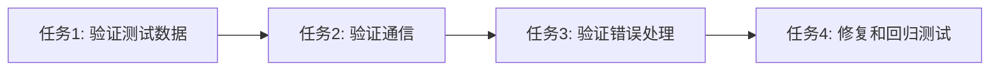

# 密码错误登录问题 - 任务拆分文档

## 子任务列表

### 任务1: 验证测试数据存在性
**输入契约**:
- 后端服务运行正常 (localhost:3000)
- 数据库连接正常

**输出契约**:
- 确认测试用户存在
- 获取测试用户的正确密码

**实现约束**:
- 使用MySQL查询验证用户数据
- 记录测试用户邮箱和密码

**依赖关系**:
- 前置: 无
- 后置: 任务2

---

### 任务2: 验证前端到后端通信
**输入契约**:
- 测试用户数据已确认
- 前端服务运行正常 (localhost:8080)

**输出契约**:
- 网络请求日志
- 响应状态码验证
- 错误信息验证

**实现约束**:
- 使用浏览器开发者工具监控
- 记录完整的请求/响应数据

**依赖关系**:
- 前置: 任务1
- 后置: 任务3

---

### 任务3: 验证错误处理链路
**输入契约**:
- 通信验证完成
- 已知测试用户凭据

**输出契约**:
- 错误处理流程验证结果
- 错误信息显示验证

**实现约束**:
- 分别测试正确密码和错误密码
- 验证错误信息展示
- 验证页面跳转行为

**依赖关系**:
- 前置: 任务2
- 后置: 任务4

---

### 任务4: 修复验证和回归测试
**输入契约**:
- 问题根因已确认
- 所有验证任务完成

**输出契约**:
- 修复后的代码
- 回归测试报告
- 验证修复效果

**实现约束**:
- 最小化修改原则
- 保持现有架构
- 完整测试覆盖

**依赖关系**:
- 前置: 任务3
- 后置: 无

## 任务依赖图

