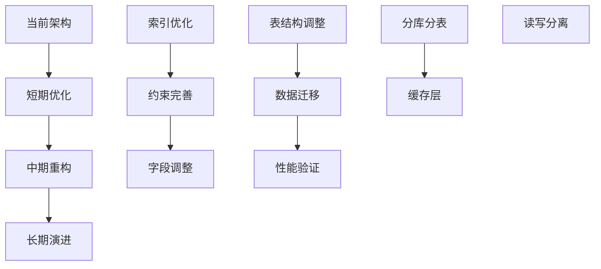

# StyleVault 数据库架构优化方案

## 📊 现状深度分析

### 1. 表结构评估矩阵

| 表名 | 设计评分 | 性能评分 | 维护评分 | 主要问题 |
|------|----------|----------|----------|----------|
| **clothing** | 9/10 | 8/10 | 9/10 | 已优化，结构合理 |
| **users** | 7/10 | 8/10 | 8/10 | JSON字段使用需谨慎 |
| **outfits** | 8/10 | 7/10 | 8/10 | 缺少复合索引 |
| **outfit_clothing** | 9/10 | 8/10 | 9/10 | 关联表设计良好 |
| **attributes** | 6/10 | 5/10 | 6/10 | 层级结构复杂，查询低效 |
| **recommendations** | 5/10 | 4/10 | 6/10 | 空表，设计待验证 |
| **user_behaviors** | 7/10 | 6/10 | 7/10 | 行为类型枚举需优化 |
| **user_preferences** | 8/10 | 7/10 | 8/10 | JSON字段缺乏验证 |
| **weather_data** | 4/10 | 3/10 | 5/10 | 空表，数据模型待完善 |

## 🔍 核心问题识别

### 1. 设计层面问题

#### A. 数据冗余与范式化
- **attributes表**：层级结构导致数据重复存储
- **用户偏好存储**：JSON字段缺乏结构化验证
- **枚举值管理**：部分枚举值分散在多个表中

#### B. 扩展性问题
- **clothing表**：已优化，但未来属性扩展需考虑
- **weather_data**：当前模型过于简单，无法支持复杂天气分析
- **recommendations**：缺少推荐算法所需的关键字段

#### C. 数据完整性
- **外键约束**：部分表使用NO ACTION而非CASCADE
- **唯一约束**：user_preferences缺少业务唯一约束
- **默认值**：部分关键字段缺少合理默认值

### 2. 性能层面问题

#### A. 索引策略
- **attributes表**：索引选择性低，path索引效率差
- **weather_data**：缺少时间序列查询索引
- **复合索引**：缺少针对业务查询的复合索引

#### B. 查询效率
- **层级查询**：attributes表的层级查询需要递归，性能差
- **关联查询**：缺少覆盖索引，回表操作多
- **JSON查询**：JSON字段查询无法使用索引

#### C. 存储优化
- **字段类型**：部分varchar长度设置不合理
- **JSON字段**：使用过度，部分应结构化存储
- **时间存储**：缺少时区考虑

### 3. 可维护性问题

#### A. 命名规范
- **一致性**：部分字段命名不统一（如user_id vs users_id）
- **语义清晰**：部分字段含义不明确

#### B. 文档完整性
- **表注释**：部分表缺少业务注释
- **字段注释**：枚举值含义未文档化

## 🎯 优化方案设计

### 1. 架构优化路线图



### 2. 短期优化方案（1-2周）

#### A. 索引优化
```sql
-- 为高频查询添加复合索引
CREATE INDEX idx_clothing_user_category ON clothing(user_id, category, status);
CREATE INDEX idx_clothing_user_brand ON clothing(user_id, brand, status);
CREATE INDEX idx_outfits_user_season ON outfits(user_id, season, status);
CREATE INDEX idx_user_behaviors_time ON user_behaviors(user_id, created_at);

-- 优化attributes表查询
CREATE INDEX idx_attributes_path_level ON attributes(path(100), level);
CREATE INDEX idx_attributes_category_type ON attributes(category, type, is_active);
```

#### B. 约束完善
```sql
-- 添加业务约束
ALTER TABLE user_preferences 
ADD UNIQUE KEY unique_user_preference_type (user_id, preference_type);

-- 完善外键约束
ALTER TABLE recommendations 
DROP FOREIGN KEY recommendations_ibfk_1,
ADD CONSTRAINT fk_recommendations_user 
FOREIGN KEY (user_id) REFERENCES users(id) ON DELETE CASCADE;
```

#### C. 字段调整
```sql
-- 优化字段类型
ALTER TABLE clothing 
MODIFY size VARCHAR(10),
MODIFY notes TEXT CHARACTER SET utf8mb4 COLLATE utf8mb4_unicode_ci;

-- 添加缺失字段
ALTER TABLE weather_data 
ADD COLUMN weather_code VARCHAR(10),
ADD COLUMN temperature_min DECIMAL(5,2),
ADD COLUMN temperature_max DECIMAL(5,2);
```

### 3. 中期重构方案（1-2月）

#### A. 表结构重构

##### 1. 优化attributes表设计
```sql
-- 创建新的属性分类表
CREATE TABLE attribute_categories (
    id INT PRIMARY KEY AUTO_INCREMENT,
    name VARCHAR(50) NOT NULL UNIQUE,
    description TEXT,
    sort_order INT DEFAULT 0,
    created_at TIMESTAMP DEFAULT CURRENT_TIMESTAMP
);

-- 简化attributes表结构
CREATE TABLE attributes_v2 (
    id INT PRIMARY KEY AUTO_INCREMENT,
    category_id INT NOT NULL,
    name VARCHAR(100) NOT NULL,
    value VARCHAR(100),
    display_name VARCHAR(100),
    color VARCHAR(7),
    sort_order INT DEFAULT 0,
    is_active TINYINT(1) DEFAULT 1,
    created_at TIMESTAMP DEFAULT CURRENT_TIMESTAMP,
    FOREIGN KEY (category_id) REFERENCES attribute_categories(id),
    UNIQUE KEY unique_category_name (category_id, name)
);
```

##### 2. 推荐系统数据模型
```sql
-- 用户画像表
CREATE TABLE user_profiles (
    id INT PRIMARY KEY AUTO_INCREMENT,
    user_id INT NOT NULL UNIQUE,
    style_preferences JSON,
    color_preferences JSON,
    brand_preferences JSON,
    price_range_min DECIMAL(10,2),
    price_range_max DECIMAL(10,2),
    updated_at TIMESTAMP DEFAULT CURRENT_TIMESTAMP ON UPDATE CURRENT_TIMESTAMP,
    FOREIGN KEY (user_id) REFERENCES users(id) ON DELETE CASCADE
);

-- 推荐规则表
CREATE TABLE recommendation_rules (
    id INT PRIMARY KEY AUTO_INCREMENT,
    rule_name VARCHAR(100) NOT NULL,
    rule_type ENUM('similarity','seasonal','trending','personal') NOT NULL,
    conditions JSON NOT NULL,
    weight DECIMAL(3,2) DEFAULT 1.0,
    is_active TINYINT(1) DEFAULT 1,
    created_at TIMESTAMP DEFAULT CURRENT_TIMESTAMP
);
```

#### B. 性能优化

##### 1. 分区策略
```sql
-- 按时间分区用户行为表
ALTER TABLE user_behaviors 
PARTITION BY RANGE (YEAR(created_at)) (
    PARTITION p2024 VALUES LESS THAN (2025),
    PARTITION p2025 VALUES LESS THAN (2026),
    PARTITION p2026 VALUES LESS THAN (2027)
);
```

##### 2. 缓存表设计
```sql
-- 用户统计数据缓存
CREATE TABLE user_statistics (
    user_id INT PRIMARY KEY,
    total_clothing INT DEFAULT 0,
    total_outfits INT DEFAULT 0,
    favorite_category VARCHAR(50),
    total_spent DECIMAL(15,2) DEFAULT 0,
    last_activity_at TIMESTAMP,
    updated_at TIMESTAMP DEFAULT CURRENT_TIMESTAMP ON UPDATE CURRENT_TIMESTAMP
);
```

### 4. 长期演进方案（3-6月）

#### A. 微服务架构支持
```sql
-- 用户服务独立数据库
CREATE DATABASE stylevault_users;
CREATE DATABASE stylevault_inventory;
CREATE DATABASE stylevault_recommendations;

-- 分布式ID生成
CREATE TABLE id_generator (
    id_name VARCHAR(50) PRIMARY KEY,
    current_id BIGINT DEFAULT 0,
    increment_by INT DEFAULT 1,
    updated_at TIMESTAMP DEFAULT CURRENT_TIMESTAMP ON UPDATE CURRENT_TIMESTAMP
);
```

#### B. 实时数据处理
```sql
-- 事件流表
CREATE TABLE event_stream (
    id BIGINT PRIMARY KEY AUTO_INCREMENT,
    event_type VARCHAR(50) NOT NULL,
    user_id INT,
    entity_type VARCHAR(50),
    entity_id INT,
    event_data JSON,
    created_at TIMESTAMP DEFAULT CURRENT_TIMESTAMP,
    processed_at TIMESTAMP NULL,
    INDEX idx_event_type_time (event_type, created_at),
    INDEX idx_user_events (user_id, created_at)
);
```

## 📈 性能基准测试方案

### 1. 测试数据集
```sql
-- 生成测试数据
-- 1000用户，50000衣物，100000行为记录
CALL generate_test_data(1000, 50000, 100000);
```

### 2. 关键查询性能测试
```sql
-- 用户衣物查询性能
EXPLAIN ANALYZE SELECT * FROM clothing 
WHERE user_id = 123 AND category = 'tops' AND status = 'active';

-- 穿搭推荐查询
EXPLAIN ANALYZE SELECT o.* FROM outfits o 
JOIN outfit_clothing oc ON o.id = oc.outfit_id 
WHERE o.user_id = 123 AND o.season = 'summer';
```

### 3. 监控指标
- 查询响应时间 < 100ms (95th percentile)
- 索引命中率 > 95%
- 连接池利用率 < 80%
- 磁盘I/O等待 < 10ms

## 🚀 实施优先级

### P0 - 立即执行（本周）
1. 添加关键复合索引
2. 完善外键约束
3. 修复字段类型问题

### P1 - 近期优化（本月）
1. attributes表结构简化
2. 用户画像表设计
3. 缓存表实现

### P2 - 中期规划（下季度）
1. 分区表实施
2. 读写分离架构
3. 监控告警系统

### P3 - 长期演进（明年）
1. 微服务数据库拆分
2. 实时数据管道
3. AI/ML集成优化