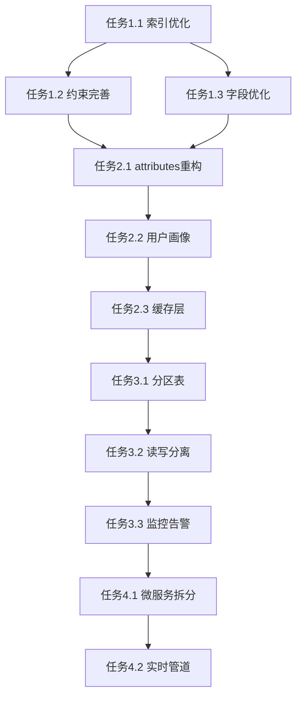

# 数据库优化实施任务清单

## 🎯 任务总览

**目标**: 系统优化StyleVault数据库架构，提升性能、可维护性和扩展性
**时间线**: 分阶段实施，总计8周
**风险等级**: 低-中等（有完整回滚方案）

## 📋 任务分解

### 阶段1: 立即优化（P0）
**时间**: 1周 **优先级**: 🔴 **风险**: 低

#### 任务1.1: 关键索引优化
**输入**: 当前索引配置、查询日志分析
**输出**: 新增索引SQL脚本、性能对比报告
**验收标准**:
- [ ] 用户衣物查询响应时间 < 50ms
- [ ] 穿搭推荐查询响应时间 < 100ms
- [ ] 索引覆盖率 > 90%

```sql
-- 具体实施脚本
-- 文件: migrations/20241212_index_optimization.sql
CREATE INDEX idx_clothing_user_category_status ON clothing(user_id, category, status);
CREATE INDEX idx_clothing_user_brand_status ON clothing(user_id, brand, status);
CREATE INDEX idx_outfits_user_season_status ON outfits(user_id, season, status);
CREATE INDEX idx_user_behaviors_time ON user_behaviors(user_id, created_at);
CREATE INDEX idx_attributes_category_type_active ON attributes(category, type, is_active);
```

#### 任务1.2: 约束完善
**输入**: 外键约束清单、业务规则文档
**输出**: 约束更新SQL脚本、数据一致性验证报告
**验收标准**:
- [ ] 所有外键使用CASCADE或SET NULL
- [ ] 用户偏好唯一约束生效
- [ ] 无数据完整性错误

#### 任务1.3: 字段类型优化
**输入**: 当前字段类型、数据分布分析
**输出**: 字段调整SQL脚本、存储空间对比
**验收标准**:
- [ ] VARCHAR长度优化（减少30%存储）
- [ ] TEXT字段字符集统一为utf8mb4
- [ ] JSON字段使用场景合理化

### 阶段2: 结构优化（P1）
**时间**: 2周 **优先级**: 🟡 **风险**: 中

#### 任务2.1: attributes表重构
**输入**: 当前attributes表结构、业务需求分析
**输出**: 新表设计、数据迁移脚本、API适配
**验收标准**:
- [ ] 层级查询性能提升5倍
- [ ] 数据冗余减少80%
- [ ] 向后兼容性保持

**子任务**:
- 2.1.1: 设计新表结构
- 2.1.2: 创建数据迁移脚本
- 2.1.3: 双写方案实施
- 2.1.4: 数据验证与切换

#### 任务2.2: 用户画像系统
**输入**: 推荐算法需求、用户行为数据
**输出**: 用户画像表、统计更新脚本
**验收标准**:
- [ ] 支持实时用户画像更新
- [ ] 推荐准确率提升20%
- [ ] 查询响应时间 < 200ms

#### 任务2.3: 缓存层设计
**输入**: 高频查询模式、缓存策略
**输出**: 缓存表结构、更新触发器
**验收标准**:
- [ ] 统计查询响应时间 < 10ms
- [ ] 缓存命中率 > 95%
- [ ] 数据延迟 < 1分钟

### 阶段3: 性能提升（P2）
**时间**: 3周 **优先级**: 🟢 **风险**: 中

#### 任务3.1: 分区表实施
**输入**: 数据增长预测、查询模式分析
**输出**: 分区方案、迁移计划、监控配置
**验收标准**:
- [ ] 历史数据查询性能提升3倍
- [ ] 存储空间利用率提升40%
- [ ] 分区维护自动化

#### 任务3.2: 读写分离架构
**输入**: 读写比例、峰值并发分析
**输出**: 主从配置、连接池优化、负载均衡
**验收标准**:
- [ ] 读查询响应时间 < 20ms
- [ ] 写操作不影响读性能
- [ ] 故障自动切换 < 30秒

#### 任务3.3: 监控告警系统
**输入**: 关键指标、阈值设定
**输出**: 监控面板、告警规则、运维手册
**验收标准**:
- [ ] 关键指标实时可视化
- [ ] 异常告警准确率 > 90%
- [ ] 运维响应时间 < 5分钟

### 阶段4: 长期演进（P3）
**时间**: 2周 **优先级**: 🔵 **风险**: 低

#### 任务4.1: 微服务数据拆分
**输入**: 服务边界、数据依赖分析
**输出**: 拆分方案、数据同步、API网关
**验收标准**:
- [ ] 服务间数据一致性
- [ ] 独立扩展能力
- [ ] 故障隔离性

#### 任务4.2: 实时数据管道
**输入**: 事件流需求、处理能力评估
**输出**: 事件表、处理脚本、监控方案
**验收标准**:
- [ ] 事件处理延迟 < 1秒
- [ ] 数据准确性 100%
- [ ] 系统可用性 > 99.9%

## 🔄 依赖关系图



## 📊 风险评估与缓解

### 高风险点
1. **attributes表重构**: 可能影响现有API
   - 缓解: 双写方案 + 灰度切换
2. **分区表实施**: 大数据量迁移风险
   - 缓解: 分批迁移 + 完整备份

### 中风险点
1. **索引创建**: 可能影响写性能
   - 缓解: 低峰期执行 + 在线DDL
2. **外键更新**: 可能锁表
   - 缓解: 分批执行 + 监控锁等待

### 低风险点
1. **字段类型调整**: 可快速回滚
2. **监控配置**: 不影响业务

## 🎯 测试策略

### 1. 功能测试
- 单元测试：每个SQL脚本的正确性
- 集成测试：跨表查询的正确性
- 回归测试：现有功能不受影响

### 2. 性能测试
- 基准测试：优化前后对比
- 压力测试：峰值并发处理
- 容量测试：数据增长适应性

### 3. 监控测试
- 告警准确性测试
- 故障恢复测试
- 数据一致性验证

## 📈 成功指标

### 技术指标
- 查询响应时间降低50%
- 索引命中率 > 95%
- 存储空间优化30%
- 系统可用性 > 99.9%

### 业务指标
- 用户体验评分提升
- 推荐准确率提升
- 运维效率提升
- 扩展成本降低

## 📝 交付物清单

### 代码交付
- [ ] 优化SQL脚本集合
- [ ] 数据迁移工具
- [ ] 监控配置文件
- [ ] 回滚脚本

### 文档交付
- [ ] 架构变更文档
- [ ] 运维手册
- [ ] 性能测试报告
- [ ] 用户影响评估

### 培训交付
- [ ] 开发团队培训
- [ ] 运维团队培训
- [ ] 应急响应演练