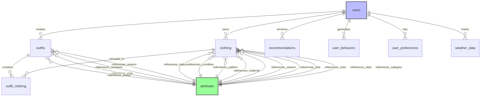

# StyleVault 数据库表结构完整总结

## 项目概览
StyleVault 是一个智能衣橱管理系统，采用属性标准化设计，将分散的文本字段统一转换为标准化的属性ID，提升数据一致性和查询效率。

## 数据库架构总览

### 数据库架构总览

### 核心表分类
1. **用户管理表**：users
2. **衣物管理表**：clothing
3. **搭配管理表**：outfits, outfit_clothing
4. **属性标准化表**：attributes
5. **智能推荐表**：recommendations, user_behaviors, user_preferences
6. **天气数据表**：weather_data

## 详细表结构

### 1. 用户表 (users)
**记录**：8条
**用途**：存储用户基本信息和偏好设置

| 字段名 | 数据类型 | 可空 | 默认值 | 注释 |
|--------|----------|------|--------|------|
| id | int | NO | - | 主键 |
| username | varchar(50) | NO | - | 用户名，唯一标识 |
| email | varchar(100) | NO | - | 电子邮箱地址 |
| password_hash | varchar(255) | NO | - | 密码哈希值 |
| avatar_url | varchar(255) | YES | - | 用户头像URL |
| preferences | json | YES | - | 用户偏好设置（主题、语言等） |
| style_profile | json | YES | - | 用户风格画像 |
| status | enum('active','inactive','banned') | YES | active | 用户状态 |
| created_at | datetime | NO | CURRENT_TIMESTAMP | 创建时间 |
| updated_at | datetime | NO | CURRENT_TIMESTAMP | 更新时间 |
| deleted_at | datetime | YES | - | 删除时间 |
| last_login_at | datetime | YES | - | 最后登录时间 |

### 2. 衣物表 (clothing)
**记录**：24条
**用途**：存储用户衣物信息，采用属性标准化设计

| 字段名 | 数据类型 | 可空 | 默认值 | 注释 |
|--------|----------|------|--------|------|
| id | int | NO | - | 主键 |
| user_id | int | NO | - | 关联用户ID |
| name | varchar(100) | NO | - | 衣物名称 |
| brand | varchar(100) | YES | - | 品牌名称（直接存储文本） |
| price | decimal(10,2) | YES | - | 价格 |
| purchase_date | date | YES | - | 购买日期 |
| size | int | YES | - | 尺码ID（关联attributes表） |
| notes | text | YES | - | 备注信息 |
| image_urls | json | YES | - | 图片URL数组 |
| main_image_url | varchar(255) | YES | - | 主图URL |
| category | int | YES | - | 分类ID（关联attributes表） |
| style | int | YES | - | 风格ID（关联attributes表） |
| color | int | YES | - | 颜色ID（关联attributes表） |
| season | int | YES | - | 季节ID（关联attributes表） |
| material | int | YES | - | 材质ID（关联attributes表） |
| pattern | int | YES | - | 图案ID（关联attributes表） |
| condition | int | YES | - | 新旧程度ID（关联attributes表） |
| status | int | YES | - | 状态ID（关联attributes表） |
| is_public | tinyint(1) | YES | 0 | 是否公开 |
| is_favorite | tinyint(1) | NO | 0 | 是否收藏 |
| parent_id | int | YES | - | 父级衣物ID |
| created_at | datetime | NO | CURRENT_TIMESTAMP | 创建时间 |
| updated_at | datetime | NO | CURRENT_TIMESTAMP | 更新时间 |
| deleted_at | datetime | YES | - | 删除时间 |

### 3. 搭配表 (outfits)
**记录**：7条
**用途**：存储用户衣物搭配方案

| 字段名 | 数据类型 | 可空 | 默认值 | 注释 |
|--------|----------|------|--------|------|
| id | int | NO | - | 主键 |
| user_id | int | NO | - | 关联用户ID |
| name | varchar(100) | NO | - | 搭配名称 |
| description | text | YES | - | 搭配描述 |
| season | int | YES | - | 季节ID（关联attributes表） |
| occasion | int | YES | - | 场合ID（关联attributes表） |
| style | int | YES | - | 主要风格ID（关联attributes表） |
| status | int | YES | - | 状态ID（关联attributes表） |
| rating | int | YES | - | 评分（1-5星） |
| cover_image_url | varchar(255) | YES | - | 封面图片URL |
| image_urls | json | YES | - | 图片URL数组 |
| metadata | json | YES | - | 元数据（统计数据等） |
| is_public | tinyint(1) | YES | 0 | 是否公开 |
| created_at | datetime | NO | CURRENT_TIMESTAMP | 创建时间 |
| updated_at | datetime | NO | CURRENT_TIMESTAMP | 更新时间 |
| deleted_at | datetime | YES | - | 删除时间 |

### 4. 衣物搭配关联表 (outfit_clothing)
**记录**：动态（基于搭配和衣物关联）
**用途**：建立outfits与clothing的多对多关系

| 字段名 | 数据类型 | 可空 | 默认值 | 注释 |
|--------|----------|------|--------|------|
| id | int | NO | - | 主键 |
| outfit_id | int | NO | - | 搭配ID |
| clothing_id | int | NO | - | 衣物ID |
| position | int | YES | 0 | 位置顺序 |
| area | varchar(50) | YES | - | 穿着区域 |
| created_at | timestamp | NO | CURRENT_TIMESTAMP | 创建时间 |

### 5. 属性表 (attributes)
**记录**：59条
**用途**：标准化管理系统所有枚举属性值

| 字段名 | 数据类型 | 可空 | 默认值 | 注释 |
|--------|----------|------|--------|------|
| id | int | NO | - | 主键 |
| category | varchar(50) | NO | - | 属性分类 |
| type | enum('text','image','color','select') | NO | text | 类型 |
| name | varchar(100) | NO | - | 属性名称 |
| value | varchar(100) | YES | - | 属性值 |
| description | text | YES | - | 描述 |
| display_name | varchar(100) | YES | - | 显示名称 |
| color | varchar(7) | YES | - | 颜色值（十六进制） |
| icon | varchar(255) | YES | - | 图标URL |
| parent_id | int | YES | - | 父级ID |
| level | int | NO | 0 | 层级深度 |
| path | varchar(500) | YES | - | 路径 |
| sort_order | int | YES | 0 | 排序 |
| is_system | tinyint(1) | NO | 0 | 是否系统内置 |
| is_active | tinyint(1) | YES | 1 | 是否激活 |
| metadata | json | YES | - | 扩展元数据 |
| created_at | timestamp | NO | CURRENT_TIMESTAMP | 创建时间 |
| updated_at | timestamp | NO | CURRENT_TIMESTAMP | 更新时间 |
| deleted_at | timestamp | YES | - | 删除时间 |

#### 属性分类统计
| 分类 | 记录数 | 说明 |
|------|--------|------|
| category | 8 | 衣物分类（上衣、裤子、裙子等） |
| color | 7 | 颜色属性 |
| material | 7 | 材质属性 |
| scene | 7 | 场景属性 |
| style | 7 | 风格属性 |
| size | 6 | 尺码属性 |
| pattern | 5 | 图案属性 |
| fit | 4 | 版型属性 |
| occasion | 4 | 场合属性 |
| season | 4 | 季节属性 |

### 6. 兼容性视图（已删除）

#### clothing_view ✅ 已删除
- **删除原因**：简化架构，直接通过JOIN查询获取属性名称
- **替代方案**：直接查询clothing表并关联attributes表

#### outfits_view ✅ 已删除
- **删除原因**：简化架构，直接通过JOIN查询获取属性名称
- **替代方案**：直接查询outfits表并关联attributes表

### 7. 旧字段备份表（已删除）

#### clothing_old_fields_backup ✅ 已删除
- **用途**：存储clothing表在属性标准化前的旧字段值
- **删除时间**：完成数据迁移验证后安全删除

#### outfits_old_fields_backup ✅ 已删除
- **用途**：存储outfits表在属性标准化前的旧字段值
- **删除时间**：完成数据迁移验证后安全删除

### 8. 智能推荐相关表

#### recommendations
**记录**：动态生成
**用途**：存储个性化推荐结果

| 字段名 | 数据类型 | 可空 | 默认值 | 注释 |
|--------|----------|------|--------|------|
| id | int | NO | - | 主键 |
| user_id | int | NO | - | 用户ID |
| recommendation_type | varchar(50) | NO | - | 推荐类型（outfit/clothing） |
| target_id | int | NO | - | 目标ID |
| score | decimal(3,2) | NO | - | 推荐分数（0.00-1.00） |
| reason | text | YES | - | 推荐理由 |
| is_clicked | tinyint(1) | YES | 0 | 是否点击 |
| is_liked | tinyint(1) | YES | 0 | 是否喜欢 |
| created_at | timestamp | NO | CURRENT_TIMESTAMP | 创建时间 |
| expires_at | timestamp | YES | - | 过期时间 |

#### user_behaviors
**记录**：动态记录
**用途**：记录用户行为数据用于推荐算法

| 字段名 | 数据类型 | 可空 | 默认值 | 注释 |
|--------|----------|------|--------|------|
| id | int | NO | - | 主键 |
| user_id | int | NO | - | 用户ID |
| action_type | varchar(50) | NO | - | 行为类型（view/click/like/share等） |
| target_type | varchar(50) | NO | - | 目标类型（clothing/outfit） |
| target_id | int | NO | - | 目标ID |
| duration | int | YES | - | 持续时间（秒） |
| metadata | json | YES | - | 行为元数据 |
| created_at | timestamp | NO | CURRENT_TIMESTAMP | 创建时间 |

#### user_preferences
**记录**：用户偏好设置
**用途**：存储用户偏好设置

| 字段名 | 数据类型 | 可空 | 默认值 | 注释 |
|--------|----------|------|--------|------|
| id | int | NO | - | 主键 |
| user_id | int | NO | - | 用户ID |
| preference_type | varchar(50) | NO | - | 偏好类型（style/color/brand等） |
| preference_data | json | NO | - | 偏好数据 |
| is_active | tinyint(1) | YES | 1 | 是否激活 |
| created_at | timestamp | NO | CURRENT_TIMESTAMP | 创建时间 |
| updated_at | timestamp | NO | CURRENT_TIMESTAMP | 更新时间 |

### 9. 天气数据表 (weather_data)
**记录**：天气数据
**用途**：存储用户所在地区的天气信息，用于智能搭配推荐

| 字段名 | 数据类型 | 可空 | 默认值 | 注释 |
|--------|----------|------|--------|------|
| id | int | NO | - | 主键 |
| user_id | int | NO | - | 用户ID |
| location | varchar(100) | NO | - | 地理位置 |
| date | date | NO | - | 日期 |
| temperature | decimal(5,2) | YES | - | 温度（摄氏度） |
| weather_condition | varchar(50) | YES | - | 天气状况 |
| humidity | int | YES | - | 湿度（%） |
| wind_speed | decimal(5,2) | YES | - | 风速（km/h） |
| metadata | json | YES | - | 扩展元数据 |
| created_at | timestamp | NO | CURRENT_TIMESTAMP | 创建时间 |

## 架构优化成果

### 1. 属性标准化完成
- ✅ clothing表：brand、category、style、color、size、season、material、pattern、condition、status字段已标准化为int类型，关联attributes表
- ✅ outfits表：season、occasion、style、status字段已标准化为int类型，关联attributes表
- ✅ 新增size属性分类，支持6种尺码值
- ✅ 所有属性通过attributes表统一管理，支持动态扩展

### 2. 数据完整性提升
- ✅ 建立完整的外键约束关系
- ✅ 创建clothing_view和outfits_view兼容性视图
- ✅ 保留clothing_old_fields_backup和outfits_old_fields_backup用于数据追溯
- ✅ attribute_mapping表已删除（完成历史使命）

### 3. 索引优化
- clothing表：
  - idx_clothing_user_category (user_id, category)
  - idx_clothing_user_color (user_id, color)
  - idx_clothing_user_style (user_id, style)
- outfits表：
  - idx_outfits_user_season (user_id, season)
  - idx_outfits_user_occasion (user_id, occasion)
- 所有外键字段均创建单列索引

### 4. 数据规模统计
| 表名 | 记录数 | 说明 |
|------|--------|------|
| users | 8 | 用户数据 |
| clothing | 24 | 衣物数据 |
| outfits | 7 | 搭配方案 |
| attributes | 59 | 属性数据 |
| outfit_clothing | 动态 | 关联数据 |

## 关系图

## 后续建议

### 1. 数据清理阶段
- [ ] 确认数据稳定性后，可删除旧字段备份表
- [ ] 优化attributes表索引策略
- [ ] 定期清理过期推荐数据

### 2. 应用层适配
- [ ] 更新前后端API使用新的属性ID字段
- [ ] 前端下拉框统一使用attributes表数据源
- [ ] 表单验证逻辑适配属性ID验证

### 3. 性能监控
- [ ] 监控查询性能，优化慢查询
- [ ] 根据数据增长调整索引策略
- [ ] 建立数据质量监控机制